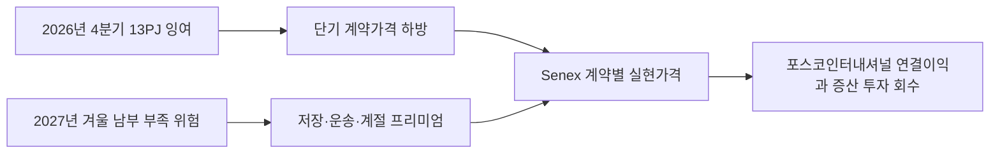

### 판단 질문과 잠정 결론

**2026년 4분기 13페타줄(PJ) 잉여를 Senex 판매가격의 약세 신호로만 볼 것인가?** 현재는 그렇게 보기 어렵습니다. 호주 경쟁소비자위원회(ACCC)는 2026년 말과 2027년 초에는 공급 여유를 전망했지만, 2027년 겨울에는 남부 지역을 중심으로 다시 부족할 수 있다고 밝혔습니다. 2026년 9월 ACCC 후속 보고서가 나오기 전까지는 연평균 가격보다 계절별 계약과 저장 가치에 초점을 맞추는 편이 타당합니다.

### 통념과 확인된 간극

시장 전체 잉여만 보면 증산 물량의 가격이 약해질 것처럼 보입니다. 그러나 같은 보고서에서 2027년 2·3분기 부족 위험, 남부 생산 감소, Iona 저장시설 의존을 함께 제시했습니다. 즉 연간 총량이 아니라 **분기·지역·저장 가능성**이 Senex의 실제 판매단가를 가르는 구조입니다. 2027년 공급계약 가격도 2026년 1분기에 전분기보다 낮아졌으므로, 높은 겨울 현물가격이 장기계약 전체에 자동 반영된다고 볼 수도 없습니다.

### 확인된 변화와 시점

ACCC는 2026년 7월 10일 동부 호주 가스시장이 2026년 4분기에 13PJ 잉여를 보일 것으로 전망했습니다. 이는 2023년 이후 가장 큰 4분기 예상 잉여입니다. 반면 LNG 생산자가 미계약 가스를 모두 수출하면 2027년 2·3분기에 부족할 위험이 있다고 밝혔습니다. ACCC는 퀸즐랜드 LNG 생산자와 관계사가 상업적으로 개발 가능한 자원의 84%를 통제한다고도 설명했습니다.

### 포스코인터내셔널에 전달되는 사업 영향

Senex의 가치가 커지는 조건은 시장 전체 부족이 아니라, 남부 고객에게 겨울 물량을 실제로 인도할 계약·저장·운송권을 확보한 경우입니다. 따라서 2026년 말 잉여 물량을 서둘러 저가 장기계약으로 고정하기보다 2027년 겨울 인도 선택권의 가치와 저장비용을 함께 비교해야 합니다.

### 사업 시나리오

| 시나리오 | 관찰 조건 | 사업 의미 | 우선 대응 |
| --- | --- | --- | --- |
| 방어 | 4분기 잉여 확대, 저장 충전 충분, 2027년 계약가격 추가 하락 | 증산분 가격 약세와 재고비용 증가 | 최소 인수조건과 고정가격 비중 재점검 |
| 기준 | 13PJ 안팎 잉여 뒤 겨울 남부 부족 | 계절별 가격 차이와 운송권 가치 확대 | 분기별 판매·저장·운송 최적화표 작성 |
| 압박 | 미계약 가스 수출과 한파로 2027년 2·3분기 부족 현실화 | 남부 인도 가능 물량의 판매 프리미엄 상승 | 겨울 인도권을 장기계약 협상에 반영 |

### 지금 확인할 지표

- 2026년 9월 ACCC Gas Inquiry의 2027년 분기별 수급과 계약가격
- Iona 저장률, 퀸즐랜드-남부 가스관 이용률과 실제 운송비
- Senex 계약별 인도지역·가격식·계절 조정·최소 인수조건

### 결론을 확정·폐기할 조건

- **이 분석이 틀렸다면:** 2027년 겨울 부족 전망이 사라지고 남부 저장·가스관 여유도 충분한 경우
- **한 가지 확인:** Senex 증산분 중 2027년 겨울 남부 고정 인도 또는 선택권이 붙은 물량 비중
- **감지 조건:** ACCC 2026년 9월 보고서에서 2027년 2·3분기 부족량 또는 계약가격 방향이 바뀔 때

### 의사결정에 필요한 다음 산출물

1. 에너지영업의 계약별 분기·인도지점·가격식 표 — 2026년 9월 30일
2. Senex의 저장·운송 선택권을 포함한 PJ당 순실현가격 민감도 — 2026년 10월 15일
3. 2027년 겨울 남부 인도물량의 장기계약과 현물 배분안 — 2026년 10월 31일

!!! warning "판단의 한계"

    ACCC 수치는 시장 전체 전망입니다. Senex의 계약가격, 저장권, 운송권과 계절별 판매계획은 공개되지 않았으므로 영향액은 회사 전망이 아니라 지배변수를 찾기 위한 예비 계산입니다.
