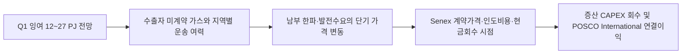

# ACCC, 2025년 1분기 동부 호주 가스 수급 잉여 축소와 단기 부족 위험

## 원문 보존

- 제목: Gas supply for Q1 2025 tightens, as risk of shortfall in short-term remains
- 발행자: Australian Competition and Consumer Commission (ACCC)
- 발표일: 2024-09-27
- 원문: https://www.accc.gov.au/media-release/gas-supply-for-q1-2025-tightens-as-risk-of-shortfall-in-short-term-remains
- 접근 상태: 공개 HTML 본문 확인. ACCC Gas Inquiry 페이지에서 동일 발표일·제목 확인.

### 핵심 원문 문장

> The gas supply surplus in the Australian east coast gas market is forecast to be between 12 and 27 petajoules (PJ) in the first quarter of 2025.

ACCC는 2025년 1분기 잉여가 수출자의 미계약 가스 수출 수준에 따라 달라지고 단기 부족 위험이 남는다고 설명했습니다. 이 수급전망은 Senex의 증산이 시장에 들어오기 전 계약·운송·남부 저장 여력을 함께 봐야 하는 기준선입니다.

## Signal

**2025년 1분기 동부 호주 가스는 총량 잉여가 남아도 지역·시점별 부족 위험이 있어 Senex 증산분의 장기계약과 남부 전송권을 우선 확보해야 하는 시장.**

- 사업축: 포스코인터내셔널 에너지 — Senex upstream·호주 동부 가스 판매
- 사업영향도: 4/5 — 단기 가격과 계약 가능 물량이 Senex 판매단가·증산 회수 시점에 직접 연결.
- 긴급도: 4/5 — 겨울 전 2025년 1분기 계약·저장·수송 조건 확인 필요.
- 평가 신뢰도: 높음(ACCC 공식 전망), 가격·실제 공급은 중간.

## Insight와 문서급 분석

### 판단 질문과 잠정 결론

**호주 동부 가스의 2025년 단기 잉여를 증산 판매의 안전판으로 볼 것인가, 아니면 남부 병목이 가격·물량을 다시 흔들 수 있는 경고로 볼 것인가?** 현재는 후자가 더 타당합니다. 총량 12~27 PJ 잉여는 완충처럼 보이지만 수출자 미계약 가스, 남부 운송, 한파와 발전수요에 조건부입니다. 2025년 겨울 전까지 계약의 지역·인도지점·전송권을 확인해야 합니다.

### 확인된 변화와 시점

2024년 9월 27일 ACCC는 2025년 1분기 총량 잉여 전망과 단기 지역 부족 위험을 함께 제시했습니다.

### 통념과 확인된 간극

통념은 “동부 시장에 잉여가 있으니 가격과 판매량이 안정된다”는 해석입니다. ACCC 확인은 잉여 범위가 좁고, 수출자의 미계약 가스 수출을 전제로 하며, 단기 부족 위험이 여전히 남는다는 것입니다. 따라서 Senex가 증산해도 퀸즐랜드 생산량이 남부 구매자에게 자동으로 같은 가격에 전달되지 않습니다. 시장 평균보다 남부 인도단가·운송비·저장 충전률이 중요한 간극입니다.

### 사업 영향 경로



### 사업 시나리오

| 시나리오 | 관찰 조건 | 사업 의미 | 우선 대응 |
| --- | --- | --- | --- |
| 방어 | 잉여 20 PJ 이상, 남부 저장률 정상, 장기 GSA 유지 | 가격 급등 없이 증산 물량 판매 | 계약별 인도지점·전송원가 확정 |
| 기준 | 잉여 12~20 PJ, 한파·발전수요 변동 | 퀸즐랜드→남부 전송 프리미엄 확대 | 남부 고객과 운송권을 묶은 가격표 작성 |
| 하방 | 미계약 가스 수출 또는 공급차질로 잉여 소멸 | 단기 현물조달·가격상한 부담, 판매량 지연 | 저장·대체수요·고정가격 계약의 스트레스 테스트 |

### 지금 확인할 지표

- ACCC 분기 수급전망과 AEMO Gas Bulletin Board의 남부 저장·파이프라인 흐름
- Senex 고객별 계약 PJ·인도지점·실제 월별 수령량
- 남부 인도단가·운송비와 퀸즐랜드→남부 전송 여력

### 의사결정에 필요한 다음 산출물

1. 2025 Q1 계약·운송권 맵 — 에너지사업 주관, 2024-12-31.
2. PJ당 가격·운송비·회수기간 EBITDA 민감도 — 재무 주관, 2025-01-15.
3. Senex 증산분 중 남부 고정 인도계약 비중 검증표 — 영업 주관, 2025-02-15.

결론을 바꾸는 단일 확인은 Senex 증산분 중 남부 고정 인도계약 비중입니다. 2025년 1분기 실제 수령량이 확인되면 시장 위험을 확정하거나 낮출 수 있습니다.

!!! warning "판단의 한계"

    ACCC는 시장 전체를 전망하며 Senex의 비공개 계약가격·운송권·실제 생산량을 공개하지 않습니다. 금액 영향은 회사 실제 전망이 아닌 조건부 모델입니다.

### impact-estimate 초안

```json
{
  "schema_version": 1,
  "title": "2025 Q1 동부 호주 가스 수급 프리미엄 예비모델",
  "description": "Senex의 남부 인도 가능 물량과 수급 프리미엄이 POSCO International 지분 EBITDA에 미치는 조건부 민감도",
  "as_of": "2024-09-27",
  "confidence": "low",
  "notice": "공개 시장범위와 가정에 기반한 예비 EBITDA 민감도이며 회사 실제값 아님",
  "formula_display": "Senex 판매량(PJ) × 가격·운송 스프레드(AUD/GJ) × POSCO International 지분율",
  "variables": [
    {"id":"sales_pj","label":"영향 판매량","unit":"PJ","min":1,"max":10,"step":1,"default":5,"kind":"assumption","basis":"Senex 계약·판매량 비공개","source_ids":[]},
    {"id":"spread_aud_gj","label":"가격·운송 스프레드","unit":"AUD/GJ","min":0.5,"max":5,"step":0.5,"default":2,"kind":"assumption","basis":"ACCC 가격·수급 위험을 반영한 가정","source_ids":[]},
    {"id":"ownership","label":"POSCO International 지분율","unit":"share","min":0.45,"max":0.55,"step":0.001,"default":0.501,"kind":"assumption","basis":"POSCO 공식 Senex 발표를 publication 단계에서 Source로 연결","source_ids":[]}
  ],
  "outputs": [{"id":"ebitda_swing","label":"예상 EBITDA 민감도","unit":"AUD million","decimals":1,"primary":true,"expression":{"op":"multiply","args":[{"op":"multiply","args":[{"var":"sales_pj"},{"var":"spread_aud_gj"}]},{"var":"ownership"}]}}],
  "presets": [{"id":"defensive","label":"방어","values":{"sales_pj":3,"spread_aud_gj":1,"ownership":0.501}},{"id":"base","label":"기준","values":{"sales_pj":5,"spread_aud_gj":2,"ownership":0.501}},{"id":"pressure","label":"압박","values":{"sales_pj":8,"spread_aud_gj":4,"ownership":0.501}}]
}
```
