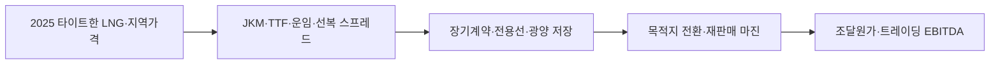

# IEA Gas Market Report Q3 2025

## 원문 보존

- 제목: Gas Market Report, Q3-2025
- 발행자: International Energy Agency (IEA)
- 발표일: 2025-07-22
- 원문: https://www.iea.org/reports/gas-market-report-q3-2025
- 접근 상태: 공개 HTML Executive summary 및 원문 보고서 설명 확인.

### 핵심 원문 문장

> Global LNG supply growth is set to accelerate in 2026 to its fastest pace since 2019, primarily driven by additions in the United States, Canada and Qatar.

> Asian LNG spot prices averaging 28% above levels in the first half of 2024.

IEA는 2025년 상반기 아시아 가스수요가 둔화하고 유럽 LNG 수입은 25% 증가했으며, 2026년 LNG 공급 증가가 7%(40 bcm)로 가속될 것으로 전망했습니다.

## Signal

**2025년 LNG 시장은 2025년 상반기 타이트한 아시아 수요·가격과 2026년 북미·카타르 공급증가가 교차하므로 포스코인터내셔널은 장기조달 고정가보다 목적지·선복·재판매 선택권의 시간가치를 관리해야 하는 글로벌 트레이딩 신호.**

- 사업축: 포스코인터내셔널 에너지 — LNG 조달·전용선·터미널·트레이딩
- 사업영향도: 4/5 — 국제 가격·물량·항로 변동이 구매비와 재판매 마진에 연결.
- 긴급도: 4/5 — 2025~26 계약·선복·저장 포지션을 공급증가 전후로 재점검.
- 평가 신뢰도: 높음(IEA 분석), 실제 가격·분쟁은 중간.

## Insight와 문서급 분석

### 판단 질문과 잠정 결론

**2026년 공급증가 전망만으로 LNG 조달비 하락을 선반영할 것인가?** 아니오. IEA는 2025년 상반기 타이트한 시장과 아시아 현물가격 28% 상승, 유럽과 아시아의 화물경쟁을 확인하면서 2026년 공급 증가를 전망합니다. 공급증가는 가격 완화 가능성이지만 시점·지역·항로에 따라 트레이딩 기회와 조달위험이 동시에 존재합니다.

### 통념과 확인된 간극

통념은 신규 LNG가 늘면 모든 구매자의 가격이 일괄 하락한다는 것입니다. IEA는 2026년 공급 증가의 중심이 미국·캐나다·카타르이며, 2025년에는 유럽 저장주입과 러시아 파이프라인 감소가 아시아 화물을 압박했다고 설명합니다. 동일한 글로벌 물량도 JKM·TTF·운임·목적지 전환 가능성에 따라 포스코인터내셔널의 순마진이 달라집니다.

### 확인된 변화와 시점

2025-07-22 발표 전망은 2025년 상반기 실적과 2025·2026 단기 전망을 구분합니다. 2026년 LNG 공급은 7% 증가 예상이지만, 중동 긴장·항로 차질·러시아 공급 변화의 변동성은 남아 있습니다.

### 사업 영향 경로

### 사업 시나리오

| 시나리오 | 관찰 조건 | 예상 사업 의미 | 우선 대응 |
| --- | --- | --- | --- |
| 방어 | 2026 공급 프로젝트 순조, 가격차 축소 | 조달비 하락·저장가치 감소 | 유연계약과 최소 저장비 최적화 |
| 기준 | 공급증가와 지역 긴장 병존 | 시기별 가격·운임 차익 확대 | 선복·목적지 전환권 확보 |
| 하방 | 프로젝트 지연·중동 항로 차질 | 현물가격·운임 급등, 조달 불안 | 비상 cargo·대체항로·고정물량 점검 |

### 지금 확인할 지표

- JKM·TTF·Henry Hub, 운임·선복 가용일수와 지역 스프레드
- 미국·캐나다·카타르 LNG 프로젝트 실제 start-up·ramp-up
- 포스코인터내셔널 장기계약 목적지 전환권·광양 저장량·전용선 일정

### 의사결정에 필요한 다음 산출물

1. 트레이딩 주관 2025~26 지역가격·운임·목적지 전환 포지션맵(2025-08-15).
2. 물류 주관 전용선 가용일수와 대체항로 비용 민감도(2025-08-31).
3. 재무 주관 조달비·재판매 마진·저장비를 분해한 EBITDA 시나리오(2025-09-15).

### 결론을 확정·폐기할 조건

2026년 공급 프로젝트의 상업운전·현물 스프레드 축소가 확인되면 공급완화 시나리오를 확정합니다. 반대로 프로젝트 지연 또는 항로 차질로 JKM·운임이 재상승하면 유연물량 우선 전략을 강화합니다.

!!! warning "판단의 한계"

    IEA 전망은 세계시장 시나리오이며 회사별 계약가격·선복·목적지 조항을 공개하지 않습니다. 가격 영향액은 회사 실제 전망이 아닙니다.

