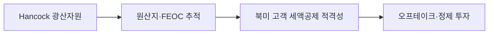

### 판단 질문과 잠정 결론

Hancock 협력을 즉시 30kt 증설로 계획에 반영할 것인가? **아니오, 후보 자원·FEOC 오프테이크로 우선 반영**합니다. 2024년 12월 발표는 연 30kt 합작을 추진한다는 사업 검토이며 입지와 투자액은 후속 결정 사항입니다. 2026년까지 투자계약과 원료 추적성이 확인될 때만 생산능력으로 승격해야 합니다.

### 통념과 확인된 간극

통념은 POSCO가 이미 68kt 생산능력을 확보했으므로 Hancock 30kt가 곧 98kt가 된다고 읽습니다. 그러나 원문은 공동으로 최적 부지를 평가하고 세부 투자액을 이후 정한다고 명시합니다. 실제 간극은 발표 용량과 집행 가능한 용량 사이에 있습니다. FEOC 비적용이라는 표현도 광산 지분·가공단계·고객별 증빙을 통과해야 효력이 생기므로 법무 검증이 필요합니다.

### 확인된 변화와 시점

양사는 2024년 12월 9일 협력계약을 서명했고 12월 16일 공개했습니다. POSCO는 2024년 기준 아르헨티나 염수 25kt와 광석 43kt 시설을 완료했다고 설명했습니다. Hancock은 호주 광산기업이며 이 협력은 광석·염수·수산화리튬·양극재로 이어지는 공급망 다변화 구상입니다.

### POSCO Holdings에 전달되는 사업 영향

포스코는 단가가 낮은 광석을 확보하더라도 한국 정제·물류·인증 비용을 포함한 delivered cost가 경쟁력을 결정합니다. 고객이 FEOC 증빙을 지불한다면 비중국 원료의 마진이 높아질 수 있지만, 증빙 비용과 공급 중단 위험이 동시에 발생합니다.

### 사업 시나리오

| 시나리오 | 관찰 조건 | 사업 의미 | 우선 대응 |
|---|---|---|---|
| 방어 | 합작 지연·대체 계약 부재 | 기존 자산 중심 유지 | 68kt 안정화 |
| 기준 | 입지·원료계약·고객 인증 확정 | 비중국 공급 프리미엄 가능 | 단계 투자 승인 |
| 구조변화 | FEOC 규칙 강화·Hancock 공급 확대 | 북미 고객의 원료 선택 변화 | 장기 오프테이크 선점 |

### 지금 확인할 지표

- 합작법인 입지·투자액·최종투자결정 — 30kt를 계획 용량으로 인정할지 결정합니다.
- 광산별 원산지·지분·가공 단계 증빙 — 고객의 30D/FEOC 적격성 판단을 바꿉니다.
- 호주 정광 가격, 운송비, 한국 수산화리튬 현금원가 — 공급망의 순마진을 검증합니다.

### 결론을 확정·폐기할 조건

- **이 분석이 틀렸다면:** 합작 투자·입지·오프테이크가 확정되고 상업생산 일정이 공개되어야 합니다.
- **한 가지 확인:** 고객이 Hancock 원료를 FEOC 적격으로 사전 인증하는지 확인하면 전략가치를 확정할 수 있습니다.
- **감지 트리거:** 투자계약, 공급량, 원산지 증명, 미국 고객 인증 공시입니다.

### 의사결정에 필요한 다음 산출물

1. 법무·컴플라이언스의 Hancock 단계별 FEOC 추적성 매트릭스.
2. 원료·물류·정제·인증을 포함한 delivered cost 비교표.
3. 고객별 장기계약·가격전가·공급중단 조항 검토안.

!!! warning "판단의 한계"

    30kt는 검토 단계의 명목 용량이며 실제 투자·가동·원가가 아닙니다. Hancock의 공개 자산 정보만으로 POSCO가 확보할 물량과 수익을 확정할 수 없습니다.

