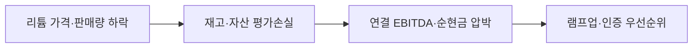

### 판단 질문과 잠정 결론

2024년 리튬 자회사 손실을 일회성 저가로 보고 증설을 계속할 것인가? **조건부 계속**이 타당합니다. 회사는 1.3조원 비현금 손실과 가격·판매량 악화를 공개하는 동시에 신설 염수·광석 플랜트의 조기 안정화와 고객 인증을 회복 경로로 제시했습니다. 2025년 상반기 현금원가와 규격품 출하가 확인되기 전까지 투자 속도는 단계 게이트로 제한해야 합니다.

### 통념과 확인된 간극

통념은 68kt 용량 확보를 곧 이익 창출로 간주하지만, 2024년 결과는 생산능력·매출·손익 인식의 시점이 다름을 보여줍니다. POSCO Future M은 금속가격 하락과 판매량 감소를 겪었고 PPLS·POSCO Argentina에는 손상·평가손실이 반영되었습니다. 반대로 회사는 시설 완공과 운영 효율화가 진행 중이라고 설명하므로 사업 자체의 실패로 단정할 근거도 없습니다.

### 확인된 변화와 시점

2025년 2월 14일 2024년 실적이 발표되었습니다. 매출 72.688조원, 영업이익 2.174조원, 순이익 9480억원이며 비현금 손실은 약 1.3조원입니다. 회사는 아르헨티나 1단계 및 광석 리튬 공장 1·2의 조기 안정화와 고객 인증을 2025년 우선과제로 제시했습니다.

### POSCO Holdings에 전달되는 사업 영향

가격이 회복되어도 고객 인증이 없으면 판매량과 현금흐름이 따라오지 않습니다. 반대로 가격이 낮아도 규격품 수율과 현금원가가 낮아지면 장기 계약으로 버틸 수 있습니다. 따라서 분기 손익을 가격효과·물량효과·원가효과로 분해해야 합니다.

### 사업 시나리오

| 시나리오 | 관찰 조건 | 사업 의미 | 우선 대응 |
|---|---|---|---|
| 방어 | 원가·수율 개선, 가격 정체 | 저가 생존력 상승 | 안정화 투자 유지 |
| 기준 | 가격 일부 회복, 인증 지연 | 매출·현금 전환 후행 | 인증 게이트 강화 |
| 하방 | 가격 추가 하락·손상 확대 | CAPEX 회수 악화 | 증설·비핵심 자산 재검토 |

### 지금 확인할 지표

- 자회사별 톤당 현금원가·규격품 수율 — 가격효과와 생산성 효과를 구분합니다.
- 고객 인증 완료 물량·계약가격·판매량 — 용량이 실제 매출로 전환되는지 확인합니다.
- 손상차손·재고평가·CAPEX 집행 — 현금손실과 비현금 회계를 구분합니다.

### 결론을 확정·폐기할 조건

- **이 분석이 틀렸다면:** 2025년 상반기 연속 흑자와 고객 인증으로 손실이 재현되지 않아야 합니다.
- **한 가지 확인:** POSCO Argentina와 PPLS의 월별 현금원가·규격품 출하 브리지가 결론을 가릅니다.
- **감지 트리거:** 가격 급락, 손상차손 재인식, 인증·출하 지연입니다.

### 의사결정에 필요한 다음 산출물

1. 재무부문의 2024 손실 가격·물량·원가 브리지.
2. 운영부문의 자회사별 수율·정지·현금원가 대시보드.
3. 투자부문의 램프업·인증 단계별 CAPEX 집행 게이트.

!!! warning "판단의 한계"

    회사는 자회사별 세부 원가·판매조건을 공개하지 않았습니다. 공개 실적만으로 향후 수익성을 확정하지 않고, 내부 월별 데이터를 결합해 판단해야 합니다.

