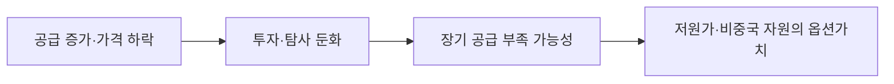

### 판단 질문과 잠정 결론

IEA의 단기 공급과잉 전망을 이유로 포스코의 리튬 자원투자를 늦출 것인가? **단기 가동·고정비 투자는 엄격히, 장기 저원가 자원은 선택적으로 유지**합니다. IEA는 가격 하락과 투자 둔화를 확인하면서도 2030년대 리튬 적자 가능성을 제시해 시점 분리가 필요합니다.

### 통념과 확인된 간극

통념은 가격 하락이 구조적 과잉을 뜻한다고 보지만 IEA는 2024년 리튬 수요가 약 30% 증가했고, 공급 증가는 가격을 눌렀으며, 2030년대에는 수요가 공급을 추월할 수 있다고 봅니다. 반대로 장기 적자 전망도 발표된 프로젝트가 실제로 완공된다는 가정에 의존합니다. 따라서 포스코의 경쟁력은 가격 예측보다 저가에도 가동 가능한 원가와 단계 투자에 달렸습니다.

### 확인된 변화와 시점

IEA는 2025년 5월 21일 보고서에서 리튬 가격이 2023년 이후 80% 이상 하락했고, 2024년 핵심광물 개발투자 증가가 5%에 그쳤다고 밝혔습니다. 리튬 시장은 단기 공급이 충분하지만 2030년대 적자 가능성이 있고, 정제 공급망 집중도는 높다고 평가했습니다.

### POSCO Holdings에 전달되는 사업 영향

포스코는 현재 가격을 기준으로 손익을 방어하면서도, 2030년대 고객 공급을 위한 원료 권리를 잃지 않아야 합니다. 염수와 광석 프로젝트를 같은 가격표로 계산하지 않고, 가동시점·회수율·정제비·계약전가를 분리해야 합니다.

### 사업 시나리오

| 시나리오 | 관찰 조건 | 사업 의미 | 우선 대응 |
|---|---|---|---|
| 방어 | 가격 약세·원가 개선 | 저가 경쟁력 축적 | 운영 최적화 |
| 기준 | 수요 증가·공급 정상화 | 단계 증설 유지 | 인증·오프테이크 확대 |
| 하방 | 신규 프로젝트 조기 가동 | 가격 회복 지연 | CAPEX 단계 축소 |

### 지금 확인할 지표

- LCE 현물·장기계약 가격과 포스코 실현가격 — 가격 하락이 손익에 전달되는 시점을 봅니다.
- 글로벌 승인·완공 프로젝트의 실제 배터리급 출하 — 발표 용량과 실물 공급을 구분합니다.
- POSCO 자원별 현금원가·회수율·가동률 — 저가 생존과 장기 옵션가치를 동시에 평가합니다.

### 결론을 확정·폐기할 조건

- **이 분석이 틀렸다면:** 2030년대 공급이 충분해지는 프로젝트의 실제 집행·출하가 누적되어야 합니다.
- **한 가지 확인:** 포스코 내부 원가곡선에서 20~30년대 가격 스트레스에도 양(+)의 현금마진인지 확인합니다.
- **감지 트리거:** IEA 공급전망 변경, 대형 광산 중단·가동, 장기계약 가격 변동입니다.

### 의사결정에 필요한 다음 산출물

1. 2026~2035 가격·공급·수요 세 시나리오.
2. 염수·광석·DLE별 현금원가 및 CAPEX 회수 비교표.
3. 가격 임계치별 투자 집행·중단 옵션.

!!! warning "판단의 한계"

    IEA 전망은 정책·프로젝트 파이프라인 가정에 기반한 산업 전망이며 POSCO의 계약·원가를 대체하지 않습니다. 가격 예측이 아니라 민감도 프레임으로 사용합니다.

