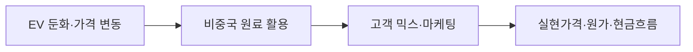

### 판단 질문과 잠정 결론

2026년 리튬 전략의 우선순위를 생산능력 확대에 둘 것인가, 공급망 활용·마케팅·원가 개선에 둘 것인가? **후자**가 경영진의 잠정 방향입니다. 신년사는 EV 둔화와 원료가격 변동을 인정하면서 호주·아르헨티나 비중국 공급망을 활용하고 선택적 투자·공정 최적화를 추진한다고 밝혔습니다.

### 통념과 확인된 간극

통념은 비중국 자원 확보 자체가 고객 프리미엄과 수익성을 보장한다고 보지만, 회사는 동시에 시장 둔화와 경쟁 심화를 언급합니다. 공급망이 구축됐다는 발언과 실제 고객 인증·판매 믹스·톤당 원가 사이에 간극이 있습니다. 2025년 11월 자원투자 후속으로 2026년에는 마케팅 역량과 현금화가 증명되어야 합니다.

### 확인된 변화와 시점

2026년 1월 2일 CEO 신년사는 에너지소재 사업이 EV 둔화·원료가격 변동·공급망 위험을 겪었다고 평가했습니다. 호주·아르헨티나의 비중국 리튬 공급망을 활용해 고객 도달 범위를 넓히고 공정 최적화로 생산원가를 개선하겠다고 제시했습니다. 이는 방향 선언이며 KPI와 예산은 후속 실적에서 확인해야 합니다.

### POSCO Holdings에 전달되는 사업 영향

생산능력을 늘려도 고객 승인·장기계약이 없으면 재고와 고정비가 커집니다. 반대로 기존 68kt와 신규 자원을 고가·비중국 고객에 배분하고 규격품 수율을 개선하면 신규 CAPEX 없이도 마진을 방어할 수 있습니다. 따라서 신년사 방향을 판매·원가 KPI로 번역해야 합니다.

### 사업 시나리오

| 시나리오 | 관찰 조건 | 사업 의미 | 우선 대응 |
|---|---|---|---|
| 방어 | 판매 믹스·원가 개선 | 선택적 투자 효과 | 고객 인증 확대 |
| 기준 | 비중국 물량 증가·가격 정체 | 매출은 늘고 마진 제한 | 계약 전가 점검 |
| 하방 | 가격 하락·판매 전환 실패 | 고정비·재고 위험 | 증산 지연·원가개선 집중 |

### 지금 확인할 지표

- 비중국 원료·제품의 고객 인증·판매 비중 — 공급망 선언의 현금화를 확인합니다.
- 제품별 실현가격·톤당 현금원가·가동률 — 마케팅과 공정 최적화의 효과를 구분합니다.
- 2026 CAPEX·자원 인수 후속 집행률 — 선택적 투자 원칙이 예산에 반영됐는지 봅니다.

### 결론을 확정·폐기할 조건

- **이 분석이 틀렸다면:** 비중국 판매 프리미엄·원가 개선 없이 신규 증설이 수익을 만든다는 증거가 필요합니다.
- **한 가지 확인:** 2026년 1분기 제품별 판매·현금원가 브리지를 확인합니다.
- **감지 트리거:** 비중국 계약, 고객 인증, 가격·원가 변동, 신규 CAPEX 가이던스입니다.

### 의사결정에 필요한 다음 산출물

1. 원료·제품·고객별 비중국 판매 믹스 대시보드.
2. 공정 최적화 투자와 톤당 원가 개선 브리지.
3. 2026년 선택적 투자·증산·보류 트리거 문서.

!!! warning "판단의 한계"

    신년사는 경영진 방향과 우선순위를 보여주지만 제품별 판매량·계약가격·원가 KPI를 공개하지 않습니다. 선언을 실적 전망으로 오인하지 않습니다.

