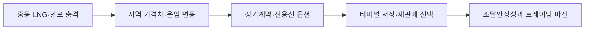

## 판단 제안

글로벌 LNG 판단을 단일 현물가격 전망에서 **조달원·항로·전용선·저장·트레이딩 선택권의 포트폴리오 가치**로 전환해야 합니다. 연초의 지배적 전망은 신규 LNG 물량으로 수급이 완화된다는 것이었지만, 7월 IEA 확인은 중동 분쟁이 그 경로를 훼손하고 호르무즈 통항 회복 시점도 불확실하다는 것입니다.

## 확인된 변화와 해석의 간극

IEA는 중동 분쟁이 완화되던 세계 가스수급을 다시 압박했고 LNG 수출설비 피해가 중기 전망까지 바꿨다고 평가했습니다. 6월 임시 평화 합의 뒤 통항은 회복 중이지만 분쟁 이전 수준을 크게 밑돕니다. 시장은 보통 가격 상승을 조달비 증가로만 보지만, 포스코인터내셔널은 장기계약, 전용선, 광양터미널, 트레이딩을 함께 보유해 변동성을 수익 또는 안정성으로 전환할 여지가 있습니다. **지배 변수는 가격 방향보다 목적지 전환이 가능한 물량과 선복의 즉시 사용 가능성**입니다.

## 사업 영향 경로

장기계약은 가격이 오르면 유리하지만 목적지·인수 의무가 경직돼 있으면 옵션이 아닙니다. 전용선도 가용일정과 항로 제약을 함께 봐야 합니다. 따라서 자산 보유량이 아니라 실제 전환 가능한 물량·시간·비용을 한 장의 포지션으로 관리해야 합니다.

## 조건부 시나리오

| 시나리오 | 확인 조건 | 사업 의미 | 대응 |
| --- | --- | --- | --- |
| 충격 지속 | 통항·설비 복구 지연, 가격차 확대 | 옵션가치 상승·조달위험 병존 | 유연물량 우선 배치 |
| 빠른 정상화 | 항로·설비 회복 | 가격차 축소 | 저장·선복 비용 최소화 |
| 지역 분절 | 특정 항로만 제약 | 지역별 가격차 장기화 | 목적지 전환권 극대화 |

판단을 뒤집는 사실은 장기계약과 전용선이 목적지 제한·가용일정 때문에 실제 재배치에 사용할 수 없다는 내부 포트폴리오 자료입니다.

## 지금 확인할 지표

- 호르무즈 LNG 통항량과 중동 액화설비 복구 일정
- JKM·TTF·Henry Hub 가격차, 운임과 선박 가용일수
- 목적지 전환 가능 장기물량, 광양 저장여력과 재판매 리드타임

## 다음 산출물과 책임

1. LNG트레이딩 주관 30·90·180일 통합 포지션맵 — 2026-08-25
2. 물류부문 주관 전용선 가용일정·우회항로 비용표 — 2026-08-31
3. 리스크부문 주관 지역분절 스트레스 시나리오 — 2026-09-15

모니터링 트리거는 통항 회복 지연, 지역 가격차 급변, 선박 가용성 하락입니다.

!!! warning "판단의 한계"

    공개자료는 포스코인터내셔널 계약의 목적지·가격공식·선복 일정을 보여주지 않습니다. 옵션가치를 금액으로 산정하지 않았으며 내부 포지션 자료가 있어야 실행 결론을 낼 수 있습니다.
