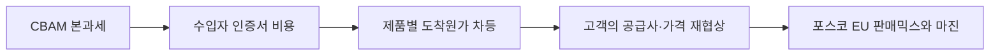

## 판단 제안

EU향 철강의 판단 단위를 판매톤수에서 **고객·품목별 탄소조정 후 공헌이익**으로 바꿔야 합니다. 통상적 해석은 CBAM을 수입자가 처리하는 규제비용으로 보는 것이지만, 확인된 변화는 2026년 1월 1일부터 신고·인증서 구매가 실제 의무가 됐다는 점입니다. 포스코가 직접 인증서를 사지 않더라도 수입자의 비용은 계약가격, 공급사 선택, 저탄소 프리미엄 요구로 되돌아옵니다.

## 확인된 변화와 해석의 간극

연간 50톤을 넘는 EU 수입자는 승인 신고자가 되어 내재배출량에 해당하는 인증서를 제출합니다. 2026년 인증서 가격은 EU ETS 분기 평균과 연동되고 철강도 대상입니다. 시장의 지배적 설명은 “고탄소 수입재에 비용이 붙는다”는 수준이지만, 실제 미확인 핵심은 포스코 제품별 검증 배출량과 고객 계약의 비용 전가 조항입니다. **지배 변수는 제품별 검증 내재배출량과 고객이 인정하는 데이터 품질**입니다.

## 사업 영향 경로

배출량이 낮고 증빙이 완전한 제품은 비용방어뿐 아니라 프리미엄 근거가 될 수 있습니다. 반대로 평균값이나 보수적 기본값에 의존하면 실제 공정개선과 무관하게 비용이 커질 수 있습니다. 따라서 영업, 생산, 탄소회계가 같은 제품코드로 데이터를 연결해야 합니다.

## 조건부 시나리오

| 시나리오 | 확인 조건 | 사업 의미 | 대응 |
| --- | --- | --- | --- |
| 우위 확보 | 검증 배출량이 경쟁재보다 낮고 고객 인정 | 프리미엄·장기계약 여지 | 저탄소 제품 우선 배정 |
| 비용 흡수 | 차이는 작고 고객 전가 거부 | 단위마진 하락 | 가격조항 재협상 |
| 판매 이탈 | 기본값 적용 또는 증빙 지연 | 도착원가 급등·대체조달 | 데이터 보완과 물량 재배치 |

이 판단을 뒤집는 사실은 핵심 고객이 CBAM 비용을 전액 부담하면서 공급사 선택에 반영하지 않는다는 계약 증거입니다.

## 지금 확인할 지표

- EU향 SKU별 검증 내재배출량, 기본값 적용 비중과 검증 완료율
- 고객별 인증서 비용 부담·가격조정 조항과 재협상 일정
- ETS 분기 평균을 반영한 고객별 탄소조정 후 공헌이익

## 다음 산출물과 책임

1. EU영업 주관 고객×SKU별 CBAM 노출 손익표 — 2026-08-31
2. 생산·탄소회계 공동 배출량 증빙 결손 목록 — 2026-08-25
3. 계약갱신 고객별 가격조정 협상안 — 2026-09-15

모니터링 트리거는 기본값 적용 SKU 비중 상승, 고객의 비용전가 거부, ETS 가격 급등 중 하나입니다.

!!! warning "판단의 한계"

    공개자료에는 포스코 제품별 실제 배출량과 고객 계약조건이 없습니다. 비용액을 계산하지 않았으며, 내부 배출·판매·계약 자료가 결합돼야 우선순위를 확정할 수 있습니다.

