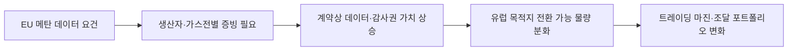

<!-- AUTO-GENERATED BY market-sensing-intelligence. DO NOT EDIT. -->

# EU LNG 수입의 메탄 검증요건 시행 임박

!!! abstract "한 문장 시그널"

    **포스코인터내셔널은 LNG 계약별 생산지·갱신일·메탄 데이터·감사권을 연결해 2027년 이후 유럽 목적지 전환이 가능한 물량을 다시 구분해야 합니다.**

| 사업축 | 사업영향도 | 긴급도 | 평가일 |
| --- | ---: | ---: | --- |
| 에너지 | **4/5** | **5/5** | 2026-08-19 |

## 왜 중요한가

EU는 2027년부터 신규·갱신 가스계약에 생산단계 메탄 측정·보고·검증 동등성 또는 OGMP 2.0 최고 보고수준과 검증을 요구합니다. 가격과 선박이 있어도 계약상 데이터 권리가 없으면 유럽 판매선택권이 약해질 수 있어 LNG 포트폴리오를 계약 단위로 점검해야 합니다.

### 판단 근거

- **사업 영향:** 메탄 데이터와 검증권은 LNG의 유럽 목적지 전환 가능성과 트레이딩 선택권 가치에 직접 영향을 줄 수 있습니다.
- **긴급성:** 2027년 1월 요건 시행과 2026년 9월 투명성 데이터베이스 공개 전에 신규·갱신 계약의 증빙 공백을 확인해야 합니다.
- **대응 시한:** 2026-10-31

!!! warning "기존 전제를 무엇이 깨는가"

    **기존 전제:** LNG의 유럽 판매선택권은 목적지 조항·선박·터미널·지역 가격차로 대부분 결정된다는 전제입니다.

    **전제를 깨는 관측:** EU가 생산지 메탄 측정·보고·검증과 독립검증을 수입자가 입증하도록 해 데이터 권리를 시장접근 조건으로 만들었습니다.

    **바꿀 결정:** 신규·갱신 LNG 계약의 가격심사에 생산지 추적, 데이터 제공·감사권, 위반책임과 유럽 전환 가능성을 함께 반영해야 합니다.

    **반증 확인:** 계약 포트폴리오 전 물량이 이미 동등성 또는 OGMP 2.0 Level 5 검증과 데이터 감사권을 충족하는지 확인합니다.

## 상세 분석

## 계약 정보권이 가르는 유럽 판매선택권

### 판단 질문

**판단 질문:** LNG의 유럽 판매 가능성을 가격과 목적지 전환권만으로 판단해도 되는가?

### 잠정 결론

**잠정 결론:** 2027년부터는 부족합니다. 새로 체결하거나 갱신한 계약은 생산지의 메탄 측정·보고·검증 체계 또는 OGMP 2.0 최고 보고수준과 검증을 입증해야 합니다. 데이터 권리를 확보하지 못한 물량은 물리적으로 운송할 수 있어도 유럽 판매선택권이 약해질 수 있습니다.

### 가격·물류 통념과 검증요건의 간극

통념은 LNG 선택권이 선박, 터미널, 목적지 조항과 지역 가격차로 결정된다는 것입니다. EU 규정은 생산단계 메탄 데이터와 검증을 수입자가 입증하도록 해 계약의 정보권을 시장접근 조건으로 바꿉니다. 공급자가 데이터를 갖고 있더라도 트레이더가 전달·감사할 권리를 계약에 확보하지 못하면 문제가 생길 수 있습니다.

완화 근거도 있습니다. 기존 계약에는 합리적 노력을 요구하고, EU는 공급안보를 보전하는 실용적 이행을 강조했습니다. 2028년 보고와 2030년 강도상한도 단계적으로 적용됩니다. 따라서 2027년 즉시 모든 비준수 물량이 배제된다고 단정하지 않고, 신규·갱신 계약부터 선택권 가치가 갈라지는 것으로 봅니다.

## 계약 시점별 검증의무와 포트폴리오 전달 경로

### 규정 발효와 단계별 적용 시점

**확인된 변화:** EU 메탄규정은 2024년 8월 4일 발효됐습니다. 2027년 1월 1일부터 2024년 8월 4일 이후 체결·갱신 계약에 측정·보고·검증 동등성 또는 OGMP 2.0 Level 5와 검증 요건이 적용됩니다. 메탄 투명성 데이터베이스는 2026년 9월 개시 예정이며, 2028년 강도 보고와 2030년 강도상한이 이어집니다.

### 포스코인터내셔널의 선택권 약화 경로

**사업 영향:** 포스코인터내셔널의 LNG 물량이 유럽으로 직접 향하지 않더라도 목적지 전환권은 포트폴리오 가치의 일부입니다. 메탄 원산지·경로·측정자료를 연결하지 못하면 가격차가 벌어져도 유럽 전환이 지연되거나 비용이 늘 수 있습니다. 신규 계약과 갱신 건은 가격조건과 함께 데이터 제공, 독립검증, 위반 책임을 묶어 검토해야 합니다.

## 조건별 대응 분기와 주간 관찰값

### 유럽 판매 가능성의 조건부 분기

**조건부 시나리오:**

| 시나리오 | 관찰 조건 | 예상되는 사업 의미 | 우선 대응 |
| --- | --- | --- | --- |
| 실용적 유예 | 회원국이 합리적 노력 폭넓게 인정 | 단기 영향 제한 | 증빙 공백 목록 작성 |
| 계약 분화 | 신규·갱신 계약에 엄격 적용 | 유럽 선택권 가치 차등 | 데이터 조항 표준화 |
| 강도 가격화 | 2028~2030 강도 기준이 비용에 반영 | 고배출 물량 할인·전환 제한 | 생산지별 메탄 포트폴리오 관리 |

### 계약·검증·집행 관찰 목록

**이번 주 확인할 지표:**

- 계약별 체결·갱신일과 생산지·가스전 추적 가능성
- OGMP 2.0 보고수준, 독립검증 범위와 데이터 감사권
- EU 회원국별 집행지침·벌칙과 2026년 데이터베이스 공개항목

## 계약 단위 검증과 후속 의사결정 자료

### 경고 수준을 가를 핵심 확인

**반증 조건:** 계약별 원산지·메탄데이터·감사권의 연결표를 확인해 포트폴리오 전 물량이 동등성 또는 검증요건과 데이터 권리를 이미 충족하면 경고를 낮춥니다.

**확인 담당:** 포스코인터내셔널 LNG 계약 담당과 EU 규제 대응 담당이 확인합니다.

**감지 트리거:** 주요 EU 수입국이 신규계약 통관에 생산지별 Level 5 검증을 실제 요구하면 경고를 강화합니다.

### 계약·물량·표준조항 산출물

**다음 산출물:**

1. LNG 계약별 갱신일·생산지·메탄 검증수준 매트릭스
2. 유럽 전환 가능 물량과 비준수 물량의 선택권 가치 비교
3. 신규 계약에 넣을 데이터 제공·감사·면책·가격조정 표준조항

### 공개정보만으로 확정할 수 없는 범위

!!! warning "판단의 한계"

    회원국별 집행과 벌칙 적용은 계속 구체화되고 있습니다. 포스코인터내셔널의 계약상 목적지 권리, 생산지, 메탄 데이터 접근권은 공개되지 않아 실제 유럽 전환 가능 물량을 계산하지 못했습니다.

??? note "연결된 판단 근거"

    - **methane mrv effective date:** 2027-01-01 · [[sources/SRC-20260819-CE495A5C|원문 근거]]
    - **methane contract scope:** 2024-08-04 이후 체결·갱신 계약 · [[sources/SRC-20260819-CE495A5C|원문 근거]]
    - **methane mrv requirement:** 동등한 MRV 또는 OGMP 2.0 Level 5와 검증 · [[sources/SRC-20260819-CE495A5C|원문 근거]]
    - **methane database launch:** 2026-09 예정 · [[sources/SRC-20260819-CE495A5C|원문 근거]]
    - **business axis:** 에너지 · [[sources/SRC-20260819-CE495A5C|원문 근거]]
    - **business impact score 1 to 5:** 4 · [[sources/SRC-20260819-CE495A5C|원문 근거]]
    - **business impact rationale:** 메탄 데이터와 검증권은 LNG의 유럽 목적지 전환 가능성과 트레이딩 선택권 가치에 직접 영향을 줄 수 있습니다. · [[sources/SRC-20260819-CE495A5C|원문 근거]]
    - **urgency score 1 to 5:** 5 · [[sources/SRC-20260819-CE495A5C|원문 근거]]
    - **urgency rationale:** 2027년 1월 요건 시행과 2026년 9월 투명성 데이터베이스 공개 전에 신규·갱신 계약의 증빙 공백을 확인해야 합니다. · [[sources/SRC-20260819-CE495A5C|원문 근거]]
    - **assessment confidence:** high · [[sources/SRC-20260819-CE495A5C|원문 근거]]
    - **assessed at:** 2026-08-19 · [[sources/SRC-20260819-CE495A5C|원문 근거]]
    - **impact path:** EU 메탄 검증요건 → 생산지·가스전별 증빙과 계약상 데이터권 필요 → 유럽 목적지 전환 가능 물량 분화 → 트레이딩 마진·조달 가치 변화 · [[sources/SRC-20260819-CE495A5C|원문 근거]]
    - **recommended follow up:** 계약별 체결·갱신일, 생산지, OGMP 보고수준, 독립검증, 데이터 감사권을 2026년 10월까지 한 표로 점검 · [[sources/SRC-20260819-CE495A5C|원문 근거]]

## 원문

- **EU methane regulation requirements for fossil-fuel imports** · European Commission · 2026-07-20 · [원문 링크](https://energy.ec.europa.eu/topics/carbon-management-and-fossil-fuels/methane-emissions_en) · [[sources/SRC-20260819-CE495A5C|보관 원문]]
