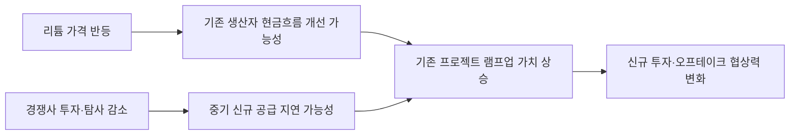

<!-- AUTO-GENERATED BY market-sensing-intelligence. DO NOT EDIT. -->

# 리튬 투자 공백이 기존 생산능력의 전략가치를 높이는 구간

!!! abstract "한 문장 시그널"

    **리튬 가격 반등과 경쟁사 투자 급감이 동시에 나타나 포스코홀딩스의 기존 프로젝트 램프업과 선별 투자 조건을 재평가할 시점입니다.**

| 사업축 | 사업영향도 | 긴급도 | 평가일 |
| --- | ---: | ---: | --- |
| 리튬 | **5/5** | **4/5** | 2026-08-18 |

## 왜 중요한가

가격 회복만이 아니라 업계 CAPEX와 탐사 지출 감소가 중기 공급 부족을 심화할 가능성이 핵심입니다. 실행 가능한 생산능력과 장기 오프테이크의 희소성이 높아질 수 있습니다.

### 판단 근거

- **사업 영향:** 리튬 가격이 두 배 이상 반등했지만 업계 투자는 약 40% 감소해 현재 현금흐름 개선과 중기 공급부족 가능성이 동시에 커지는 투자창구가 형성됐다.
- **긴급성:** 산업 전반의 투자 축소기에 경쟁 프로젝트·자산가치·장기계약 조건이 재평가되므로 2026년 투자계획 확정 전에 재검토할 가치가 높다.
- **대응 시한:** 2026-09-30

## 상세 분석

### 확인된 변화와 핵심 해석

IEA는 리튬 가격이 두 배 이상 반등했고 2035년까지 공급 부족이 지속될 것으로 전망했습니다. 동시에 2025년 리튬 기업 투자는 약 **40%**, 탐사 지출은 약 **45%** 감소했다고 보고했습니다. 가격 회복과 투자 위축이 동시에 나타났다는 점이 이 시그널의 핵심입니다.

가격 상승만 보면 단기 시황 반등일 수 있습니다. 그러나 낮은 가격기에 경쟁 프로젝트의 자금 투입과 탐사가 줄었다면 수년 뒤 공급 파이프라인이 약해질 수 있습니다. 광산·염호·정제 프로젝트는 투자 결정부터 안정 생산까지 시간이 걸리므로 현재의 투자 공백은 당장 공급량보다 중기 생산능력에 늦게 반영될 가능성이 큽니다.

### 포스코홀딩스에 전달되는 사업 영향

첫 번째 영향은 **기존 프로젝트의 실행가치 재평가**입니다. 이미 건설·시운전·램프업 단계에 있는 생산능력은 신규 프로젝트보다 공급시장에 빨리 진입할 수 있어 투자 공백기에 상대적 가치가 높아질 수 있습니다. 두 번째는 **선별 투자 기회**입니다. 자금조달이 어려워진 경쟁 자산이 매각되거나 파트너를 찾을 수 있지만, 가격 반등만 믿고 고비용 자산을 인수하면 다음 하락기에 손실이 확대될 수 있습니다. 세 번째는 **장기계약 조건 변화**입니다. 고객이 미래 공급 부족을 우려하면 물량 확보를 위해 가격식·선급금·투자분담 조건을 조정할 가능성이 있습니다.

### 사업 시나리오

| 시나리오 | 관찰 조건 | 포스코홀딩스 의미 | 우선 대응 |
| --- | --- | --- | --- |
| **공급 타이트닝** | 투자 감소 지속, 수요 증가 유지, 프로젝트 지연 확대 | 기존 생산능력과 오프테이크 가치 상승 | 램프업 병목 제거와 고객조건 재협상 |
| **완만한 균형** | 가격 회복으로 경쟁 투자 재개 | 선별 투자 여지는 있으나 희소성 프리미엄 제한 | 원가경쟁력 중심의 프로젝트 선별 |
| **재과잉** | 수요 둔화 또는 저비용 공급의 빠른 증설 | 고비용 프로젝트 손상 위험 | 단계투자·중단 조건과 현금 보전 우선 |

현재 공개정보만으로 어느 시나리오가 확정됐다고 판단할 수 없습니다. 중요한 것은 단일 가격 전망을 채택하는 것이 아니라 각 프로젝트가 세 시나리오에서 버틸 수 있는지를 비교하는 것입니다.

### 지금 확인할 지표

- 아르헨티나·호주 프로젝트별 현금원가, 손익분기 가격과 램프업 속도
- 생산수율·회수율·품질 안정화 등 계획 대비 램프업 병목
- 경쟁사 CAPEX 취소·연기, 파트너 철수와 자산 매각 가격
- 신규 광산·염호의 최종투자결정과 실제 착공 간 시차
- 고객 장기계약의 가격식, 최소구매 조건과 물량 확정 시점
- 배터리 수요 변화와 재활용 공급이 1차 리튬 수요를 대체하는 속도

### 의사결정에 필요한 다음 산출물

1. 프로젝트별 원가곡선과 가격 시나리오별 현금흐름
2. 램프업 한 달 지연이 생산량·현금흐름에 미치는 민감도
3. 경쟁 자산·오프테이크 후보의 가격과 실행 가능성 비교표
4. 증설·인수·보류 결정을 나누는 가격 및 운영 트리거

!!! warning "판단의 한계"

    IEA 전망은 산업 전체 방향을 보여주지만 포스코홀딩스 개별 프로젝트의 경제성을 확정하지 않습니다. 프로젝트별 내부 원가곡선, 품질·수율, 고객 계약식을 결합하기 전에는 투자 확대 또는 축소의 최종 결론으로 사용해서는 안 됩니다.

??? note "연결된 판단 근거"

    - **business impact score 1 to 5:** 5 · [[sources/SRC-20260818-F3E8E66B|원문 근거]]
    - **urgency score 1 to 5:** 4 · [[sources/SRC-20260818-F3E8E66B|원문 근거]]
    - **impact path:** 리튬 수요 증가·가격 반등 + 업계 투자 급감 → 단기 판매가격 개선과 2030년대 공급부족 가능성 → 기존 프로젝트 램프업·신규 투자·오프테이크 조건의 가치 상승 · [[sources/SRC-20260818-F3E8E66B|원문 근거]]
    - **business impact rationale:** 리튬 가격이 두 배 이상 반등했지만 업계 투자는 약 40% 감소해 현재 현금흐름 개선과 중기 공급부족 가능성이 동시에 커지는 투자창구가 형성됐다. · [[sources/SRC-20260818-F3E8E66B|원문 근거]]
    - **recommended follow up:** 아르헨티나·호주 프로젝트별 손익분기 가격과 램프업, 경쟁사 CAPEX 취소·연기, 고객 장기계약 가격식을 월간 재평가 · [[sources/SRC-20260818-F3E8E66B|원문 근거]]
    - **business axis:** 리튬 · [[sources/SRC-20260818-F3E8E66B|원문 근거]]
    - **urgency rationale:** 산업 전반의 투자 축소기에 경쟁 프로젝트·자산가치·장기계약 조건이 재평가되므로 2026년 투자계획 확정 전에 재검토할 가치가 높다. · [[sources/SRC-20260818-F3E8E66B|원문 근거]]
    - **assessment confidence:** medium · [[sources/SRC-20260818-F3E8E66B|원문 근거]]
    - **assessed at:** 2026-08-18 · [[sources/SRC-20260818-F3E8E66B|원문 근거]]

## 원문

- **Global Critical Minerals Outlook 2026: lithium market and investment signals** · International Energy Agency · 2026-07-16 · [원문 링크](https://www.iea.org/reports/global-critical-minerals-outlook-2026/executive-summary) · [[sources/SRC-20260818-F3E8E66B|보관 원문]]
