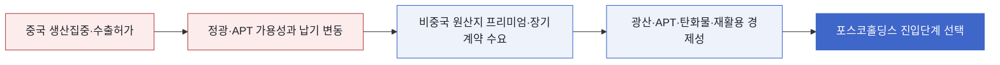

<!-- AUTO-GENERATED BY market-sensing-intelligence. DO NOT EDIT. -->

# 중국 텅스텐 통제 뒤 국제가격 급등

!!! abstract "한 문장 시그널"

    **포스코홀딩스는 텅스텐을 희토류와 별도의 우선 후보로 올리고 국내 고객의 장기구매 조건을 확인한 뒤 병목 가치사슬에 진입해야 합니다.**

| 사업축 | 사업영향도 | 긴급도 | 평가일 |
| --- | ---: | ---: | --- |
| 리튬 | **5/5** | **4/5** | 2026-08-19 |

## 왜 중요한가

중국은 2025년 2월 일부 텅스텐 제품·합금·기술을 수출허가 대상으로 전환했습니다. USGS는 중국이 2025년 세계 광산생산의 약 79%를 차지했고 로테르담 정광·APT 가격이 두 배 안팎 올랐다고 집계했습니다. 포스코홀딩스는 현물가격을 추종하기보다 국내 수요기업의 품목별 최소구매와 가격공식이 성립하는 공급망 단계를 찾아야 합니다.

### 판단 근거

- **사업 영향:** 중국의 세계 광산생산 비중 약 79%와 수출허가제가 겹친 뒤 국제가격이 두 배 안팎 올라, 텅스텐은 국가안보성과 비중국 공급 프리미엄을 함께 검증할 우선 후보입니다.
- **긴급성:** 수출통제가 이미 시행 중이고 2025년 가격상승이 확인돼, 대체 공급원·정광·APT·재활용 중 어느 단계가 병목인지 즉시 확인할 필요가 있습니다.

!!! warning "기존 전제를 무엇이 깨는가"

    **기존 전제:** 국가안보형 신규진입 검토는 희토류를 중심으로 시작하고 텅스텐은 후순위로 둘 수 있습니다.

    **전제를 깨는 관측:** 중국이 일부 텅스텐 제품과 기술을 수출허가 대상으로 전환한 가운데 중국의 세계 광산생산 비중은 약 79%였고 2025년 정광·APT 국제가격이 두 배 안팎 상승했습니다.

    **바꿀 결정:** 텅스텐을 우선 실사 후보에 포함하고 광산·APT·탄화물·재활용 중 국내 고객 병목과 장기계약이 확인되는 단계를 먼저 비교합니다.

    **반증 확인:** 중국 외 신규생산 증가와 수출허가 안정화 뒤에도 국내 고객이 비중국 공급 프리미엄을 지불하는지 확인합니다.

## 상세 분석

## 텅스텐 우선 실사를 가르는 고객 구매조건

판단 질문: 텅스텐을 희토류와 별도로 전략광물 신규진입 우선 후보에 올려야 합니까?

잠정 결론: 예, 중국 생산집중·수출허가·가격상승이 동시에 확인돼 우선 실사 가치가 높습니다. 다만 광산 전체를 인수하기보다 국내 수요기업이 실제로 필요로 하는 정광, 파라텅스텐산암모늄(APT), 탄화텅스텐, 재활용 단계 중 병목을 먼저 찾아야 합니다.

## 공급불안과 장기 투자수익의 간극

확인된 변화: 중국 상무부와 해관총서는 2025년 2월 4일부터 일부 텅스텐 제품·합금과 관련 생산기술을 허가 대상에 포함했습니다. USGS는 2025년 중국 생산을 6만7천 톤, 세계 생산을 8만5천 톤으로 추정했습니다. 중국은 세계 텅스텐 광산생산의 약 79%를 차지했으며, 로테르담 65% 정광 가격은 톤 단위당 266달러에서 551달러로, APT는 331달러에서 675달러로 상승했습니다. 이 변화는 수출통제 이후의 시장 동향이지만 가격상승 전부를 통제 하나의 효과로 단정할 수는 없습니다.

중국의 수출통제와 가격상승은 비중국 공급자에게 기회를 만들지만 높은 현물가격이 장기간 유지된다는 보장은 아닙니다. 카자흐스탄 신규 생산과 북미 지원사업도 움직였습니다. 따라서 “공급이 집중됐으니 광산은 무조건 수익성 있다”가 아니라 장기구매가격이 신규 프로젝트 원가와 투자회수기간을 지지하는지가 핵심입니다.

## 공급망 병목별 기회와 과잉투자 위험

사업 영향: 텅스텐은 원소 이름보다 공급망 어느 단계의 병목을 통제할 수 있는지가 사업가치를 결정합니다.

- 포착할 기회: 한국의 방산·초경공구·반도체 수요기업이 비중국 원산지와 공급보장을 위해 장기 프리미엄을 지불한다면, 광산보다 APT 전환·탄화물·스크랩 회수에서 더 빠른 진입기회를 만들 수 있습니다.
- 방어할 위험: 2025년 가격급등을 영구 가격으로 가정하거나 중국 외 신규광산 증가를 무시하면 과도한 인수가격을 지불할 수 있습니다. 기준 가격은 장기계약과 하방 시나리오로 검증해야 합니다.
- 미실행 기회비용: 통제 이후 수요기업이 먼저 다른 비중국 공급자와 계약하면 고객 검증, 공동투자, 정책금융을 묶을 수 있는 초기 협상창구를 놓칠 수 있습니다.
- 결정 전환 조건: 국내 고객의 품목별 최소구매량과 가격공식이 신규 공급원 원가를 지지하면 실사로 전환하고, 중국 외 증산으로 가격이 정상화되는데도 프리미엄 계약이 없으면 투자를 보류합니다.

## 조건부 시나리오

조건부 시나리오:

| 시나리오 | 관찰 조건 | 예상되는 사업 의미 | 우선 대응 |
| --- | --- | --- | --- |
| 공급보장 프리미엄 지속 | 중국 허가 지연과 고객 장기계약 프리미엄 지속 | 비중국 APT·재활용의 투자회수 가능성 상승 | 고객 공동투자와 최소구매계약 우선 협상 |
| 가격 정상화·안보수요 유지 | 가격은 하락하지만 원산지 다변화 요구 유지 | 현물차익보다 안정공급 수수료·계약가치가 중요 | 저원가 자산과 중간재 가공 조합 비교 |
| 대체공급 급증 | 카자흐스탄·북미 등 증산, 고객 프리미엄 소멸 | 고가 광산 인수의 하방 위험 확대 | 소수지분·구매권·재활용 옵션으로 축소 |

이 시나리오는 미래 가격을 맞히기 위한 예측이 아니라 장기계약이 투자결정을 지탱하는지 확인하는 틀입니다.

## 최소구매량과 가격공식이라는 투자 전환선

## 확인할 지표

이번 주 확인할 지표:

- 한국의 텅스텐 품목별 수입량·중국 의존도·재고일수 — 실제 공급안보 노출을 구분합니다.
- 정광, APT, 탄화텅스텐, 초경스크랩의 장기계약 가격공식 — 가치가 생기는 단계를 가릅니다.
- 카자흐스탄·호주·북미 프로젝트의 실제 출하량과 원가 — 중국 외 공급 증가의 속도를 확인합니다.
- 국내 방산·공구·반도체 고객의 비중국 원산지 요구와 최소구매량 — 안보 프리미엄의 지속성을 확인합니다.

반증 조건: 국내 핵심 고객의 품목별 최소구매량과 장기 가격공식이 신규 공급원 원가를 지지하는지 확인합니다. 중국 외 생산이 빠르게 늘고 수출허가가 안정화돼 고객이 장기 프리미엄을 지불하지 않으면 우선 실사 결론을 폐기합니다.

확인 담당: 전략광물 사업개발 및 국내 고객 영업 담당입니다.

감지 트리거: 중국 수출허가 규정 변경, 월별 수출량 급변, USGS 생산량 수정, 주요 비중국 프로젝트 첫 출하가 발생하는 상태입니다.

## 의사결정에 필요한 다음 산출물

다음 산출물:

1. 한국 텅스텐 공급망의 품목별 수입의존도·재고·고객지도
2. 광산, APT, 탄화물, 재활용의 원료수율·CAPEX·납기·판매계약 비교표
3. 현물가격이 2024년 수준으로 돌아가는 하방 스트레스 테스트
4. 고객 최소구매계약을 선행조건으로 둔 단계별 투자안

!!! warning "판단의 한계"

    공개자료에는 포스코홀딩스의 목표 물량·원가·투자비와 국내 고객별 구매조건이 없습니다. 현재는 텅스텐을 우선 실사 후보로 올릴 근거를 제시한 것이며, 특정 광산이나 가공설비의 손익을 확정한 것이 아닙니다.

??? note "연결된 판단 근거"

    business axis: 전략광물 · 원문 근거 assessment confidence: high · 원문 근거 china world production share 2025: 약 79% · 원문 근거 assessed at: 2026-08-19 · 원문 근거 export control effective date: 2025-02-04 · 원문 근거 rotterdam apt price 2025: mtu당 331달러에서 675달러 · 원문 근거 urgency rationale: 수출통제가 이미 시행 중이고 2025년 가격상승이 확인돼, 대체 공급원·정광·APT·재활용 중 어느 단계가 병목인지 즉시 확인할 필요가 있습니다. · 원문 근거 recommended follow up: 국내 초경공구·방산·반도체 수요기업의 품목별 수입의존도와 장기구매 의향을 확인하고 광산·APT·재활용 세 단계의 진입경제성을 동일 기준으로 비교 · 원문 근거 impact path: 중국 생산집중·수출허가 → 비중국 정광·APT 공급 부족과 가격상승 → 텅스텐 광산·중간재·재활용 진입의 계약가치와 투자회수조건 변화 · 원문 근거 business impact score 1 to 5: 5 · 원문 근거 urgency score 1 to 5: 4 · 원문 근거 business impact rationale: 중국의 세계 광산생산 비중 약 79%와 수출허가제가 겹친 뒤 국제가격이 두 배 안팎 올라, 텅스텐은 국가안보성과 비중국 공급 프리미엄을 함께 검증할 우선 후보입니다. · 원문 근거 world mine production 2025 t: 85000 · 원문 근거 controlled scope: 일부 텅스텐 제품·합금·생산기술 · 원문 근거 china mine production 2025 t: 67000 · 원문 근거 rotterdam concentrate price 2025: mtu당 266달러에서 551달러 · 원문 근거

??? note "연결된 판단 근거"

    - **business axis:** 리튬 · [[sources/SRC-20260819-AFB27A7E|원문 근거]] · [[sources/SRC-20260819-745DCE52|원문 근거]]
    - **business impact score 1 to 5:** 5 · [[sources/SRC-20260819-AFB27A7E|원문 근거]] · [[sources/SRC-20260819-745DCE52|원문 근거]]
    - **business impact rationale:** 중국의 세계 광산생산 비중 약 79%와 수출허가제가 겹친 뒤 국제가격이 두 배 안팎 올라, 텅스텐은 국가안보성과 비중국 공급 프리미엄을 함께 검증할 우선 후보입니다. · [[sources/SRC-20260819-AFB27A7E|원문 근거]] · [[sources/SRC-20260819-745DCE52|원문 근거]]
    - **urgency score 1 to 5:** 4 · [[sources/SRC-20260819-AFB27A7E|원문 근거]] · [[sources/SRC-20260819-745DCE52|원문 근거]]
    - **urgency rationale:** 수출통제가 이미 시행 중이고 2025년 가격상승이 확인돼, 대체 공급원·정광·APT·재활용 중 어느 단계가 병목인지 즉시 확인할 필요가 있습니다. · [[sources/SRC-20260819-AFB27A7E|원문 근거]] · [[sources/SRC-20260819-745DCE52|원문 근거]]
    - **assessment confidence:** medium · [[sources/SRC-20260819-AFB27A7E|원문 근거]] · [[sources/SRC-20260819-745DCE52|원문 근거]]
    - **assessed at:** 2026-08-19 · [[sources/SRC-20260819-AFB27A7E|원문 근거]] · [[sources/SRC-20260819-745DCE52|원문 근거]]
    - **impact path:** 중국 생산집중·수출허가 → 비중국 정광·APT 공급 부족과 가격상승 → 텅스텐 광산·중간재·재활용 진입의 계약가치와 투자회수조건 변화 · [[sources/SRC-20260819-AFB27A7E|원문 근거]] · [[sources/SRC-20260819-745DCE52|원문 근거]]
    - **recommended follow up:** 국내 초경공구·방산·반도체 수요기업의 품목별 수입의존도와 장기구매 의향을 확인하고 광산·APT·재활용 세 단계의 진입경제성을 동일 기준으로 비교 · [[sources/SRC-20260819-AFB27A7E|원문 근거]] · [[sources/SRC-20260819-745DCE52|원문 근거]]
    - **observed change:** 중국 상무부와 해관총서는 2025년 2월 4일부터 일부 텅스텐 제품·합금과 관련 생산기술을 허가 대상에 포함했습니다. USGS는 2025년 중국 생산을 6만7천 톤, 세계 생산을 8만5천 톤으로 추정했습니다. 중국은 세계 텅스텐 광산생산의 약 79%를 차지했으며, 로테르담 65% 정광 가격은 톤 단위당 266달러에서 551달러로, APT는 331달러에서 675달러로 상승했습니다. 이 변화는 수출통제 이후의 시장 동향이지만 가격상승 전부를 통제 하나의 효과로 단정할 수는 없습니다. · [[sources/SRC-20260819-AFB27A7E|원문 근거]] · [[sources/SRC-20260819-745DCE52|원문 근거]]
    - **published at:** 2026-02-06 · [[sources/SRC-20260819-AFB27A7E|원문 근거]] · [[sources/SRC-20260819-745DCE52|원문 근거]]
    - **supporting source 1:** Mineral Commodity Summaries 2026: Tungsten · [[sources/SRC-20260819-AFB27A7E|원문 근거]]
    - **supporting source 2:** 중국 텅스텐 등 관련 품목 수출통제 · [[sources/SRC-20260819-745DCE52|원문 근거]]

## 원문

- **Mineral Commodity Summaries 2026: Tungsten** · U.S. Geological Survey · 2026-02-06 · [원문 링크](https://pubs.usgs.gov/periodicals/mcs2026/mcs2026-tungsten.pdf) · [[sources/SRC-20260819-AFB27A7E|보관 원문]]
- **중국 텅스텐 등 관련 품목 수출통제** · 중화인민공화국 상무부·해관총서 · 2025-02-04 · [원문 링크](https://www.mofcom.gov.cn/cms_files/filemanager/policySummary/viewcore_eecb876dd3e440deaab226390c863807.html) · [[sources/SRC-20260819-745DCE52|보관 원문]]
