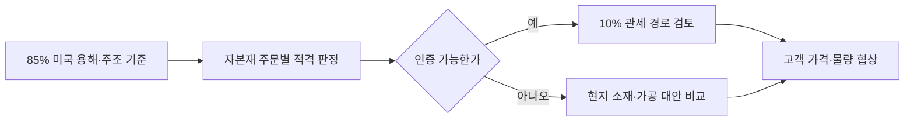

<!-- AUTO-GENERATED BY market-sensing-intelligence. DO NOT EDIT. -->

# 미국 자본재에 85% 자국 용해·주조 기준 적용

!!! abstract "한 문장 시그널"

    **포스코는 미국 자본재 주문별 용해·주조 증빙 가능성을 확인한 뒤 수출과 현지조달 경로를 선택해야 합니다.**

| 사업축 | 사업영향도 | 긴급도 | 평가일 |
| --- | ---: | ---: | --- |
| 철강 | **4/5** | **4/5** | 2026-08-20 |

## 왜 중요한가

미국은 일부 자본재의 우대관세 조건에 철강 함량 중 미국 용해·주조 85% 이상 기준을 적용했습니다. 포스코는 평균 관세율보다 주문별 적용품목과 인증 가능성을 먼저 확인해 기존 수출과 현지조달 경로를 나눠야 합니다.

### 판단 근거

- **사업 영향:** 미국 자본재 주문의 적격 판정이 수출 가능 경로와 고객 협상조건을 직접 바꿉니다.
- **긴급성:** 85% 용해·주조 기준이 이미 적용 중이며 제도는 2027년 말까지 이어집니다.

!!! warning "기존 전제를 무엇이 깨는가"

    **기존 전제:** 미국 자본재 주문은 제품가격과 일반 관세율을 맞추면 기존 생산경로로 수주할 수 있습니다.

    **전제를 깨는 관측:** 일부 자본재의 우대관세에 철강 함량 중 미국 용해·주조 85% 이상이라는 생산자격이 추가됐습니다.

    **바꿀 결정:** 주문별 적용품목·철강 함량·용해주조 증빙을 먼저 확인하고 적격 생산경로별 원가와 납기를 비교해야 합니다.

    **반증 확인:** 적용품목이 포스코 고객 주문과 겹치는지와 세관이 요구하는 증빙 범위를 확인합니다.

## 상세 분석

## 관세율보다 먼저 확인할 85% 생산자격

판단 질문: 미국 자본재 고객의 주문을 기존 수출경로로 계속 대응할 수 있는가, 아니면 주문별로 미국 용해·주조 자격을 먼저 확보해야 하는가?

잠정 결론: 미국이 일부 자본재의 우대관세 조건에 철강 함량 중 최소 85%를 미국에서 용해·주조하도록 요구하면서, 가격경쟁력만으로는 주문 적격성을 설명할 수 없게 됐습니다. 포스코는 미국 자본재 주문마다 철강의 용해·주조국과 적용품목을 확인하고, 적격 경로가 없는 주문은 현지 소재 조달이나 가공 파트너를 별도 비교해야 합니다.

## 하나의 포고문이 주문 자격을 바꾼 범위

확인된 변화:

미국 대통령 포고문은 2026년 6월 8일부터 2027년 12월 31일까지 적용되는 체계에서, 철강 함량의 85% 이상이 미국에서 용해·주조된 일부 자본재에 10% 관세를 적용할 수 있도록 했습니다. 이 Signal은 미국 자본재의 생산자격 변화만 다룹니다. 미국의 일반 철강 50% 관세, EU·영국 쿼터, 세계 과잉설비는 별도 Signal과 핵심 전략 이슈의 배경이며 여기의 손익에 합산하지 않습니다.

자격 판정은 주문서의 제품명만으로 끝나지 않습니다. 적용 대상 자본재인지, 철강 함량을 어떤 기준으로 계산하는지, 용해·주조 이력을 어떤 문서로 증명하는지가 함께 맞아야 합니다. 따라서 시장 전체의 평균 관세보다 고객 주문별 인증 가능 여부가 먼저 달라집니다. 이 차이를 놓치면 가격을 제시한 뒤에야 주문이 우대관세 대상이 아님을 확인할 수 있습니다.

사업 영향 경로: 생산자격은 주문 적격 판정과 관세 경로를 거쳐 고객 가격·물량 협상으로 전달됩니다.

## 주문별 인증 여부가 대응을 가른다

| 시나리오 | 관찰 조건 | 사업 의미 | 우선 대응 |
| --- | --- | --- | --- |
| 적격 유지 | 적용품목이며 85% 기준과 증빙을 충족 | 기존 고객 주문의 우대관세 경로 유지 가능 | 인증서류와 계약상 책임을 고정 |
| 부분 전환 | 핵심 주문만 현지 소재로 85% 충족 | 제품·고객별 원가와 납기 차별화 | 현지 소재·가공 파트너 견적 비교 |
| 비적격 | 적용품목이나 기준 또는 증빙 미충족 | 우대관세 전제의 가격제안이 무효화될 수 있음 | 주문 철회·가격 조정·대체 생산경로 판단 |

공개자료만으로 포스코의 미국 자본재 주문량, 철강 함량, 인증 가능한 생산경로를 알 수 없습니다. 따라서 지금 금액을 계산하면 실제 노출보다 주문 적격성에 대한 가정이 결과를 지배합니다. 미국 일반 철강관세 Signal과 같은 매출을 다시 계산할 위험도 있어 정량 영향은 내부 주문 원장이 확보될 때까지 보류합니다.

## 적용품목과 증빙 원장을 먼저 만든다

관찰 지표:

- 적용 대상 품목 목록과 고객 주문의 일치 여부
- 고객별 철강 함량과 미국 용해·주조 비중
- 용해·주조 증빙 승인률과 보완 요구
- 적격·비적격 생산경로의 도착원가 차이

확인 담당: 통상 담당은 포고문과 세관 지침을, 마케팅 담당은 고객 주문과 관세 귀속을, 생산전략 담당은 용해·주조 경로와 인증서류를 확인해야 합니다.

## 의사결정에 필요한 다음 산출물

다음 산출물:

1. 미국 자본재 주문별 적용품목·철강 함량·용해주조국 원장
2. 주문별 증빙 가능성과 세관 보완 요구 목록
3. 기존 수출·미국산 소재 조달·현지 가공의 원가·납기 비교표

반증 조건: 실제 적용품목이 포스코 고객 주문과 겹치지 않거나, 고객이 요구하는 우대관세가 85% 기준과 무관하다고 공식 확인되면 이 Signal의 사업영향도를 낮춥니다.

감지 트리거: 미국의 적용품목별 인증절차, 세관 판정 사례, 주요 고객의 증빙 요구가 공개될 때 다시 평가합니다.

!!! warning "판단의 한계"

    포고문은 기준과 적용기간을 확인해 주지만 포스코의 주문별 적용 여부는 공개하지 않습니다. 고객 주문, 철강 함량 산정, 증빙 승인 여부가 없으므로 이 분석은 적격성 점검 순서를 제시하며 실적 전망을 뜻하지 않습니다.

??? note "연결된 판단 근거"

    us domestic melted poured threshold: 철강 함량 중 미국 용해·주조 85% 이상 · 원문 근거 us updated tariff window: 2026-06-08~2027-12-31 · 원문 근거 business axis: 철강 · 원문 근거 business impact score 1 to 5: 4 · 원문 근거 business impact rationale: 미국 자본재 주문의 적격 판정이 수출 가능 경로와 고객 협상조건을 직접 바꿉니다. · 원문 근거 urgency score 1 to 5: 4 · 원문 근거 urgency rationale: 85% 용해·주조 기준이 이미 적용 중이며 제도는 2027년 말까지 이어집니다. · 원문 근거 assessment confidence: medium · 원문 근거 assessed at: 2026-08-20 · 원문 근거 impact path: 85% 미국 용해·주조 기준 → 자본재 적격 판정 → 주문별 관세·조달조건 → 생산경로 선택 · 원문 근거 recommended follow up: 미국 자본재 고객 주문별 철강 원산지·용해주조 인증 가능성을 확인합니다. · 원문 근거

??? note "연결된 판단 근거"

    - **business axis:** 철강 · [[sources/SRC-20260820-9C0937F2|원문 근거]]
    - **business impact score 1 to 5:** 4 · [[sources/SRC-20260820-9C0937F2|원문 근거]]
    - **business impact rationale:** 미국 자본재 주문의 적격 판정이 수출 가능 경로와 고객 협상조건을 직접 바꿉니다. · [[sources/SRC-20260820-9C0937F2|원문 근거]]
    - **urgency score 1 to 5:** 4 · [[sources/SRC-20260820-9C0937F2|원문 근거]]
    - **urgency rationale:** 85% 용해·주조 기준이 이미 적용 중이며 제도는 2027년 말까지 이어집니다. · [[sources/SRC-20260820-9C0937F2|원문 근거]]
    - **assessment confidence:** medium · [[sources/SRC-20260820-9C0937F2|원문 근거]]
    - **assessed at:** 2026-08-20 · [[sources/SRC-20260820-9C0937F2|원문 근거]]
    - **impact path:** 85% 미국 용해·주조 기준 → 자본재 적격 판정 → 주문별 관세·조달조건 → 생산경로 선택 · [[sources/SRC-20260820-9C0937F2|원문 근거]]
    - **recommended follow up:** 미국 자본재 고객 주문별 철강 원산지·용해주조 인증 가능성을 확인합니다. · 원문 근거 · [[sources/SRC-20260820-9C0937F2|원문 근거]]
    - **observed change:** 미국은 일부 자본재의 우대관세 조건에 철강 함량 중 미국 용해·주조 85% 이상 기준을 적용했습니다. 포스코는 평균 관세율보다 주문별 적용품목과 인증 가능성을 먼저 확인해 기존 수출과 현지조달 경로를 나눠야 합니다. · [[sources/SRC-20260820-9C0937F2|원문 근거]]
    - **published at:** 2026-06-01 · [[sources/SRC-20260820-9C0937F2|원문 근거]]
    - **supporting source 1:** Further Adjusting the Tariff Regimes for Imports of Aluminum, Steel, and Copper · [[sources/SRC-20260820-9C0937F2|원문 근거]]

## 원문

- **Further Adjusting the Tariff Regimes for Imports of Aluminum, Steel, and Copper** · The White House · 2026-06-01 · [원문 링크](https://www.whitehouse.gov/presidential-actions/2026/06/further-adjusting-the-tariff-regimes-for-imports-of-aluminum-steel-and-copper-into-the-united-states/) · [[sources/SRC-20260820-9C0937F2|보관 원문]]
