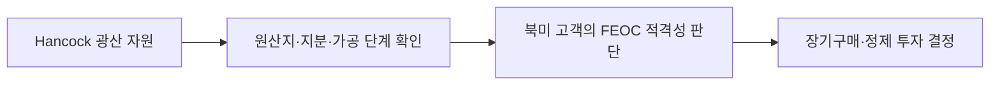

<!-- AUTO-GENERATED BY market-sensing-intelligence. DO NOT EDIT. -->

# 호주 리튬 연 3만 톤 협력 검토

!!! abstract "한 문장 시그널"

    **포스코홀딩스와 Hancock이 연 3만 톤 규모의 호주 리튬 사업을 검토하기로 했지만 투자액·입지·가동 일정은 정하지 않았으므로, 포스코홀딩스는 이를 확정 공급량이 아닌 비중국 원료 후보로 관리해야 합니다.**

| 사업축 | 사업영향도 | 긴급도 | 평가일 |
| --- | ---: | ---: | --- |
| 리튬 | **4/5** | **3/5** | 2024-12-16 |

## 왜 중요한가

포스코홀딩스와 호주 Hancock은 2024년 12월 연 3만 톤 규모의 리튬 사업을 검토하기로 했습니다. 입지·투자액·가동일정은 후속 결정사항이어서 3만 톤을 확정 공급량으로 볼 수 없습니다. 인허가·원료 추적·고객계약이 확인될 때까지 비중국 공급망 선택지로 평가해야 합니다.

### 판단 근거

- **사업 영향:** 비중국 원료와 고객 적격성은 북미 판매 가능 물량과 계약 프리미엄을 좌우할 수 있습니다.
- **긴급성:** 협력 실행 단계가 2025~2026년 투자·계약 선점 여부를 결정합니다.
- **대응 시한:** 2026-10-15

## 정량 영향 시뮬레이션

공개정보와 명시적 가정으로 계산한 예비 추정입니다. 숫자를 먼저 확인한 뒤 슬라이더로 가정을 바꾸면 결과가 즉시 갱신됩니다.

```impact-simulator
{"schema_version":1,"title":"호주 공급 협력 매출 기회","description":"Hancock 협력의 계획 공급능력과 가동률을 가격에 적용한 연간 매출 기회.","as_of":"2026-08-19","confidence":"medium","notice":"공개자료 기반 민감도 초안이며 POSCO 실제 원가·계약·물량이 아닙니다.","variables":[{"id":"capacity","label":"계획 공급능력","unit":"kt/년","min":1,"max":50,"step":1,"default":30,"kind":"verified","basis":"POSCO-Hancock 발표 30kt/년","source_ids":["SRC-20260819-55D6ECBF"]},{"id":"ramp","label":"가동률","unit":"fraction","min":0.1,"max":1,"step":0.05,"default":0.5,"kind":"assumption","basis":"상업화 초기 가동률","source_ids":[]},{"id":"price","label":"수산화리튬 가격","unit":"USD/t","min":3000,"max":30000,"step":500,"default":12000,"kind":"assumption","basis":"시장 가격 시나리오","source_ids":[]}],"outputs":[{"id":"annual_revenue_opportunity","label":"연간 매출 기회","unit":"USD m/년","decimals":1,"primary":true,"expression":{"op":"divide","args":[{"op":"multiply","args":[{"op":"multiply","args":[{"var":"capacity"},{"var":"ramp"}]},{"var":"price"}]},1000]}}],"presets":[{"id":"downside","label":"하방","values":{"capacity":20,"ramp":0.3,"price":8000}},{"id":"base","label":"기준","values":{"capacity":30,"ramp":0.5,"price":12000}},{"id":"upside","label":"상방","values":{"capacity":30,"ramp":0.8,"price":18000}}]}
```

## 상세 분석

### 판단 질문과 잠정 결론

Hancock 협력의 연 3만 톤을 지금부터 포스코홀딩스 생산계획에 넣을 것인가? **아니오.** 투자계약과 인허가가 확인되기 전에는 비중국 원료 후보와 북미 고객 대응 선택지로만 관리해야 합니다. 2024년 12월 발표는 양사가 연 3만 톤 리튬 사업을 함께 검토한다는 내용이며, 입지·투자액·가동 일정은 후속 결정사항입니다. 이 판단은 2026년까지 투자계약과 원료 추적성을 확인한 뒤 다시 검토해야 합니다.

### 일반적 해석과 확인된 차이

발표된 3만 톤과 포스코홀딩스가 2024년에 제시한 기존 염수 2만5천 톤·광석 4만3천 톤을 더해 곧바로 9만8천 톤 공급능력을 확보했다고 읽을 수 있습니다. 그러나 원문은 양사가 최적 입지를 공동으로 평가하고 세부 투자액은 이후 정한다고 했습니다. 실제 차이는 발표된 계획 용량과 지금 고객에게 인도할 수 있는 용량 사이에 있습니다. 미국 해외우려기관(해외우려기업(FEOC)) 규정 적용을 피할 수 있다는 설명도 광산 지분·가공 단계·고객별 원산지 증빙이 확인되어야 실제 판매 조건으로 바뀝니다.

### 확인된 변화와 시점

포스코홀딩스와 Hancock은 2024년 12월 9일 협력계약에 서명했고 12월 16일 공개했습니다. 회사는 2024년 기준 아르헨티나 염수 2만5천 톤과 광석 4만3천 톤의 생산능력을 확보했다고 설명했습니다. Hancock 협력은 광석·염수·수산화리튬·양극재로 이어지는 공급망을 다변화하려는 구상입니다. 다만 협력 발표만으로 상업 생산 물량이나 최종 투자결정이 확정된 것은 아닙니다.

### 포스코홀딩스에 전달되는 사업 영향

Hancock 원료가 북미 고객이 인정하는 비중국 공급망이 되는 경로는 다음과 같습니다.



포스코홀딩스가 단가가 낮은 호주 광석을 확보하더라도 광산에서 한국 정제시설까지의 운송비, 정제비, 품질 인증비를 더한 도착원가가 경쟁력을 결정합니다. 고객이 비중국 원료에 값을 더 지불하면 이익이 높아질 수 있지만, 증빙 비용과 공급 중단 위험도 함께 생깁니다. 따라서 3만 톤의 가치를 판단할 때는 명목 용량이 아니라 실제 인도 가능한 물량, 제품 품질, 고객 계약의 가격 전가 조건을 확인해야 합니다.

### 조건부 시나리오

아래 표는 Hancock 협력의 진행 상태에 따라 포스코홀딩스가 생산계획과 고객계약을 어떻게 다르게 다뤄야 하는지 보여줍니다.

| 시나리오 | 관찰 조건 | 사업 의미 | 우선 대응 |
| --- | --- | --- | --- |
| 방어 | 합작 논의가 지연되고 대체 계약도 없음 | 3만 톤는 여전히 계획이며 기존 자산 안정화가 우선 | 기존 6만8천 톤 생산능력의 안정 가동 |
| 기준 | 입지·원료계약·고객 인증이 순차적으로 확정됨 | 비중국 원료 가격 가산분과 북미 판매 선택지 가능 | 단계별 투자와 장기구매 승인 |
| 구조 변화 | FEOC 요건이 강화되거나 Hancock 공급이 실제로 확대됨 | 북미 고객의 원료 선택과 가격 조건이 바뀜 | 고객별 장기구매와 원산지 증빙 선점 |

이 협력의 전략적 가치는 투자 발표가 아니라 투자계약, 상업 생산 일정, 고객 사전승인이 함께 확인될 때 높아집니다.

### 지금 확인할 지표

- 합작법인의 입지·투자액·최종 투자결정 — 3만 톤을 계획 용량으로 인정할지 결정합니다.
- 광산별 원산지·지분·가공 단계 증빙 — 고객의 FEOC 적격성 판단을 바꿉니다.
- 호주 정광 가격·운송비·한국 수산화리튬 현금 원가 — 공급망의 순이익을 검증합니다.
- 고객별 장기구매·가격 전가·공급중단 조항 — 원료 가격 가산분이 실제 현금으로 남는지 확인합니다.

### 결론을 확정·폐기할 조건

- **이 분석이 틀렸다면:** 합작 투자·입지·장기구매와 상업 생산 일정이 확정되고, 3만 톤의 판매 가능한 물량이 공개되어야 합니다.
- **한 가지 확인:** 북미 고객이 Hancock 원료를 FEOC 요건에 맞는 것으로 사전 인증하는지 확인하면 협력의 전략적 가치를 확정할 수 있습니다.
- **감지 조건:** 투자계약, 공급량, 원산지 증명, 미국 고객 인증과 규정 변경입니다.

### 의사결정에 필요한 다음 산출물

1. 법무·컴플라이언스의 Hancock 단계별 원산지·FEOC 추적성 매트릭스
2. 원료·물류·정제·인증을 포함한 도착원가 비교표
3. 고객별 장기계약·가격 전가·공급중단 조항 검토안

!!! warning "판단의 한계"

    3만 톤는 협력 검토 단계의 계획 용량이며 실제 투자·가동·원가·매출이 아닙니다. Hancock의 공개 자산 정보만으로 포스코홀딩스가 확보할 물량과 수익을 확정할 수 없습니다.

??? note "연결된 판단 근거"

    - **planned capacity:** 30 kt/year 계획 · [[sources/SRC-20260819-55D6ECBF|원문 근거]]
    - **existing capacity:** 염수 25 kt/year 및 광석 43 kt/year, 합계 68 kt/year · [[sources/SRC-20260819-55D6ECBF|원문 근거]]
    - **feoc option:** 비중국·FEOC 리스크를 낮추는 호주 공급망 옵션 · [[sources/SRC-20260819-55D6ECBF|원문 근거]]
    - **business axis:** 리튬 · [[sources/SRC-20260819-55D6ECBF|원문 근거]]
    - **business impact score 1 to 5:** 4 · [[sources/SRC-20260819-55D6ECBF|원문 근거]]
    - **business impact rationale:** 비중국 원료와 고객 적격성은 북미 판매 가능 물량과 계약 프리미엄을 좌우할 수 있습니다. · [[sources/SRC-20260819-55D6ECBF|원문 근거]]
    - **urgency score 1 to 5:** 3 · [[sources/SRC-20260819-55D6ECBF|원문 근거]]
    - **urgency rationale:** 협력 실행 단계가 2025~2026년 투자·계약 선점 여부를 결정합니다. · [[sources/SRC-20260819-55D6ECBF|원문 근거]]
    - **assessment confidence:** medium · [[sources/SRC-20260819-55D6ECBF|원문 근거]]
    - **assessed at:** 2024-12-16 · [[sources/SRC-20260819-55D6ECBF|원문 근거]]
    - **impact path:** 호주 협력 계획 → FEOC 적격 원료 옵션 → 북미 고객계약·투자 우선순위 조정 · [[sources/SRC-20260819-55D6ECBF|원문 근거]]
    - **recommended follow up:** Hancock 30kt 프로젝트의 FID·인허가·오프테이크·FEOC 적격성 확인 · [[sources/SRC-20260819-55D6ECBF|원문 근거]]

## 원문

- **POSCO-Hancock 호주 리튬 협력과 비중국 공급망 옵션** · POSCO Holdings · 2024-12-16 · [원문 링크](https://newsroom.posco.com/en/posco-holdings-partners-with-australian-mining-company-hancock-in-lithium-business-for-rechargeable-battery-materials/) · [[sources/SRC-20260819-55D6ECBF|보관 원문]]
