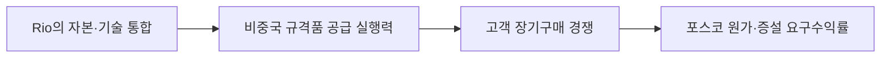

<!-- AUTO-GENERATED BY market-sensing-intelligence. DO NOT EDIT. -->

# Rio Tinto의 Arcadium 인수 완료와 2028년 증설 계획

!!! abstract "한 문장 시그널"

    **Rio Tinto가 연 7만5,000톤의 탄산리튬환산 생산능력을 보유한 Arcadium 인수를 마치고 2028년 말까지 두 배 이상 증설할 계획이므로, 포스코홀딩스는 경쟁사의 실제 배터리급 출하를 반영해 원가와 장기계약 조건을 다시 계산해야 합니다.**

| 사업축 | 사업영향도 | 긴급도 | 평가일 |
| --- | ---: | ---: | --- |
| 리튬 | **4/5** | **3/5** | 2024-10-09 |

## 왜 중요한가

Rio Tinto는 2024년 10월 Arcadium을 약 67억달러에 인수하기로 했고 2025년 3월 거래를 마쳤습니다. Arcadium은 탄산리튬환산 연 7만5,000톤의 생산능력과 2028년 말까지 두 배 이상 늘리는 계획을 보유하고 있습니다. 계획 용량을 즉시 공급으로 보지 말고 실제 출하와 고객 인증이 늘 때 포스코홀딩스의 가격·계약 조건을 다시 계산해야 합니다.

### 판단 근거

- **사업 영향:** 경쟁사의 공급능력 확대는 가격 기준과 장기 계약 협상력을 불리하게 이동시킬 수 있습니다.
- **긴급성:** 증설은 중기 변수지만 2025~2026년 계약·램프업 가정에 선반영해야 합니다.
- **대응 시한:** 2026-09-15

## 정량 영향 시뮬레이션

공개정보와 명시적 가정으로 계산한 예비 추정입니다. 숫자를 먼저 확인한 뒤 슬라이더로 가정을 바꾸면 결과가 즉시 갱신됩니다.

```impact-simulator
{"schema_version":1,"title":"경쟁 공급 확대 매출 노출","description":"Arcadium 증설이 시장 가격과 POSCO 노출 물량에 미치는 연간 매출 민감도.","as_of":"2026-08-19","confidence":"medium","notice":"공개자료 기반 민감도 초안이며 POSCO 실제 원가·계약·물량이 아닙니다.","variables":[{"id":"volume","label":"노출 물량","unit":"kt/년","min":1,"max":100,"step":1,"default":25,"kind":"verified","basis":"Arcadium 발표 생산능력 대용값","source_ids":["SRC-20260819-10D122AB"]},{"id":"price","label":"탄산리튬 가격","unit":"USD/t","min":1000,"max":30000,"step":500,"default":12000,"kind":"assumption","basis":"시장 가격 시나리오","source_ids":[]},{"id":"exposure","label":"POSCO 노출률","unit":"fraction","min":0.05,"max":1,"step":0.05,"default":0.2,"kind":"assumption","basis":"회사 실제 계약 미공개","source_ids":[]}],"outputs":[{"id":"annual_revenue_exposure","label":"연간 매출 노출","unit":"USD m/년","decimals":1,"primary":true,"expression":{"op":"divide","args":[{"op":"multiply","args":[{"var":"volume"},{"var":"price"}]},1000]}}],"presets":[{"id":"downside","label":"하방","values":{"volume":10,"price":8000,"exposure":0.1}},{"id":"base","label":"기준","values":{"volume":25,"price":12000,"exposure":0.2}},{"id":"upside","label":"상방","values":{"volume":60,"price":18000,"exposure":0.3}}]}
```

## 상세 분석

### 판단 질문과 잠정 결론

Rio Tinto의 Arcadium 인수와 증설 계획을 포스코홀딩스의 원가·증설 판단에 반영할 것인가? **예.** 다만 인수 발표를 곧바로 공급과잉으로 보지 말고, 실제 배터리급 출하와 고객 인증이 반복되는지 확인하는 조건부 판단으로 반영해야 합니다. Rio Tinto는 Arcadium의 생산·정제·고객 네트워크를 통합하고 있으며, 이 실행력이 확인될수록 포스코홀딩스의 가격·장기계약 가정도 보수적으로 바뀔 수 있습니다. 이 판단은 2026년 3분기 경쟁사 생산·판매 자료가 나오면 다시 검토해야 합니다.

### 일반적 해석과 확인된 차이

대형 인수를 가격 회복을 겨냥한 금융 거래로만 보면 Arcadium의 광산·염수·직접리튬추출(DLE)·수산화리튬·고객관계가 결합되는 경쟁력을 놓칠 수 있습니다. 반대로 인수 자체가 곧 생산 증가를 뜻하는 것도 아닙니다. 7만5천 톤의 현재 생산능력과 2028년 말 두 배 이상 확대 계획은 실제 고객에게 인도된 배터리급 물량과 구분해야 합니다. 확인된 차이는 인수 발표와 실제 공급, 명목 용량과 판매 가능한 규격품 사이에 있습니다.

### 확인된 변화와 시점

Rio Tinto는 2024년 10월 9일 Arcadium을 약 67억달러에 인수하기로 발표했고, 후속 실적자료에서 2025년 3월 거래 완료와 통합 진행을 확인했습니다. Arcadium은 탄산리튬환산(LCE) 기준 연 7만5천 톤의 현재 생산능력과 2028년 말까지 두 배 이상 확대할 계획을 갖고 있습니다. 이는 회사가 발표한 생산능력과 계획이며, 실제 증산은 프로젝트별 가동률·품질·고객 인증으로 확인해야 합니다.

### 포스코홀딩스에 전달되는 사업 영향

Rio Tinto의 통합이 포스코홀딩스의 가격·증설 판단으로 이어지는 경로를 아래처럼 정리할 수 있습니다.



Rio Tinto가 광산·염수·DLE·수산화리튬·고객관계를 한 플랫폼으로 묶으면 포스코홀딩스와 같은 비중국 고객 시장에서 경쟁할 수 있습니다. 고객이 공급 안정성과 해외우려기업(FEOC) 적격성을 함께 구매하면 포스코홀딩스의 가격과 장기계약 협상력이 약해질 수 있습니다. 그러나 공급 증가가 곧 가격 폭락을 뜻하지는 않으며, 수요 증가나 다른 프로젝트 지연이 이를 상쇄할 수 있습니다. 포스코홀딩스는 명목 용량보다 규격품 수율, 현금 원가, 가격 전가 조항을 먼저 비교해야 합니다.

### 조건부 시나리오

아래 표는 인수 통합과 실제 출하가 어떻게 진행되는지에 따른 포스코홀딩스의 대응 기준입니다.

| 시나리오 | 관찰 조건 | 사업 의미 | 우선 대응 |
| --- | --- | --- | --- |
| 방어 | 통합 완료 뒤에도 생산·출하 증가가 없음 | 경쟁 압력이 제한됨 | 기존 생산 안정화 유지 |
| 기준 | 분기 생산과 고객 인증이 계획대로 증가 | 고객·가격 조건 경쟁이 심해짐 | 낮은 가격을 적용한 스트레스 재계산 |
| 구조 변화 | 2028년 목표를 앞당기고 장기계약을 확대함 | 비중국 공급이 예상보다 빨리 늘어남 | 증설 조건과 장기계약 재협상 |

판단을 뒤집는 사실은 생산 증가가 재고 축적에 그치고 고객 인도 가능한 배터리급 물량으로 이어지지 않는다는 증거입니다.

### 지금 확인할 지표

- Rio Tinto의 분기 LCE 생산·출하와 2028년 목표 변경 — 명목 용량이 판매 물량인지 확인합니다.
- Sal de Vida·Rincon 등 프로젝트별 고객 인증·가동률 — 경쟁 공급이 실제로 늘어나는지 봅니다.
- 포스코홀딩스 원료별 현금 원가와 고객별 장기계약 가격 전가 — 경쟁 공급이 이익을 얼마나 압박하는지 계산합니다.
- 북미·비중국 고객의 공급 안정성·FEOC 조건 — 가격 외 경쟁 요소가 무엇인지 확인합니다.

### 결론을 확정·폐기할 조건

- **이 분석이 틀렸다면:** Rio의 생산·출하가 두 분기 연속 정체되고 신규 고객계약이 확인되지 않아야 합니다.
- **한 가지 확인:** 2026년 3분기 통합 이후 배터리급 출하량과 고객 인증을 확인하면 공급 선행 여부를 판단할 수 있습니다.
- **감지 조건:** 2028년 생산 계획치 상향, 북미 장기구매 체결, 포스코 고객의 단가·물량 재협상입니다.

### 의사결정에 필요한 다음 산출물

1. 경쟁 프로젝트별 생산·인증·원가 비교표
2. 리튬 가격 하락과 경쟁 공급 선행을 결합한 상각 전 영업이익(EBITDA) 민감도
3. 고객별 FEOC·공급 안정성 가격 가산분과 계약 갱신 일정

!!! warning "판단의 한계"

    Rio Tinto의 연결 생산량은 프로젝트별 배터리급 출하와 원가를 모두 공개하지 않습니다. 포스코홀딩스 내부 계약·원가·재고 자료를 결합하기 전에는 증설 중단이나 가속을 확정할 수 없습니다.

??? note "연결된 판단 근거"

    - **capacity:** 75 kt LCE/year · [[sources/SRC-20260819-10D122AB|원문 근거]]
    - **capacity target:** 2028년 말까지 150 kt LCE/year 초과로 두 배 이상 확대 계획 · [[sources/SRC-20260819-10D122AB|원문 근거]]
    - **transaction:** 약 USD 6.7 billion · [[sources/SRC-20260819-10D122AB|원문 근거]]
    - **business axis:** 리튬 · [[sources/SRC-20260819-10D122AB|원문 근거]]
    - **business impact score 1 to 5:** 4 · [[sources/SRC-20260819-10D122AB|원문 근거]]
    - **business impact rationale:** 경쟁사의 공급능력 확대는 가격 기준과 장기 계약 협상력을 불리하게 이동시킬 수 있습니다. · [[sources/SRC-20260819-10D122AB|원문 근거]]
    - **urgency score 1 to 5:** 3 · [[sources/SRC-20260819-10D122AB|원문 근거]]
    - **urgency rationale:** 증설은 중기 변수지만 2025~2026년 계약·램프업 가정에 선반영해야 합니다. · [[sources/SRC-20260819-10D122AB|원문 근거]]
    - **assessment confidence:** medium · [[sources/SRC-20260819-10D122AB|원문 근거]]
    - **assessed at:** 2024-10-09 · [[sources/SRC-20260819-10D122AB|원문 근거]]
    - **impact path:** 경쟁 공급 확대 → 시장 가격·계약 기준 압력 → POSCO 램프업·오프테이크 재검토 · [[sources/SRC-20260819-10D122AB|원문 근거]]
    - **recommended follow up:** Rio Tinto Arcadium 통합·증설 진행률과 POSCO 장기계약 가격전가 조건 대조 · [[sources/SRC-20260819-10D122AB|원문 근거]]

## 원문

- **Rio Tinto의 Arcadium 인수로 리튬 경쟁 공급 확대** · Rio Tinto · 2024-10-09 · [원문 링크](https://www.riotinto.com/news/releases/2024/rio-tinto-to-acquire-arcadium-lithium) · [[sources/SRC-20260819-10D122AB|보관 원문]]
