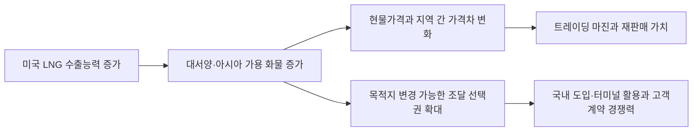

<!-- AUTO-GENERATED BY market-sensing-intelligence. DO NOT EDIT. -->

# 미국 LNG 수출의 2027년까지 30% 증가 전망

!!! abstract "한 문장 시그널"

    **미국 LNG 공급 증가가 조달 선택권과 판매마진을 반대 방향으로 움직일 수 있어, 포스코인터내셔널은 계약별 도착원가·목적지 전환권·가격전가 시차를 함께 비교해야 합니다.**

| 사업축 | 사업영향도 | 긴급도 | 평가일 |
| --- | ---: | ---: | --- |
| 에너지 | **4/5** | **3/5** | 2026-08-19 |

## 왜 중요한가

EIA는 미국 LNG 수출이 2026년 17.0Bcf/d로 늘고 2027년에도 9% 더 증가할 것으로 전망했습니다. 다만 2025년 미국 물량의 68%가 유럽으로 향해 설비 증설이 곧바로 아시아 공급 증가를 뜻하지는 않습니다. 포스코인터내셔널은 미국산 LNG의 실제 아시아 도착원가와 목적지 변경 가능 물량을 확인해야 합니다.

### 판단 근거

- **사업 영향:** 미국산 유연 물량은 LNG 조달원가와 지역 간 재판매 마진, 광양터미널 활용률을 동시에 바꿀 수 있습니다.
- **긴급성:** 2027년 신규 설비 가동 전에 장기계약·현물·유가연동 물량의 가격지표와 목적지 권리를 비교할 시간이 남아 있습니다.
- **대응 시한:** 2026-10-31

## 정량 영향 시뮬레이션

공개정보와 명시적 가정으로 계산한 예비 추정입니다. 숫자를 먼저 확인한 뒤 슬라이더로 가정을 바꾸면 결과가 즉시 갱신됩니다.

```impact-simulator
{"schema_version":1,"title":"미국 LNG 증설에 따른 트레이딩 상각 전 영업이익 민감도","description":"영향 화물량, 단위마진 변화, 가격노출과 실현률, 환율을 이용해 원화 기준 순마진 변화를 계산합니다.","as_of":"2026-04-16","confidence":"low","notice":"공개 공급전망과 가정에 기반한 예비 계산이며 회사 실제 물량·계약·헤지값이나 전망이 아닙니다.","formula_display":"영향물량(million MMBtu) × 단위마진 변화(USD/MMBtu) × 가격노출 비중 × 실현률 × 환율(KRW/USD) ÷ 1,000","variables":[{"id":"volume_mmbtu_m","label":"영향 화물량","unit":"million MMBtu","min":2,"max":40,"step":1,"default":12,"kind":"assumption","basis":"포스코인터내셔널의 미국산 LNG 계약·재판매 물량 비공개","source_ids":[]},{"id":"margin_delta","label":"단위마진 변화","unit":"USD/MMBtu","min":-2,"max":2,"step":0.1,"default":-0.5,"kind":"assumption","basis":"공급 증가가 지역 가격차에 미치는 민감도 가정","source_ids":[]},{"id":"market_exposure","label":"가격노출 비중","unit":"share","min":0,"max":1,"step":0.05,"default":0.5,"kind":"assumption","basis":"고정·연동·현물 계약 비중 비공개","source_ids":[]},{"id":"capture_rate","label":"마진 실현률","unit":"share","min":0.2,"max":1,"step":0.05,"default":0.6,"kind":"assumption","basis":"운임·액화비·헤지 후 실현률 비공개","source_ids":[]},{"id":"fx_krw_usd","label":"원·달러 환율","unit":"KRW/USD","min":1100,"max":1600,"step":10,"default":1350,"kind":"assumption","basis":"장기 민감도 기준값","source_ids":[]}],"outputs":[{"id":"ebitda_change","label":"트레이딩 상각 전 영업이익 변화","unit":"KRW billion","decimals":1,"primary":true,"expression":{"op":"divide","args":[{"op":"multiply","args":[{"op":"multiply","args":[{"op":"multiply","args":[{"op":"multiply","args":[{"var":"volume_mmbtu_m"},{"var":"margin_delta"}]},{"var":"market_exposure"}]},{"var":"capture_rate"}]},{"var":"fx_krw_usd"}]},1000]}},{"id":"usd_margin_change","label":"환산 전 마진 변화","unit":"USD million","decimals":1,"primary":false,"expression":{"op":"multiply","args":[{"op":"multiply","args":[{"op":"multiply","args":[{"var":"volume_mmbtu_m"},{"var":"margin_delta"}]},{"var":"market_exposure"}]},{"var":"capture_rate"}]}}],"presets":[{"id":"defensive","label":"방어","values":{"volume_mmbtu_m":8,"margin_delta":0.8,"market_exposure":0.35,"capture_rate":0.5,"fx_krw_usd":1300}},{"id":"base","label":"기준","values":{"volume_mmbtu_m":12,"margin_delta":-0.5,"market_exposure":0.5,"capture_rate":0.6,"fx_krw_usd":1350}},{"id":"pressure","label":"압박","values":{"volume_mmbtu_m":20,"margin_delta":-1.3,"market_exposure":0.7,"capture_rate":0.75,"fx_krw_usd":1400}}]}
```

## 상세 분석

### 판단 질문과 잠정 결론

**미국 LNG 증설을 포스코인터내셔널의 조달 기회로 볼 것인가, 판매마진 압박으로 볼 것인가?** 현재는 두 효과를 계약별로 분리해야 합니다. 미국 에너지정보청(EIA)은 미국 LNG 수출이 2026년 17.0Bcf/d로 늘고 2027년에도 9% 더 증가할 것으로 전망했습니다. 목적지 변경이 쉬운 미국 물량은 조달 선택권을 넓히지만, 공급 충격이 진정되면 아시아 현물가격과 중개마진을 낮출 수 있습니다.

### 통념과 확인된 간극

공급 증가를 곧바로 가격 하락으로 읽으면 실제 손익 반영 시점을 놓칩니다. 미국의 신규 물량은 액화시설 가동, 헨리허브 가격, 운임, 목적지와 장기계약 조건을 거쳐 아시아에 도착합니다. EIA 자료에서도 2025년 미국 LNG의 68%가 유럽으로 향했고 아시아 물량은 4.0Bcf/d에서 2.5Bcf/d로 감소했습니다. 설비가 늘어도 아시아 도착물량이 같은 속도로 늘어난다고 단정할 수 없습니다.

### 확인된 변화와 시점

EIA는 2026년 4월 16일 미국 LNG 수출이 2026년에 1.9Bcf/d 늘어 평균 17.0Bcf/d가 되고, 2027년에 다시 1.5Bcf/d 증가할 것으로 전망했습니다. 당시 미국의 최대 수출능력은 18.3Bcf/d였습니다. Corpus Christi 3단계와 Golden Pass 증설이 2026년에, Port Arthur·Rio Grande와 Golden Pass 후속 설비가 2027년에 순차 가동될 예정이라고 설명했습니다. 이는 전망과 예정 일정이며 실제 상업가동을 확정한 사실은 아닙니다.

### 포스코인터내셔널에 전달되는 사업 영향



포스코인터내셔널에는 공급 증가 자체보다 어느 물량을 헨리허브 연동으로 확보하고, 유럽과 아시아 사이에서 목적지를 바꿀 수 있는지가 중요합니다. 장기계약의 목적지 제한·액화비·운임을 포함한 도착원가가 기존 유가연동 조달보다 낮을 때만 조달 선택권이 실제 가치가 됩니다.

### 사업 시나리오

| 시나리오 | 관찰 조건 | 사업 의미 | 우선 대응 |
| --- | --- | --- | --- |
| 방어 | 신규 설비 지연, 유럽 수요 강세, 아시아 도착물량 제한 | 현물가격과 조달비 고점 지속 | 단기 화물 노출과 고객 가격전가 점검 |
| 기준 | EIA 일정대로 증설, 유럽·아시아 물량 균형 | 조달 선택권 확대와 마진 정상화 병존 | 미국산 도착원가를 계약별 비교 |
| 압박 | 증설 조기 가동, 아시아 유입 확대, 운임 안정 | 재판매 마진 축소와 저가 조달 기회 동시 발생 | 판매계약과 조달계약의 가격지표를 분리 헤지 |

### 지금 확인할 지표

- Golden Pass·Corpus Christi의 실제 상업가동일과 월별 수출량
- 미국산 LNG의 유럽·아시아 목적지 비중, JKM-헨리허브 가격차와 운임
- 포스코인터내셔널 계약의 가격지표, 목적지 제한, 재판매 권리와 고객 가격전가 시차

### 결론을 확정·폐기할 조건

- **이 분석이 틀렸다면:** 신규 미국 물량이 시설 지연 또는 유럽 흡수로 아시아에 유입되지 않는 경우
- **한 가지 확인:** 포스코인터내셔널이 2027년까지 확보한 미국산 LNG의 목적지 변경 가능 물량과 도착원가
- **감지 조건:** 미국 월별 LNG 수출이 EIA 경로에서 10% 이상 벗어나거나 아시아 비중이 반등할 때

### 의사결정에 필요한 다음 산출물

1. 미국산·유가연동·현물 조달의 아시아 도착원가 비교표 — 2026년 9월 30일
2. 목적지 변경 권리와 고객 가격전가 시차를 반영한 계약별 마진표 — 2026년 10월 15일
3. 미국 증설 지연·기준·조기 가동에 따른 2027년 조달·판매 배분안 — 2026년 10월 31일

!!! warning "판단의 한계"

    EIA 전망은 미국 전체 수출 경로이며 포스코인터내셔널의 비공개 계약·물량·운임·헤지 조건을 포함하지 않습니다. 영향액은 계약별 실제값을 넣기 전 방향성과 임계값을 확인하는 예비 계산입니다.

??? note "연결된 판단 근거"

    - **us lng export growth 2026 bcf d:** 1.9 Bcf/d increase to 17.0 Bcf/d average · [[sources/SRC-20260819-198CA198|원문 근거]]
    - **us lng export growth 2027:** 9% or 1.5 Bcf/d additional increase · [[sources/SRC-20260819-198CA198|원문 근거]]
    - **us lng peak export capacity:** 18.3 Bcf/d · [[sources/SRC-20260819-198CA198|원문 근거]]
    - **us lng europe exports 2025:** 10.3 Bcf/d, 68% of U.S. LNG exports · [[sources/SRC-20260819-198CA198|원문 근거]]
    - **us lng asia exports 2025:** 2.5 Bcf/d, down from 4.0 Bcf/d in 2024 · [[sources/SRC-20260819-198CA198|원문 근거]]
    - **business axis:** 에너지 · [[sources/SRC-20260819-198CA198|원문 근거]]
    - **business impact score 1 to 5:** 4 · [[sources/SRC-20260819-198CA198|원문 근거]]
    - **business impact rationale:** 미국산 유연 물량은 LNG 조달원가와 지역 간 재판매 마진, 광양터미널 활용률을 동시에 바꿀 수 있습니다. · [[sources/SRC-20260819-198CA198|원문 근거]]
    - **urgency score 1 to 5:** 3 · [[sources/SRC-20260819-198CA198|원문 근거]]
    - **urgency rationale:** 2027년 신규 설비 가동 전에 장기계약·현물·유가연동 물량의 가격지표와 목적지 권리를 비교할 시간이 남아 있습니다. · [[sources/SRC-20260819-198CA198|원문 근거]]
    - **assessment confidence:** medium · [[sources/SRC-20260819-198CA198|원문 근거]]
    - **assessed at:** 2026-08-19 · [[sources/SRC-20260819-198CA198|원문 근거]]
    - **impact path:** 미국 LNG 수출능력 증가 → 아시아 가용 화물·지역 가격차 변화 → 포스코인터내셔널 조달원가·재판매 마진·터미널 활용률 · [[sources/SRC-20260819-198CA198|원문 근거]]
    - **recommended follow up:** 미국산 LNG의 계약별 아시아 도착원가·목적지 전환권·가격전가 시차를 비교 · [[sources/SRC-20260819-198CA198|원문 근거]]

## 원문

- **U.S. natural gas exports to grow nearly 30% by 2027 as LNG facilities ramp up** · U.S. Energy Information Administration · 2026-04-16 · [원문 링크](https://www.eia.gov/todayinenergy/detail.php?id=67484) · [[sources/SRC-20260819-198CA198|보관 원문]]
