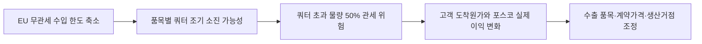

<!-- AUTO-GENERATED BY market-sensing-intelligence. DO NOT EDIT. -->

# EU 철강 무관세 수입한도 연 1,830만 톤 확정

!!! abstract "한 문장 시그널"

    **EU가 2026년 7월 1일부터 철강 무관세 수입을 연 1,830만 톤으로 제한하고 초과 물량에 50% 관세를 부과하므로, 포스코는 한국·품목별 쿼터와 탄소·물류비를 반영해 고객별 도착원가를 다시 계산해야 합니다.**

| 사업축 | 사업영향도 | 긴급도 | 평가일 |
| --- | ---: | ---: | --- |
| 철강 | **5/5** | **5/5** | 2026-08-18 |

## 왜 중요한가

EU는 2026년 7월 1일부터 철강 무관세 수입한도를 연 1,830만 톤으로 정하고 초과분에 50% 관세를 부과했습니다. 30개 품목군이 대상이며 유럽경제지역 국가는 예외입니다. 포스코는 한국산 쿼터 소진 속도와 관세·탄소국경조정·물류비를 고객별로 계산해 직수출, 현지 생산, 대체시장 가운데 하나를 선택해야 합니다.

### 판단 근거

- **사업 영향:** EU 무관세 수입 한도가 연 18.3Mt로 축소되고 쿼터 초과분에 50% 관세가 붙어 제품·분기별 쿼터 소진 순서와 현지 생산 전환의 경제성이 직접 바뀐다.
- **긴급성:** 이미 시행 중이므로 한국 배정 쿼터, 품목별 소진율, 계약별 관세 부담 주체를 즉시 점검해야 한다.
- **대응 시한:** 2026-08-25

## 상세 분석

# EU 철강 수입 제한과 포스코의 판매 기준

## 확인된 변화 요약

EU는 2026년 7월 1일부터 철강의 무관세 수입을 연간 1,830만 톤으로 제한하고 쿼터 초과 물량에 50% 관세를 부과하는 조치를 시행했습니다. 공식 페이지는 30개 철강 품목군을 대상으로 하며 유럽경제지역(EEA) 국가 제품은 예외라고 설명합니다. 포스코의 실제 쿼터와 계약조건은 공개되지 않았으므로, 한국·품목별 잔여 쿼터와 고객 도착원가를 확인한 뒤 판매·생산 거점을 다시 비교해야 합니다.

## 사업 판단 요약

**판단 질문:** 포스코는 EU 직수출을 기존 물량대로 유지할 수 있습니까?

**잠정 결론:** 이미 시행된 규칙이므로 EU 전체 수요보다 한국·품목·분기별 쿼터 소진과 관세 부담 주체를 먼저 봐야 합니다. 2026년 8월 25일까지 고객별 도착원가와 현지 생산 대안을 다시 계산해야 합니다.

### 확인된 변화와 시점

유럽연합 집행위원회는 2026년 6월 30일 새 철강 수입 조치를 발표했고, 2026년 7월 1일부터 적용한다고 밝혔습니다. 연간 무관세 수입 한도는 1,830만 톤이며, 쿼터를 넘는 물량에는 50% 관세가 붙습니다. 조치는 30개 철강 품목군을 대상으로 하고 EEA 국가 제품은 예외로 둡니다. 집행위는 세계 철강 과잉설비와 무역 전환 위험을 배경으로 설명했습니다.

따라서 이 사안은 장래 규제 가능성이 아니라 이미 통관·계약·판매가격에 반영해야 하는 규칙입니다. 같은 EU 판매라도 쿼터 잔량, 통관 시점, 계약상 관세 부담 주체가 다르면 실제 이익이 달라집니다.

### 포스코에 전달되는 사업 영향

첫째, 쿼터가 먼저 소진된 품목은 수요가 있어도 무관세로 팔 수 있는 물량이 제한됩니다. 둘째, 관세를 포스코·유통사·최종 고객 중 누가 부담하는지에 따라 명목 판매량과 실제 판매이익이 달라집니다. 셋째, 직수출 대신 EU 현지 생산·역내 가공·다른 지역 판매를 선택할 때 물류비와 환율까지 다시 계산해야 합니다.

탄소국경조정제도(CBAM) 비용은 쿼터 안에 들어간다는 이유만으로 사라지지 않습니다. 관세·CBAM·물류비·환율을 고객 도착원가로 합산해 고부가 제품의 가격 전가력이 충분한지 비교해야 합니다.

### 사업 시나리오

| 시나리오 | 관찰 조건 | 예상되는 사업 의미 | 우선 대응 |
| --- | --- | --- | --- |
| 방어 가능 | 핵심 품목 쿼터에 여유가 있고 고객이 비용 분담을 수용함 | 판매량과 이익을 함께 지킬 가능성 | 장기계약 물량을 우선 배정하고 가격조건 확정 |
| 이익 압박 | 쿼터 소진이 빨라지고 가격 전가가 제한됨 | 매출은 유지돼도 단위이익 하락 | 고객·품목별 최소 수익성 기준 적용 |
| 물량 재배치 | 초과 관세가 현지 생산·타지역 판매비용보다 커짐 | EU 직수출 일부의 경제성 상실 | 현지 생산과 대체시장 전환 손익 비교 |

이 표는 규칙이 모든 품목의 판매를 막는다고 단정한 것이 아닙니다. 실제 우선순위는 제품별 쿼터와 계약별 손익을 입력한 뒤 정해야 합니다.

### 지금 확인할 지표

- 한국·제품별 배정 쿼터와 분기별 소진율, 예상 소진 시점
- 선적일과 통관일 차이로 쿼터 적용이 달라지는 계약 물량
- 계약별 관세 부담 주체, 가격 재협상 조항과 고객의 비용 수용도
- 관세·CBAM·물류비·환율을 합친 고객별 도착원가와 판매이익
- EU 현지 생산 대체 물량, 설비 여력과 전환 소요기간
- EU 이외 시장으로 돌릴 때의 가격 할인과 추가 물류비

### 의사결정에 필요한 다음 산출물

1. 고객×품목×분기 단위의 쿼터 노출 물량표
2. 쿼터 안·밖을 나눈 계약별 손익 민감도
3. EU 직수출·현지 생산·대체시장 판매의 동일 기준 경제성 비교
4. 쿼터 소진 임계점에 맞춘 영업·생산·물류 대응 재검토 조건

!!! warning "판단의 한계"

    공개 자료만으로 포스코의 품목별 EU 매출, 고객 계약조건, 현지 설비 여력은 확인할 수 없습니다. 이 평가는 규칙이 손익에 전달되는 경로를 보여주는 것이며, 실제 노출액과 대응 우선순위는 내부 판매·원가·계약 자료를 결합한 뒤 확정해야 합니다.

??? note "연결된 판단 근거"

    - **business impact score 1 to 5:** 5 · [[sources/SRC-20260818-5C2CEB19|원문 근거]]
    - **urgency score 1 to 5:** 5 · [[sources/SRC-20260818-5C2CEB19|원문 근거]]
    - **impact path:** EU 수입쿼터 축소 및 초과분 50% 관세 → 한국산 철강의 EU 도착원가·판매가능 물량 변화 → 수출 믹스·가격·현지 생산 전략 조정 · [[sources/SRC-20260818-5C2CEB19|원문 근거]]
    - **effective date:** 2026-07-01 · [[sources/SRC-20260818-5C2CEB19|원문 근거]]
    - **recommended follow up:** 한국·품목별 쿼터 배정과 분기별 소진율, CBAM 비용까지 합산한 고객별 마진, EU 현지 생산 대체 가능성을 주간 점검 · [[sources/SRC-20260818-5C2CEB19|원문 근거]]
    - **business axis:** 철강 · [[sources/SRC-20260818-5C2CEB19|원문 근거]]
    - **business impact rationale:** EU 무관세 수입 한도가 연 18.3Mt로 축소되고 쿼터 초과분에 50% 관세가 붙어 제품·분기별 쿼터 소진 순서와 현지 생산 전환의 경제성이 직접 바뀐다. · [[sources/SRC-20260818-5C2CEB19|원문 근거]]
    - **assessment confidence:** medium · [[sources/SRC-20260818-5C2CEB19|원문 근거]]
    - **assessed at:** 2026-08-18 · [[sources/SRC-20260818-5C2CEB19|원문 근거]]
    - **urgency rationale:** 이미 시행 중이므로 한국 배정 쿼터, 품목별 소진율, 계약별 관세 부담 주체를 즉시 점검해야 한다. · [[sources/SRC-20260818-5C2CEB19|원문 근거]]

## 원문

- **EU steel measure: 18.3 Mt tariff-free quota and 50% out-of-quota duty** · European Commission · 2026-06-30 · [원문 링크](https://policy.trade.ec.europa.eu/enforcement-and-protection/protecting-eu-steelmaking_en) · [[sources/SRC-20260818-5C2CEB19|보관 원문]]
