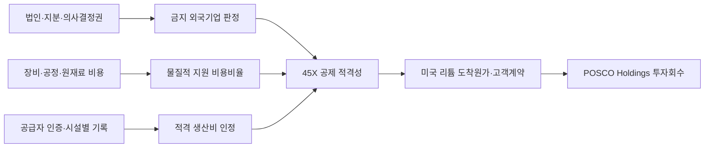

<!-- AUTO-GENERATED BY market-sensing-intelligence. DO NOT EDIT. -->

# 미국 리튬 세액공제의 공급망 요건 강화

!!! abstract "한 문장 시그널"

    **금지 외국기업의 소유·재료·공정 관여가 미국 생산세액공제를 줄일 수 있어, 포스코홀딩스는 실증·계약 전에 법인구조와 공급자별 비용·인증을 확인해야 합니다.**

| 사업축 | 사업영향도 | 긴급도 | 평가일 |
| --- | ---: | ---: | --- |
| 리튬 | **5/5** | **5/5** | 2026-08-19 |

## 왜 중요한가

미국 세무당국은 2026년 금지 외국기업의 물질적 지원 비용비율과 임시 안전기준을 제시했습니다. 미국에서 생산한다는 사실만으로 공제가 확정되지 않으며 공급자 인증과 시설별 기록도 필요합니다. 포스코홀딩스는 기술 실증과 별도로 세액공제 적격성을 선행 검증해야 합니다.

### 판단 근거

- **사업 영향:** 금지 외국기업의 소유·재료·공정 관여 여부가 미국 리튬 생산세액공제와 고객 계약경제성을 바꿉니다.
- **긴급성:** 미국 리튬 실증·법인·공급계약을 확정하기 전에 소유구조와 공급자 인증을 점검해야 합니다.
- **대응 시한:** 2026-09-30

## 정량 영향 시뮬레이션

공개정보와 명시적 가정으로 계산한 예비 추정입니다. 숫자를 먼저 확인한 뒤 슬라이더로 가정을 바꾸면 결과가 즉시 갱신됩니다.

```impact-simulator
{"schema_version":1,"title":"미국 리튬 45X 세액공제 순가치 민감도","description":"적격 생산비, 공제율, 금지기업 관련 비적격 비중과 준수비용에 따른 연간 순가치입니다.","as_of":"2026-08-19","confidence":"low","notice":"공개 제도와 AI 가정을 결합한 예비 계산이며 POSCO 실제 생산비·세액공제·세무의견이 아닙니다.","formula_display":"생산비 × 공제율 × (1 - 비적격 비용비중) - 연간 준수비용","variables":[{"id":"production_cost","label":"연간 생산비","unit":"USD m/년","min":10,"max":500,"step":10,"default":100,"kind":"assumption","basis":"미국 사업의 내부 적격 생산비로 교체할 가정","source_ids":[]},{"id":"credit_rate","label":"45X 공제율","unit":"fraction","min":0,"max":0.1,"step":0.01,"default":0.1,"kind":"verified","basis":"적격 핵심광물 생산비의 10%","source_ids":["SRC-20260819-3C4323B0"]},{"id":"ineligible_share","label":"비적격 비용비중","unit":"fraction","min":0,"max":1,"step":0.05,"default":0.5,"kind":"assumption","basis":"금지기업 물질적 지원 및 증빙 실패 비용비중","source_ids":["SRC-20260819-F58609F2"]},{"id":"compliance_cost","label":"연간 준수·대체조달 비용","unit":"USD m/년","min":0,"max":20,"step":0.5,"default":2,"kind":"assumption","basis":"법무·세무·인증·대체조달의 예비 비용","source_ids":[]}],"outputs":[{"id":"net_credit_value","label":"연간 세액공제 순가치","unit":"USD m/년","decimals":1,"primary":true,"expression":{"op":"subtract","args":[{"op":"multiply","args":[{"var":"production_cost"},{"var":"credit_rate"},{"op":"subtract","args":[1,{"var":"ineligible_share"}]}]},{"var":"compliance_cost"}]}}],"presets":[{"id":"defense","label":"방어","values":{"production_cost":100,"credit_rate":0.1,"ineligible_share":0.1,"compliance_cost":1}},{"id":"base","label":"기준","values":{"production_cost":100,"credit_rate":0.1,"ineligible_share":0.5,"compliance_cost":2}},{"id":"pressure","label":"압박","values":{"production_cost":100,"credit_rate":0.1,"ineligible_share":1,"compliance_cost":5}}]}
```

## 상세 분석

미국의 리튬 생산세액공제는 생산시설이 미국에 있다는 사실만으로 확보되지 않습니다. 2026년 지침은 금지 외국기업의 소유·영향과 장비·재료·공정에서 받은 물질적 지원을 별도로 계산하도록 했습니다. 포스코홀딩스는 미국 직접리튬추출 실증과 후속 사업의 기술성 검증에 앞서 법인·공급망·인증 구조가 세액공제 요건을 통과하는지 확인해야 합니다.

## 판단 질문과 잠정 결론

**질문:** 미국 내 리튬 생산이라는 이유만으로 생산비의 10% 상당인 45X 세액공제를 사업경제성에 반영해도 되는가?

**잠정 결론:** 아직 반영하면 안 됩니다. 2025년 7월 4일 이후 시작하는 과세연도에는 금지 외국기업 또는 해당 영향기업의 적격성이 제한되고, 금지 외국기업으로부터 물질적 지원을 받은 부품·광물도 공제에서 제외될 수 있습니다. 2026년 2월 지침은 향후 표가 나올 때까지 임시 계산방법을 제공하지만, 포스코 관련 법인·장비·시약·원재료·기술사용료의 실제 비용 비중은 공개되지 않았습니다.

## 통념과 확인된 간극

통념은 비중국 공급망과 미국 현지 생산을 결합하면 정책 인센티브를 받을 수 있다는 것입니다. 확인된 간극은 `비중국 원료`와 `금지 외국기업의 물질적 지원이 없는 생산구조`가 같은 조건이 아니라는 점입니다. 원료의 원산지가 적격이어도 장비, 공정 라이선스, 중간재, 자금·지배권 구조가 별도 판정에 영향을 줄 수 있습니다. 공급자 인증 없이 직접·간접 재료비를 생산비에 포함하기도 어렵기 때문에, 기술 실증 성공과 세액공제 확보 사이에 법인·세무·구매 검증 단계가 추가됐습니다.

## 확인된 변화와 시점

IRS의 2025년 12월 개정 Form 7207 지침은 2025년 7월 4일 이후 시작하는 과세연도에 새로운 금지 외국기업 제한이 적용된다고 명시했습니다. 리튬은 탄산리튬·수산화리튬으로 전환하거나 질량 기준 99.9% 이상으로 정제할 때 적격 핵심광물이 될 수 있습니다. 2026년 2월 Notice 2026-15 발표는 물질적 지원 비용비율과 임시 안전기준을 제시했고, 향후 안전기준 표가 나올 때까지 이를 사용할 수 있다고 밝혔습니다. 정책 변화는 공제율 자체보다 공제를 받을 수 있는 비용의 범위와 증빙 책임을 바꿨습니다.

## 포스코홀딩스에 전달되는 사업 영향



정책이 포스코홀딩스 손익에 전달되는 핵심 변수는 명목 10% 공제율보다 `적격 생산비`와 `비적격 비용 비중`입니다. 미국 실증이 기술적으로 성공해도 금지 외국기업 판정이나 공급자 인증 실패로 공제 기반이 줄면 예상 현금원가가 올라갑니다. 반대로 법인 지배권과 공급망을 초기에 정리하면 세액공제를 고객 가격에 얼마나 반영할지 협상할 선택지가 생깁니다.

## 조건부 사업 시나리오

| 시나리오 | 관찰 조건 | 예상되는 사업 의미 | 우선 대응 |
| --- | --- | --- | --- |
| 방어 | 소유·지배권이 적격이고 금지기업 관련 비용이 낮으며 공급자 인증 확보 | 45X 공제 대부분을 사업경제성에 반영 가능 | 시설·공급자별 증빙 체계 확정 |
| 기준 | 일부 장비·재료의 판정이 불명확하지만 대체조달 가능 | 공제액 일부 감소와 대체비용 발생 | 비용비율 계산 후 대체조달 임계값 결정 |
| 압박 | 법인 지배권 또는 핵심 공정·재료가 금지기업 제한에 해당 | 공제 상실과 일정 지연이 동시에 발생 가능 | 구조 변경안과 공제 제외 기준 투자안 병행 비교 |

## 지금 확인할 지표

- 미국 사업법인의 지분·이사회·거부권·기술사용권: 금지 외국기업 또는 영향기업 판정을 검토합니다.
- 장비·시약·중간재·공정 라이선스별 공급자와 비용: 물질적 지원 비용비율의 분모와 분자를 계산합니다.
- 공급자 인증서 발급 가능 여부: 생산비 인정과 사후 세무위험을 확인합니다.
- 고객 계약의 세액공제 공유 조항: 공제 확보가 포스코 마진인지 고객가격 인하인지 구분합니다.

## 결론을 확정·폐기할 조건

- **이 분석이 틀렸다면:** 세무 검토에서 관련 법인과 공급망이 모두 적격이며 물질적 지원 비용이 임시 안전기준보다 충분히 낮다고 확인돼야 합니다.
- **한 가지 확인:** 미국 사업의 장비·재료·라이선스 비용을 공급자별로 나눈 원가명세가 있으면 예상 공제액을 가장 빨리 확정할 수 있습니다.
- **감지 조건:** IRS의 새 안전기준 표, 금지 외국기업 정의 변경, 미국 실증의 법인·공급자 변경, 고객 장기계약 체결 시 즉시 재평가합니다.

## 의사결정에 필요한 다음 산출물

1. 법인·주주·이사회·기술권리를 연결한 금지 외국기업 판정표
2. 공급자별 비용과 인증상태를 반영한 45X 적격 생산비 명세
3. 공제 0%·부분·전액의 투자회수기간 및 고객가격 비교안

!!! warning "판단의 한계"

    공개자료는 미국 세법과 임시 계산방법을 설명하지만 포스코의 실제 법인구조·공급자·생산비를 보여주지 않습니다. 아래 계산은 공제 가능액의 민감도를 보여주는 것이며 실제 세무의견이나 회사 전망이 아닙니다.

??? note "연결된 판단 근거"

    - **form 7207 revision:** December 2025 · [[sources/SRC-20260819-53232380|원문 근거]]
    - **pfe restriction effective tax years:** tax years beginning after 2025-07-04 · [[sources/SRC-20260819-53232380|원문 근거]]
    - **pfe taxpayer ineligibility:** specified foreign entity 또는 covered foreign-influenced entity는 45X 공제 불가 · [[sources/SRC-20260819-53232380|원문 근거]]
    - **material assistance rule:** 금지 외국기업의 물질적 지원을 받은 적격 부품은 45X 공제 대상에서 제외 · [[sources/SRC-20260819-F58609F2|원문 근거]]
    - **notice reliance period:** 2025-07-04 이후 시작 과세연도의 판매분부터 향후 safe-harbour table 공표일까지 · [[sources/SRC-20260819-F58609F2|원문 근거]]
    - **supplier certification required:** 직접·간접 재료비를 생산비에 포함하려면 공급자 인증 첨부 필요 · [[sources/SRC-20260819-53232380|원문 근거]]
    - **qualifying lithium form:** 탄산리튬 또는 수산화리튬 전환, 또는 리튬 질량순도 99.9% 이상 · [[sources/SRC-20260819-53232380|원문 근거]]
    - **critical mineral credit rate:** qualifying production cost의 10% · [[sources/SRC-20260819-3C4323B0|원문 근거]]
    - **business axis:** 리튬 · [[sources/SRC-20260819-F58609F2|원문 근거]]
    - **business impact score 1 to 5:** 5 · [[sources/SRC-20260819-F58609F2|원문 근거]]
    - **business impact rationale:** 금지 외국기업의 소유·재료·공정 관여 여부가 미국 리튬 생산세액공제와 고객 계약경제성을 바꿉니다. · [[sources/SRC-20260819-F58609F2|원문 근거]]
    - **urgency score 1 to 5:** 5 · [[sources/SRC-20260819-F58609F2|원문 근거]]
    - **urgency rationale:** 미국 리튬 실증·법인·공급계약을 확정하기 전에 소유구조와 공급자 인증을 점검해야 합니다. · [[sources/SRC-20260819-F58609F2|원문 근거]]
    - **assessment confidence:** high · [[sources/SRC-20260819-F58609F2|원문 근거]]
    - **assessed at:** 2026-08-19 · [[sources/SRC-20260819-F58609F2|원문 근거]]
    - **impact path:** 미국 PFE 판정·물질적 지원 비율 → 45X 적격성과 공급자 인증 → 미국산 리튬 도착원가·고객계약 → POSCO Holdings 투자회수 · [[sources/SRC-20260819-F58609F2|원문 근거]]
    - **response deadline:** 2026-09-30 · [[sources/SRC-20260819-F58609F2|원문 근거]]
    - **affected business:** POSCO Holdings 미국 직접리튬추출 실증, 북미 정제·판매·합작 구조 · [[sources/SRC-20260819-F58609F2|원문 근거]]
    - **recommended follow up:** 법인·지분·이사회 권리, 중국계 장비·공정·원재료 비용 비중, 공급자 인증 가능성을 세무·법무·구매가 공동 점검 · [[sources/SRC-20260819-F58609F2|원문 근거]]

## 원문

- **Instructions for Form 7207 December 2025** · Internal Revenue Service · 2026-01-07 · [원문 링크](https://www.irs.gov/instructions/i7207) · [[sources/SRC-20260819-53232380|보관 원문]]
- **Treasury and IRS guidance on prohibited foreign entity material assistance** · Internal Revenue Service · 2026-02-12 · [원문 링크](https://www.irs.gov/newsroom/treasury-irs-provide-guidance-for-certain-energy-tax-credits-regarding-material-assistance-provided-by-prohibited-foreign-entities-under-the-one-big-beautiful-bill) · [[sources/SRC-20260819-F58609F2|보관 원문]]
- **Section 45X final regulations calculation context** · Internal Revenue Service · 2024-12-16 · [원문 링크](https://www.irs.gov/irb/2024-51_IRB) · [[sources/SRC-20260819-3C4323B0|보관 원문]]
