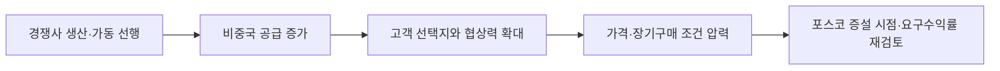

<!-- AUTO-GENERATED BY market-sensing-intelligence. DO NOT EDIT. -->

# Rio Tinto의 2026년 2분기 리튬 생산 20% 증가

!!! abstract "한 문장 시그널"

    **Rio Tinto의 2026년 2분기 리튬 생산이 전년보다 20% 늘고 일부 프로젝트가 첫 생산에 들어갔으므로, 포스코홀딩스는 경쟁사의 실제 배터리급 출하를 반영해 증설 원가·품질·장기계약 기준을 다시 세워야 합니다.**

| 사업축 | 사업영향도 | 긴급도 | 평가일 |
| --- | ---: | ---: | --- |
| 리튬 | **4/5** | **4/5** | 2026-08-18 |

## 왜 중요한가

Rio Tinto는 2026년 2분기 탄산리튬환산 생산량이 1만4,600톤으로 전년보다 20% 늘었고 상반기 생산량은 2만7,300톤으로 53% 증가했다고 발표했습니다. Rincon 생산 안정화와 Sal de Vida·Fenix 1B의 첫 생산이 증가를 이끌었지만 연간 목표 6만1,000~6만4,000톤은 유지됐습니다. 실제 배터리급 출하를 확인해 포스코홀딩스의 증설 수익률을 다시 계산해야 합니다.

### 판단 근거

- **사업 영향:** 경쟁사 램프업 선행은 비중국계 공급곡선과 고객 협상력을 바꿔 포스코홀딩스의 증설 시점·요구수익률에 영향을 줍니다.
- **긴급성:** 2027~2028 증설 의사결정 전에 발표 용량이 아닌 실제 분기 출하속도를 반영해야 합니다.
- **대응 시한:** 2026-09-30

## 상세 분석

### 판단 질문과 잠정 결론

Rio Tinto의 생산 증가를 포스코홀딩스의 리튬 증설 판단에 반영할 것인가? **예.** 다만 생산량 증가를 곧바로 공급과잉으로 해석하지 말고, 실제 배터리급 출하와 고객 인증이 반복되는지 확인하는 조건부 판단으로 반영해야 합니다. 포스코홀딩스의 다음 증설 기준은 시장점유율보다 낮은 가격에서도 버틸 원가, 규격품 품질, 장기구매 확정 여부에 두는 것이 타당합니다.

### 일반적 해석과 확인된 차이

경쟁사의 생산이 20% 늘었다는 소식만으로 곧 시장에 물량이 넘친다고 볼 수는 없습니다. 반대로 발표된 증설 계획을 먼 미래 공급으로만 할인하면 실제로 빨라진 생산의 영향을 놓칠 수 있습니다. Rio Tinto의 생산량이 고객에게 인도된 배터리급 물량인지, 재고나 시운전 물량인지가 현재의 핵심 차이입니다. 확인된 반대 근거는 연간 생산 계획치가 6만1천~6만4천 톤으로 유지됐다는 점입니다.

### 확인된 변화와 시점

Rio Tinto는 2026년 7월 15일 2분기 생산실적을 발표했습니다. 2분기 탄산리튬환산(LCE) 생산량은 1만4,600톤으로 전년 동기보다 20%, 전분기보다 15% 증가했고, 상반기 생산량은 2만7,300톤으로 전년보다 53% 늘었습니다. Rincon 초기 생산설비의 생산 안정화와 Sal de Vida·Fenix 1B의 첫 생산이 증가를 이끌었으며, 두 프로젝트의 첫 생산은 계획보다 빨랐습니다. 2026년 연간 생산 계획치 6만1천~6만4천 톤은 유지됐습니다.

### 포스코홀딩스에 전달되는 사업 영향

경쟁사의 생산 증가가 포스코홀딩스의 가격·계약·증설 기준으로 이어지는 경로는 다음과 같습니다.

공급 증가가 곧 가격 폭락을 뜻하지는 않습니다. 수요가 늘거나 다른 프로젝트가 지연되면 효과가 상쇄될 수 있습니다. 다만 포스코홀딩스가 프로젝트 지연을 전제로 높은 장기가격을 적용했다면, Rio Tinto의 실제 생산 데이터는 투자 가정을 먼저 낮춰보게 하는 신호입니다. 포스코홀딩스는 명목 용량이 아니라 규격품 출하, 현금 원가, 장기계약의 가격 전가를 비교해야 합니다.

### 조건부 시나리오

아래 표는 Rio Tinto의 생산이 실제 공급으로 이어지는 정도에 따른 포스코홀딩스의 대응 기준입니다.

| 시나리오 | 확인 조건 | 사업 의미 | 우선 대응 |
| --- | --- | --- | --- |
| 공급 선행 | 분기 생산·출하 증가와 계획치 상향이 함께 확인됨 | 가격 회복폭이 제한되고 고객 협상이 어려워짐 | 저가격 스트레스 강화 |
| 계획 범위 | 연간 6만1천~6만4천 톤 범위가 유지되고 증가가 둔화됨 | 기존 공급 전망이 크게 바뀌지 않음 | 단계 투자 유지 |
| 실행 차질 | 품질·가동 문제로 고객 출하가 지연됨 | 공급 압력이 늦춰짐 | 선택적 조기계약 검토 |

판단을 바꾸는 사실은 생산 증가가 재고 축적에 그치고 고객 인도 가능한 배터리급 물량으로 이어지지 않는다는 증거입니다.

### 지금 확인할 지표

- Rio Tinto의 분기 LCE 생산·출하와 연간 계획치 — 생산 증가가 판매 물량인지 확인합니다.
- Sal de Vida·Fenix·Rincon의 고객 승인·가동률 — 프로젝트별 실행 속도를 구분합니다.
- 포스코홀딩스 프로젝트의 현금 원가와 장기구매 확정 비중 — 경쟁 공급이 요구수익률을 얼마나 바꾸는지 계산합니다.
- 고객의 단가·물량 재협상 — 시장 공급 증가가 계약에 전파되는 시점을 확인합니다.

### 결론을 확정·폐기할 조건

- **이 분석이 틀렸다면:** Rio Tinto의 실제 생산·출하가 증가하지 않고 신규 고객 인증도 이어지지 않아야 합니다.
- **한 가지 확인:** 2026년 3분기 배터리급 출하량과 고객 인증을 확인하면 생산 증가가 공급 선행인지 판단할 수 있습니다.
- **감지 조건:** 연간 계획치 상향, 조기 고객 승인, 분기 출하 증가가 두 차례 연속 확인되는 경우입니다.

### 의사결정에 필요한 다음 산출물

1. 경쟁 프로젝트 실행률을 반영한 공급·출하 비교표
2. 저가격과 일정 선행을 함께 적용한 충격 검토
3. 고객별 장기구매 방어조건과 계약 갱신 일정

!!! warning "판단의 한계"

    Rio Tinto의 연결 생산량은 프로젝트별 원가와 판매 가능한 품질을 모두 보여주지 않습니다. 포스코홀딩스의 내부 원가·계약정보와 결합하기 전에는 증설 중단이나 가속을 확정할 수 없습니다.

??? note "연결된 판단 근거"

    - **q2 2026 lce production:** 14.6 kt; +20% year on year · [[sources/SRC-20260818-D7286E4D|원문 근거]]
    - **h1 2026 lce production:** 27.3 kt; +53% year on year · [[sources/SRC-20260818-D7286E4D|원문 근거]]
    - **full year 2026 lce guidance:** 61-64 kt; unchanged · [[sources/SRC-20260818-D7286E4D|원문 근거]]
    - **business axis:** 리튬 · [[sources/SRC-20260818-D7286E4D|원문 근거]]
    - **business impact score 1 to 5:** 4 · [[sources/SRC-20260818-D7286E4D|원문 근거]]
    - **business impact rationale:** 경쟁사 램프업 선행은 비중국계 공급곡선과 고객 협상력을 바꿔 포스코홀딩스의 증설 시점·요구수익률에 영향을 줍니다. · [[sources/SRC-20260818-D7286E4D|원문 근거]]
    - **urgency score 1 to 5:** 4 · [[sources/SRC-20260818-D7286E4D|원문 근거]]
    - **urgency rationale:** 2027~2028 증설 의사결정 전에 발표 용량이 아닌 실제 분기 출하속도를 반영해야 합니다. · [[sources/SRC-20260818-D7286E4D|원문 근거]]
    - **assessment confidence:** medium · [[sources/SRC-20260818-D7286E4D|원문 근거]]
    - **assessed at:** 2026-08-18 · [[sources/SRC-20260818-D7286E4D|원문 근거]]
    - **impact path:** 경쟁사 조기생산→비중국 공급증가→가격·오프테이크 압박→포스코 증설 게이트 · [[sources/SRC-20260818-D7286E4D|원문 근거]]
    - **recommended follow up:** 경쟁 프로젝트 실행률 공급곡선과 저가격 스트레스 테스트를 2026-09-30까지 완료 · [[sources/SRC-20260818-D7286E4D|원문 근거]]

## 원문

- **Rio Tinto releases second quarter 2026 production results** · Rio Tinto · 2026-07-15 · [원문 링크](https://www.riotinto.com/en/news/releases/2026/rio-tinto-releases-second-quarter-2026-production-results) · [[sources/SRC-20260818-D7286E4D|보관 원문]]
