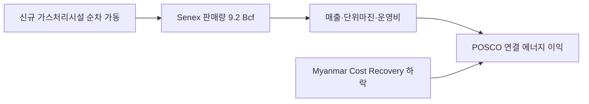

<!-- AUTO-GENERATED BY market-sensing-intelligence. DO NOT EDIT. -->

# Senex 증산 실적과 Myanmar 회수율 하락의 병존

!!! abstract "한 문장 시그널"

    **2025년 3분기 Senex 신규 처리시설 증산이 판매량·영업이익으로 확인됐지만 미얀마 Cost Recovery 하락이 병존해 에너지 성장률을 Senex 증산과 Myanmar 회수율로 분리 관리해야 하는 후속 검증 신호.**

| 사업축 | 사업영향도 | 긴급도 | 평가일 |
| --- | ---: | ---: | --- |
| 에너지 | **5/5** | **4/5** | 2025-10-27 |

## 왜 중요한가

Senex 판매량은 9.2 Bcf, 영업이익은 267억원으로 늘었지만 Myanmar 가스전 영업이익은 900억원으로 감소했습니다. 증산의 구조적 지속성과 회수율 위험을 분리해 2026년 예산을 짜야 합니다.

### 판단 근거

- **사업 영향:** 증산 실적과 자산별 회수율이 연결 에너지 손익을 직접 바꿉니다.
- **긴급성:** 2025년 결산과 2026년 계획에서 시설·회수율 지속성을 확인해야 합니다.
- **대응 시한:** 2026-02-15

## 상세 분석

# POSCO International 2025년 3분기 에너지 증산 실적

## 원문 보존

- 제목: 포스코인터내셔널 ’25년 3분기 경영실적, 에너지
- 발행자: POSCO INTERNATIONAL
- 발표일: 2025-10-27
- 원문: https://www.poscointl.com/upload/file/202510/202510QrrmjSOggdZe.pdf
- 접근 상태: 공개 PDF 13쪽, 에너지 4쪽 확인.

### 핵심 원문 문장

> Senex 신규가스처리시설 가동에 따른 증산과 하절기 폭염으로 발전사업 이익 증가

원문 표는 2025년 3분기 Senex 판매량 9.2 Bcf(전년 3분기 6.2 Bcf 대비 +48.4%), 매출 1,053억원(+57.2%), 영업이익 267억원(+164.4%)을 제시합니다. 미얀마 가스전은 판매량 42.9 Bcf, 영업이익 900억원으로 전년 대비 감소했습니다.

## Signal

**2025년 3분기 Senex 신규 처리시설 증산이 판매량·영업이익으로 확인됐지만 미얀마 Cost Recovery 하락이 병존해 에너지 성장률을 Senex 증산과 Myanmar 회수율로 분리 관리해야 하는 후속 검증 신호.**

- 사업축: 포스코인터내셔널 에너지 — Senex·Myanmar·terminal·power
- 사업영향도: 5/5 — 증산 실현과 자산별 이익 변동이 연결 실적에 직접 반영.
- 긴급도: 4/5 — 후속 시설 가동·계약단가·미얀마 회수율을 2025년 연간 결산에서 확인.
- 평가 신뢰도: 높음(회사 IR 실적), 지속성은 중간.

## Insight와 문서급 분석

### 판단 질문과 잠정 결론

**Senex 3분기 실적을 구조적 증산의 확정으로 확대해석해도 되는가?** 조건부로 예입니다. 판매량·매출·영업이익이 모두 증가했고 원인은 신규 가스처리시설 순차 가동으로 설명됩니다. 그러나 3분기 한 시점이고, 미얀마 이익 감소와 발전·터미널 변동성이 있어 2026년 지속수익으로 확정하려면 시설별 생산·계약·원가를 더 확인해야 합니다.

### 통념과 확인된 간극

통념은 에너지 부문 이익 상승을 LNG 전반의 호조로 해석하는 것입니다. 실제 IR은 Senex 증산으로 +164.4% 영업이익을 기록하는 한편, 미얀마는 Cost Recovery 비율 하락으로 영업이익이 1,080억원에서 900억원으로 감소했다고 구분합니다. 성장과 회수위험이 동시에 나타나는 간극입니다.

### 확인된 변화와 시점

2025-10-27 발표, 2025년 3분기 실적입니다. 2025년 2분기 Senex 판매량 8.0 Bcf에서 9.2 Bcf로 늘었고 매출은 898억원에서 1,053억원으로 증가했습니다. 이는 2025-02-28 first gas 이후 단계별 가동의 후속상태입니다.

### 사업 영향 경로

### 사업 시나리오

| 시나리오 | 관찰 조건 | 예상 사업 의미 | 우선 대응 |
| --- | --- | --- | --- |
| 상방 | 신규시설 가동률·판매량 지속, 단가 유지 | Senex 증산이 구조적 이익원으로 정착 | 2026년 고객별 인도·원가 계획 확정 |
| 기준 | 생산은 증가하나 단가·운영비 정상화 | 이익 증가폭 둔화, 자산별 변동 병존 | Senex·Myanmar 별도 손익 브리지 |
| 하방 | 시설 지연·가격 하락·Cost Recovery 추가 악화 | 증산 효과와 미얀마 하락이 상쇄 | 회수율·계약전가·CAPEX 회수 재설계 |

### 지금 확인할 지표

- Senex 시설별 판매량·가동률·가격·운영비와 2025년 연간 60 PJ 진척
- Myanmar Cost Recovery 비율·가스관 상태·판매량·환율
- 터미널 회전율, 발전 이용률·SMP·용량요금과 연료비

### 의사결정에 필요한 다음 산출물

1. 2025년 연간 Senex 증산·가격·원가·현금흐름 브리지(2026-02-15).
2. 미얀마 회수율·정비·환율을 포함한 자산별 downside 표(2026-02-15).
3. 2026년 시설별 고객 인도·계약 만기·CAPEX 집행 계획(2026-01-31).

### 결론을 확정·폐기할 조건

2025년 연간 판매량·영업이익 증가가 유지되고 시설 가동률이 계획 이상이면 증산의 구조적 이익 결론을 확정합니다. 2026년 1분기 판매량 정체나 단위마진 급락이 확인되면 일시적 ramp-up으로 폐기합니다.

!!! warning "판단의 한계"

    IR은 보고부문 실적을 제시하지만 고객별 가격·원가·가동률·현금흐름을 공개하지 않습니다. 전년 대비 수치는 사업부문 배부 기준의 영향을 받을 수 있습니다.

??? note "연결된 판단 근거"

    - **senex q3 2025 sales volume:** 9.2 Bcf · [[sources/SRC-20260819-D7164DFA|원문 근거]]
    - **senex q3 2025 operating profit:** 267억원 · [[sources/SRC-20260819-D7164DFA|원문 근거]]
    - **myanmar q3 2025 operating profit:** 900억원 · [[sources/SRC-20260819-D7164DFA|원문 근거]]
    - **business axis:** 에너지 · [[sources/SRC-20260819-D7164DFA|원문 근거]]
    - **business impact score 1 to 5:** 5 · [[sources/SRC-20260819-D7164DFA|원문 근거]]
    - **business impact rationale:** 증산 실적과 자산별 회수율이 연결 에너지 손익을 직접 바꿉니다. · [[sources/SRC-20260819-D7164DFA|원문 근거]]
    - **urgency score 1 to 5:** 4 · [[sources/SRC-20260819-D7164DFA|원문 근거]]
    - **urgency rationale:** 2025년 결산과 2026년 계획에서 시설·회수율 지속성을 확인해야 합니다. · [[sources/SRC-20260819-D7164DFA|원문 근거]]
    - **assessment confidence:** high · [[sources/SRC-20260819-D7164DFA|원문 근거]]
    - **assessed at:** 2025-10-27 · [[sources/SRC-20260819-D7164DFA|원문 근거]]
    - **impact path:** 신규 처리시설 → Senex 판매량·단가·운영비 → 연결 에너지 이익, Myanmar 회수율은 반대 방향 · [[sources/SRC-20260819-D7164DFA|원문 근거]]
    - **recommended follow up:** Senex 연간 생산·판매·원가와 Myanmar Cost Recovery·정비를 별도 손익 브리지로 확인 · [[sources/SRC-20260819-D7164DFA|원문 근거]]
    - **response deadline:** 2026-02-15 · [[sources/SRC-20260819-D7164DFA|원문 근거]]
    - **affected business:** Senex·Myanmar gas field·power generation · [[sources/SRC-20260819-D7164DFA|원문 근거]]

## 원문

- **POSCO International 2025 Q3 Senex ramp-up results** · POSCO INTERNATIONAL · 2025-10-27 · [원문 링크](https://www.poscointl.com/upload/file/202510/202510QrrmjSOggdZe.pdf) · [[sources/SRC-20260819-D7164DFA|보관 원문]]
