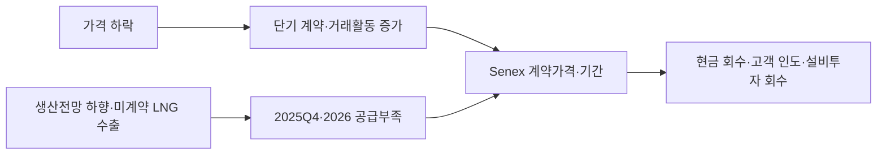

<!-- AUTO-GENERATED BY market-sensing-intelligence. DO NOT EDIT. -->

# 호주 동부 가스가격 하락 속 2026년 공급 부족 위험

!!! abstract "한 문장 시그널"

    **호주 동부 가스가격이 낮아져도 미계약 물량의 수출 여부에 따라 2026년 공급이 부족할 수 있어, 포스코인터내셔널은 Senex 계약의 가격과 기간·인도조건을 분리해 점검해야 합니다.**

| 사업축 | 사업영향도 | 긴급도 | 평가일 |
| --- | ---: | ---: | --- |
| 에너지 | **5/5** | **5/5** | 2025-06-30 |

## 왜 중요한가

호주 동부 가스가격 하락은 공급 안정과 같은 뜻이 아닙니다. 미계약 가스가 수출되면 국내 가용 물량이 줄 수 있으므로, Senex의 실제 판매가치는 시장 평균가격보다 계약기간과 인도지점, 운송 가능 물량에 달려 있습니다.

### 판단 근거

- **사업 영향:** 가격과 공급의 간극이 Senex 계약기간·현금회수·고객 인도에 직접 영향을 줍니다.
- **긴급성:** 2025 Q4·2026 계약 및 저장 재충전 전에 대응이 필요합니다.
- **대응 시한:** 2025-09-01

## 상세 분석

### 판단 질문과 잠정 결론

가격이 낮아졌으므로 Senex의 장기 판매계약 위험도 낮아졌다고 볼 것인가? **아니오입니다.** ACCC는 가격 수준과 동시에 2025년 4분기 공급범위를 2페타줄(PJ) 부족에서 11페타줄(PJ) 잉여까지로 제시했고, 퀸즐랜드 LNG 생산자가 미계약 가스를 모두 수출하면 2026년에도 부족 위험이 있다고 밝혔습니다. 가격은 하락해도 국내에서 확보할 물량과 계약기간은 별도 문제입니다.

### 확인된 변화와 시점

ACCC는 2025년 6월 30일 동부 호주 가스시장 전망을 발표했습니다. 2025년 4분기 공급은 2페타줄(PJ) 부족에서 11페타줄(PJ) 잉여까지의 범위이며 2026년은 미계약 LNG 수출 여부에 따라 부족할 수 있습니다. 생산자 2025년 공급가격은 13.34 AUD/GJ(기가줄당 호주달러), 산업·상업 소매 제안은 14.34 AUD/GJ로 제시됐습니다. ACCC는 2028년부터 장기간 이어질 공급 부족 가능성도 유지된다고 설명했습니다.

### 일반적 해석과 확인된 차이

가격 하락은 구매자에게 유리해 보이지만 장기 공급계약의 확실성을 뜻하지 않습니다. ACCC는 장기 공급계약 물량이 2022년 이전보다 낮고 단기 계약 비중이 커졌다고 설명했습니다. Senex의 고객 인도와 현금 회수는 퀸즐랜드 생산자의 미계약 가스 수출, 저장 재충전, 남부 의존과 함께 따로 확인해야 합니다.

### 포스코인터내셔널에 전달되는 사업 영향

가격과 공급이 같은 방향으로 움직인다고 가정하면 계약 위험을 과소평가할 수 있습니다. 가격 하락은 구매효과를 줄 수 있지만 공급이 부족하면 현물조달비와 고객 이탈이 커질 수 있습니다. 계약기간·인도지점·저장·전송권을 한 표에서 대조해야 합니다.

### 조건부 사업 시나리오

| 시나리오 | 관찰 조건 | 사업 의미 | 우선 대응 |
| --- | --- | --- | --- |
| 방어 | 미계약 LNG 국내공급·저장 재충전 정상 | 가격 하락의 구매효과와 물량 안정 | 장기 공급계약과 저장권 결합 |
| 기준 | 2025년 4분기 공급범위 하단, 2026년 남부 의존 | 단기 가격은 낮아도 물량 가격 가산분 지속 | 계약기간·인도지점별 다시 평가 |
| 하방 | 미계약 가스 수출 확대·생산계획 추가 하향 | 2026년 부족·현물조달·고객 이탈 | 비상조달·대체연료·가격 전가 조건 마련 |

### 지금 확인할 지표

- 2025년 4분기·2026년 호주 경쟁소비자위원회(ACCC) 수급 업데이트와 생산자 전망 변경
- Senex·LNG 생산자의 미계약 가스 국내 전환량과 저장 재충전
- 장기 공급계약의 만기·가격·인수 의무와 산업 고객 이탈률

### 의사결정에 필요한 다음 산출물

1. 2026년 계약 만기·가격·물량·전송권 맵 — 계약팀, 2025-07-31
2. 13.34/14.34 AUD/GJ와 2~11페타줄(PJ) 수급범위 민감도 — 재무, 2025-08-15
3. 부족·저장고갈 시 비상조달 실행표 — 운영, 2025-09-01

### 결론을 확정·폐기할 조건

2025년 하반기 실제 계약물량과 저장충전이 전망 상단이면 공급 악화 판단을 낮춥니다. 미계약 가스 수출 또는 국내 계약물량 감소가 확인되면 장기계약 우선 전략을 확정합니다. 결론을 한 번에 바꾸는 핵심 자료는 Senex의 2026년 고객별 계약물량과 실제 저장·전송 가능량입니다.

!!! warning "판단의 한계"

    ACCC는 시장 전체의 조건부 전망을 제시했습니다. Senex의 실제 계약·원가·수익·고객별 노출은 공개되지 않았으므로 이 분석은 공급과 계약의 연결 경로를 제시한 것이며 회사 손익을 확정한 것은 아닙니다.

## 공개 근거 확인

아래에는 판단에 사용한 공개 수치와 조건을 원문 기준으로 정리했습니다.

## 왜 중요한가

ACCC는 2025년 4분기를 2페타줄(PJ) 부족~11페타줄(PJ) 잉여로, 2026년을 미계약 LNG 수출 시 부족 위험으로 제시했습니다. 가격 하락이 장기 공급 확실성을 뜻하지 않으므로 계약기간·저장·전송권을 별도 관리해야 합니다.

### 판단 근거

- **사업 영향:** 가격과 공급의 차이가 Senex 계약기간·현금 회수·고객 인도에 직접 영향을 줍니다.
- **긴급성:** 2025년 4분기·2026 계약 및 저장 재충전 전에 대응이 필요합니다.
- **대응 시한:** 2025-09-01

## 근거 세부사항
### 확인한 공개자료

### 자료와 확인 범위
- 제목: Deteriorating short-term outlook for east coast gas supply
- 발행자: Australian Competition and Consumer Commission (ACCC)
- 발표일: 2025-06-30; 전망기간 2025년 4분기·2026년
- 원문: https://www.accc.gov.au/media-release/deteriorating-short-term-outlook-for-east-coast-gas-supply
- 접근 상태: 공개 HTML 본문 확인.

### 원문에서 확인한 사실
> The report finds that there is a risk of shortfall in the fourth quarter of 2025 and throughout 2026 if Queensland LNG producers export all uncontracted gas.

> There is no change to the medium-term outlook, with structural shortfalls on the east coast still projected from 2028 unless new gas supply is brought online.

ACCC는 2025년 4분기를 2페타줄(PJ) 부족~11페타줄(PJ) 잉여 범위로, 2026년은 퀸즐랜드 LNG 생산자의 미계약 가스 수출 시 부족 위험으로 제시했습니다. 생산자 2025 공급가격은 13.34 AUD/GJ, 산업·상업 소매 제안은 14.34 AUD/GJ였습니다.

### 사업 판단

ACCC가 단기 가스가격 하락과 함께 2026년 미계약 가스가 모두 수출될 경우의 공급 부족 위험을 제시했으므로, 포스코인터내셔널은 Senex 판매계약의 기간·인도권·현금 회수를 가격 변화와 분리해 점검해야 합니다.

## 판단 근거 세부사항
### 판단 질문과 잠정 결론
**가격이 낮아졌으므로 Senex의 장기 판매계약 위험도 낮아졌다고 볼 것인가?** 아니오. ACCC는 가격 하락과 동시에 공급전망 악화, 2026년 부족 위험, 2028년 장기간 이어질 공급 부족을 지적했습니다. 가격은 국제시장·Gas Code·거래활동을 반영하지만, 계약기간과 국내 공급의 확실성은 별도 변수입니다.

### 시장 해석과 확인된 차이
가격 하락은 구매자에게 유리하지만 ACCC는 장기 가스공급계약(GSA) 물량이 2022년 이전보다 낮고 가스가 단기 계약으로 팔려 장기 확실성이 부족하다고 했습니다. Senex는 국내 제조업 공급에 강점이 있어도 퀸즐랜드 LNG 생산자의 미계약 가스·저장 재충전·남부 의존이 가격·물량을 동시에 흔들 수 있습니다.

### 확인된 변화와 시점
2025-06-30 현재 2025년 4분기 공급범위가 2페타줄(PJ) 부족에서 11페타줄(PJ) 잉여로 악화됐고, 2026년에도 조건부 부족이 예상됩니다. 가격 하락은 2024년 하반기 계약 데이터를 반영한 후행 자료이고, 전망 악화는 최신 생산계획·수출행동을 반영한 것입니다.

### 사업 영향 경로

### 사업 시나리오

| 시나리오 | 관찰 조건 | 예상 사업 의미 | 우선 대응 |
| --- | --- | --- | --- |
| 방어 | 미계약 LNG 국내공급·저장 재충전 정상 | 가격 하락의 구매효과와 물량 안정 | 장기 가스공급계약(GSA)와 저장권 묶기 |
| 기준 | Q4 공급범위 하단, 2026 남부 의존 | 단기 가격은 낮아도 물량 가격 가산분 지속 | 기간·인도지점별 계약 다시 평가 |
| 하방 | 미계약 가스 수출·생산계획 추가 하향 | 2026 부족·현물조달·고객 이탈 | 비상조달·대체연료·가격 전가 조건 마련 |

### 지금 확인할 지표

- 2025년 4분기·2026 ACCC 수급 업데이트와 생산자 전망 변경
- Senex·LNG 생산자의 미계약 가스 국내 전환량 및 저장 재충전
- 장기 가스공급계약(GSA) 계약기간·가격·최소 인수 의무와 산업 고객 이탈률

### 의사결정에 필요한 다음 산출물
1. 계약팀 주관 2026년 장기 가스공급계약(GSA) 만기·가격·물량·전송권 맵(2025-07-31).
2. 재무 주관 13.34/14.34 AUD/GJ 가격과 2~11페타줄(PJ) 수급범위 민감도(2025-08-15).
3. 운영 주관 Q4 부족·2026 저장고갈 시 비상조달 실행표(2025-09-01).

### 결론을 확정·폐기할 조건
2025년 하반기 실제 계약물량과 저장충전이 전망 상단이면 공급 악화 결론을 낮춥니다. 2026년 미계약 가스 수출 또는 국내 계약물량 감소가 확인되면 장기 계약 우선 전략을 확정합니다.

!!! warning "판단의 한계"

    ACCC는 전체 시장의 조건부 전망이며 Senex의 실제 계약·원가·수익·고객별 노출을 공개하지 않습니다.

??? note "근거 수치와 평가"

    - **2025년 4분기 공급 범위:** 2페타줄(PJ) 부족~11페타줄 잉여 · [[sources/SRC-20260819-4F098D9C|원문 근거]]
    - **2026년 공급 부족 조건:** 퀸즐랜드 LNG 생산자가 미계약 가스를 모두 수출하면 공급 부족 위험 · [[sources/SRC-20260819-4F098D9C|원문 근거]]
    - **2025년 생산자 제안가격:** 13.34 AUD/GJ · [[sources/SRC-20260819-4F098D9C|원문 근거]]
    - **사업축:** 에너지 · [[sources/SRC-20260819-4F098D9C|원문 근거]]
    - **사업영향도:** 5 · [[sources/SRC-20260819-4F098D9C|원문 근거]]
    - **사업영향도 근거:** 가격과 공급의 차이가 Senex 계약기간·현금 회수·고객 인도에 직접 영향을 줍니다. · [[sources/SRC-20260819-4F098D9C|원문 근거]]
    - **긴급도:** 5 · [[sources/SRC-20260819-4F098D9C|원문 근거]]
    - **긴급도 근거:** 2025년 4분기·2026 계약 및 저장 재충전 전에 대응이 필요합니다. · [[sources/SRC-20260819-4F098D9C|원문 근거]]
    - **평가 신뢰도:** 높음 · [[sources/SRC-20260819-4F098D9C|원문 근거]]
    - **평가일:** 2025-06-30 · [[sources/SRC-20260819-4F098D9C|원문 근거]]
    - **사업 영향 경로:** 가격 하락·단기계약 → 미계약 LNG 수출·저장 → 2025년 4분기·2026 부족 → Senex 계약 현금 회수 · [[sources/SRC-20260819-4F098D9C|원문 근거]]
    - **후속 확인:** 2026년 장기 가스공급계약(GSA) 만기·가격·물량·전송권과 ACCC 생산전망·저장충전을 대조 · [[sources/SRC-20260819-4F098D9C|원문 근거]]
    - **대응 기한:** 2025-09-01 · [[sources/SRC-20260819-4F098D9C|원문 근거]]
    - **영향 사업:** Senex·가스 거래·호주 동부 고객계약 · [[sources/SRC-20260819-4F098D9C|원문 근거]]

### 출처
- **ACCC 2025년 4분기·2026년 호주 동부 가스 전망** · Australian Competition and Consumer Commission · 2025-06-30 · [원문 링크](https://www.accc.gov.au/media-release/deteriorating-short-term-outlook-for-east-coast-gas-supply) · [[sources/SRC-20260819-4F098D9C|보관 원문]]

??? note "연결된 판단 근거"

    - **q4 2025 supply range:** 2 PJ shortfall to 11 PJ surplus · [[sources/SRC-20260819-4F098D9C|원문 근거]]
    - **2026 shortfall condition:** shortfall risk if Queensland LNG producers export all uncontracted gas · [[sources/SRC-20260819-4F098D9C|원문 근거]]
    - **2025 producer offer price:** 13.34 AUD/GJ · [[sources/SRC-20260819-4F098D9C|원문 근거]]
    - **business axis:** 에너지 · [[sources/SRC-20260819-4F098D9C|원문 근거]]
    - **business impact score 1 to 5:** 5 · [[sources/SRC-20260819-4F098D9C|원문 근거]]
    - **business impact rationale:** 가격과 공급의 간극이 Senex 계약기간·현금회수·고객 인도에 직접 영향을 줍니다. · [[sources/SRC-20260819-4F098D9C|원문 근거]]
    - **urgency score 1 to 5:** 5 · [[sources/SRC-20260819-4F098D9C|원문 근거]]
    - **urgency rationale:** 2025 Q4·2026 계약 및 저장 재충전 전에 대응이 필요합니다. · [[sources/SRC-20260819-4F098D9C|원문 근거]]
    - **assessment confidence:** high · [[sources/SRC-20260819-4F098D9C|원문 근거]]
    - **assessed at:** 2025-06-30 · [[sources/SRC-20260819-4F098D9C|원문 근거]]
    - **impact path:** 가격 하락·단기계약 → 미계약 LNG 수출·저장 → 2025Q4·2026 부족 → Senex 계약 현금회수 · [[sources/SRC-20260819-4F098D9C|원문 근거]]
    - **recommended follow up:** 2026년 GSA 만기·가격·물량·전송권과 ACCC 생산전망·저장충전을 대조 · [[sources/SRC-20260819-4F098D9C|원문 근거]]
    - **response deadline:** 2025-09-01 · [[sources/SRC-20260819-4F098D9C|원문 근거]]
    - **affected business:** Senex·가스 trading·호주 동부 고객계약 · [[sources/SRC-20260819-4F098D9C|원문 근거]]

## 원문

- **ACCC 2025 Q4 and 2026 east coast gas outlook deteriorates** · Australian Competition and Consumer Commission · 2025-06-30 · [원문 링크](https://www.accc.gov.au/media-release/deteriorating-short-term-outlook-for-east-coast-gas-supply) · [[sources/SRC-20260819-4F098D9C|보관 원문]]
