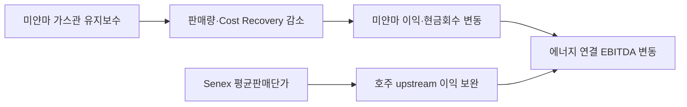

<!-- AUTO-GENERATED BY market-sensing-intelligence. DO NOT EDIT. -->

# 미얀마 회수율과 Senex 단가의 분리 관리

!!! abstract "한 문장 시그널"

    **2024년 3분기 에너지는 미얀마 유지보수·Cost Recovery 하락을 Senex 단가 상승과 터미널·발전 이익이 보완한 구조.**

| 사업축 | 사업영향도 | 긴급도 | 평가일 |
| --- | ---: | ---: | --- |
| 에너지 | **5/5** | **4/5** | 2024-10-30 |

## 왜 중요한가

POSCO IR은 미얀마 가스전 판매량·이익 감소 원인을 가스관 유지보수와 Cost Recovery 하락으로, Senex 증가를 평균판매단가 상승으로 구분합니다. 전체 이익보다 자산별 현금회수 조건을 분리 관리해야 합니다.

### 판단 근거

- **사업 영향:** 자산별 물량·가격·회수율이 연결 에너지 손익에 직접 반영됩니다.
- **긴급성:** 다음 분기까지 미얀마 회수율과 Senex 단가의 지속성을 검증해야 합니다.
- **대응 시한:** 2025-01-31

## 정량 영향 시뮬레이션

공개정보와 명시적 가정으로 계산한 예비 추정입니다. 숫자를 먼저 확인한 뒤 슬라이더로 가정을 바꾸면 결과가 즉시 갱신됩니다.

```impact-simulator
{"schema_version":1,"title":"2024 Q3 energy asset EBITDA bridge","description":"Conditional bridge for reported Myanmar and Senex operating profit with an undisclosed Myanmar cost-recovery adjustment.","as_of":"2024-10-30","confidence":"medium","notice":"Reported IR values are used as a base; the recovery adjustment is an assumption and this is not a company forecast.","formula_display":"myanmar_op + senex_op + recovery_adjustment","variables":[{"id":"myanmar_op","label":"Myanmar gas field reported operating profit","unit":"KRW 100m","min":700,"max":1400,"step":10,"default":1080,"kind":"assumption","basis":"POSCO International IR value pending source registration.","source_ids":[]},{"id":"senex_op","label":"Senex reported operating profit","unit":"KRW 100m","min":50,"max":150,"step":5,"default":101,"kind":"assumption","basis":"POSCO International IR value pending source registration.","source_ids":[]},{"id":"recovery_adjustment","label":"Myanmar cost-recovery adjustment","unit":"KRW 100m","min":-300,"max":300,"step":10,"default":0,"kind":"assumption","basis":"Contract recovery calculation is not public.","source_ids":[]}],"outputs":[{"id":"energy_op","label":"Adjusted energy operating profit","unit":"KRW 100m","decimals":0,"primary":true,"expression":{"op":"add","args":[{"op":"add","args":[{"var":"myanmar_op"},{"var":"senex_op"}]},{"var":"recovery_adjustment"}]}}],"presets":[{"id":"defensive","label":"Defensive","values":{"myanmar_op":1200,"senex_op":110,"recovery_adjustment":100}},{"id":"base","label":"Base","values":{"myanmar_op":1080,"senex_op":101,"recovery_adjustment":0}},{"id":"pressure","label":"Pressure","values":{"myanmar_op":800,"senex_op":80,"recovery_adjustment":-150}}]}
```

## 상세 분석

# POSCO International 2024년 3분기 에너지 실적

## 원문 보존

- 제목: ’24.3Q Results – Energy
- 발행자: POSCO INTERNATIONAL
- 발표일: 2024-10-30 (IR 활동 페이지의 3Q 2024 Earnings Release)
- 원문: https://poscointl.com/upload/ir/kor_3Q%202024%20Earnings%20Release.pdf
- 접근 상태: 공개 PDF 14쪽, 에너지 4쪽 본문 확인.

### 핵심 원문 문장

> 미얀마 : 가스관 유지보수 및 Cost Recovery 감소 영향

> SENEX: 평균 판매 단가 상승에 따른 매출 및 영업이익 증가

원문 표에는 2024년 3분기 기준 미얀마 가스전 판매량 43.1 Bcf, 매출 1,644억원, 영업이익 1,080억원, Senex 판매량 6.2 Bcf, 매출 670억원, 영업이익 101억원, 터미널 영업이익 168억원, 발전 영업이익 635억원이 기재돼 있습니다.

## Signal

**2024년 3분기 에너지는 미얀마 가스전 유지보수·Cost Recovery 하락을 Senex 단가 상승과 터미널·발전 이익이 보완한 구조로, upstream별 현금회수 조건을 분리 관리해야 하는 시점.**

- 사업축: 포스코인터내셔널 에너지 — Myanmar gas field·Senex·terminal·power generation
- 사업영향도: 5/5 — 실제 연결 영업이익과 판매량이 upstream 운영·가격·회수율에 의해 갈림.
- 긴급도: 4/5 — 유지보수와 Cost Recovery 회복 여부를 다음 분기까지 확인.
- 평가 신뢰도: 높음(회사 IR 원문), 원인 지속성은 중간.

## Insight와 문서급 분석

### 판단 질문과 잠정 결론

**미얀마 생산량 감소를 일시적 유지보수로 처리하고 Senex 증산만 확대해도 되는가?** 아니오. 회사 IR은 미얀마 가스관 유지보수와 Cost Recovery 감소가 2024년 3분기 이익을 낮췄고, Senex는 평균판매단가 상승이 이익을 높였다고 구분합니다. 즉 전체 에너지 이익이 유지되어도 자산별 현금 흐름과 회수 메커니즘은 서로 다른 위험입니다.

### 확인된 변화와 시점

2024년 10월 30일 POSCO International IR은 미얀마 유지보수·Cost Recovery 하락과 Senex 단가 상승을 자산별로 구분했습니다.

### 통념과 확인된 간극

시장 통념은 “LNG 가치사슬 통합이 가격과 물량의 변동을 상쇄한다”는 것입니다. 실제 표는 상쇄가 발생했지만 미얀마 판매량은 전년 동기 46.6 Bcf에서 43.1 Bcf로 7.5% 감소했고 영업이익은 1,125억원에서 1,080억원으로 줄었습니다. 반면 Senex 판매량은 6.1→6.2 Bcf로 거의 같아도 단가 상승으로 매출·영업이익이 증가했습니다. 유지보수 일정과 Cost Recovery 비율을 확인하지 않으면 통합 효과를 과대평가할 수 있습니다.

### 사업 영향 경로



### 사업 시나리오

| 시나리오 | 관찰 조건 | 사업 의미 | 우선 대응 |
| --- | --- | --- | --- |
| 방어 | 미얀마 정비 종료·회수율 회복, Senex 단가 유지 | 미얀마 현금흐름 정상화와 호주 증산 병행 | 정비별 생산·회수율 월별 대조 |
| 기준 | 미얀마 물량은 안정되나 회수율 변동, Senex 단가 정상화 | 자산별 이익 상쇄가 약화 | 회수율·가격 공식을 자산별 예산에 반영 |
| 하방 | 정비 장기화·Cost Recovery 추가 하락·Senex 단가 하락 | 통합 효과가 동시에 약화 | 미얀마 보수·계약수익 및 호주 판매계약 재협상 |

### 지금 확인할 지표

- 미얀마 가스관 정비 종료일·생산량·판매량·Cost Recovery 비율
- Senex 단가·판매 PJ, 터미널 가동률과 발전 SMP
- 자산별 물량·가격·환율·회수율·정비비 브리지

### 의사결정에 필요한 다음 산출물

1. 자산별 원인별 이익 브리지 — 에너지사업 주관, 2024-11-30.
2. 미얀마 Cost Recovery 회복 여부 검증표 — 가스전 운영 주관, 2025-01-31.
3. Senex 단가·증산·터미널·발전의 통합 예산 민감도 — 재무 주관, 2025-02-15.

결론을 뒤집는 단일 확인은 미얀마 Cost Recovery 비율이 2024년 3분기 수준에서 회복됐는지 여부입니다.

!!! warning "판단의 한계"

    IR은 사업부문 실적과 회사가 설명한 주요 원인을 제공하지만 미얀마 계약의 회수율 산식, 실제 유지보수 기간, Senex 가격공식은 공개하지 않습니다. 금액 민감도는 원문 실적의 단순 차이가 아니라 예비 분석입니다.

### impact-estimate 초안

```json
{
  "schema_version": 1,
  "title":"2024 Q3 에너지 자산별 EBITDA 브리지",
  "description":"공시된 Myanmar·Senex 영업이익과 미공개 Cost Recovery 변동의 조건부 연결 EBITDA 브리지",
  "as_of":"2024-10-30",
  "confidence":"medium",
  "notice":"회사 IR의 보고실적을 기준으로 한 원인분해 초안이며 미래 전망 아님",
  "formula_display":"보고 영업이익 + 물량·가격·회수율 조정",
  "variables":[
    {"id":"myanmar_op","label":"미얀마 가스전 보고 영업이익","unit":"KRW 100m","min":700,"max":1400,"step":10,"default":1080,"kind":"assumption","basis":"publication 단계에서 POSCO IR Source ID 연결","source_ids":[]},
    {"id":"senex_op","label":"Senex 보고 영업이익","unit":"KRW 100m","min":50,"max":150,"step":5,"default":101,"kind":"assumption","basis":"publication 단계에서 POSCO IR Source ID 연결","source_ids":[]},
    {"id":"recovery_adjustment","label":"미얀마 회수율 조정","unit":"KRW 100m","min":-300,"max":300,"step":10,"default":0,"kind":"assumption","basis":"비공개 계약값","source_ids":[]}
  ],
  "outputs":[{"id":"energy_op","label":"조정 에너지 영업이익","unit":"KRW 100m","decimals":0,"primary":true,"expression":{"op":"add","args":[{"op":"add","args":[{"var":"myanmar_op"},{"var":"senex_op"}]},{"var":"recovery_adjustment"}]}}],
  "presets":[{"id":"defensive","label":"방어","values":{"myanmar_op":1200,"senex_op":110,"recovery_adjustment":100}},{"id":"base","label":"기준","values":{"myanmar_op":1080,"senex_op":101,"recovery_adjustment":0}},{"id":"pressure","label":"압박","values":{"myanmar_op":800,"senex_op":80,"recovery_adjustment":-150}}]
}
```

??? note "연결된 판단 근거"

    - **myanmar q3 2024 sales volume:** 43.1 Bcf · [[sources/SRC-20260819-73A730DD|원문 근거]]
    - **myanmar q3 2024 operating profit:** 1,080억원 · [[sources/SRC-20260819-73A730DD|원문 근거]]
    - **senex q3 2024 operating profit:** 101억원 · [[sources/SRC-20260819-73A730DD|원문 근거]]
    - **business axis:** 에너지 · [[sources/SRC-20260819-73A730DD|원문 근거]]
    - **business impact score 1 to 5:** 5 · [[sources/SRC-20260819-73A730DD|원문 근거]]
    - **business impact rationale:** 자산별 물량·가격·회수율이 연결 에너지 손익에 직접 반영됩니다. · [[sources/SRC-20260819-73A730DD|원문 근거]]
    - **urgency score 1 to 5:** 4 · [[sources/SRC-20260819-73A730DD|원문 근거]]
    - **urgency rationale:** 다음 분기까지 미얀마 회수율과 Senex 단가의 지속성을 검증해야 합니다. · [[sources/SRC-20260819-73A730DD|원문 근거]]
    - **assessment confidence:** high · [[sources/SRC-20260819-73A730DD|원문 근거]]
    - **assessed at:** 2024-10-30 · [[sources/SRC-20260819-73A730DD|원문 근거]]
    - **impact path:** 미얀마 정비·회수율·Senex 단가 → 자산별 판매량·마진 → 에너지 연결 EBITDA · [[sources/SRC-20260819-73A730DD|원문 근거]]
    - **recommended follow up:** 미얀마 Cost Recovery·정비일과 Senex 단가·판매량을 자산별 이익 브리지로 확인 · [[sources/SRC-20260819-73A730DD|원문 근거]]
    - **response deadline:** 2025-01-31 · [[sources/SRC-20260819-73A730DD|원문 근거]]
    - **affected business:** Myanmar gas field·Senex·LNG terminal·power generation · [[sources/SRC-20260819-73A730DD|원문 근거]]

## 원문

- **POSCO International 2024 Q3 Energy Results** · POSCO INTERNATIONAL · 2024-10-30 · [원문 링크](https://poscointl.com/upload/ir/kor_3Q%202024%20Earnings%20Release.pdf) · [[sources/SRC-20260819-73A730DD|보관 원문]]
