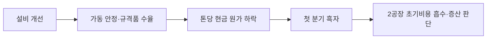

<!-- AUTO-GENERATED BY market-sensing-intelligence. DO NOT EDIT. -->

# 포스코아르헨티나의 2026년 2분기 첫 흑자

!!! abstract "한 문장 시그널"

    **포스코아르헨티나가 2026년 2분기 처음으로 분기 흑자를 냈지만 하반기 2공장 초기 운영비가 늘어날 예정이므로, 포스코홀딩스는 흑자의 반복 여부와 증산 물량의 비용 흡수력을 함께 확인해야 합니다.**

| 사업축 | 사업영향도 | 긴급도 | 평가일 |
| --- | ---: | ---: | --- |
| 리튬 | **5/5** | **5/5** | 2026-08-18 |

## 왜 중요한가

포스코아르헨티나는 1공장 안정화와 설비 개선을 바탕으로 2026년 2분기 첫 분기 흑자를 기록했다고 발표했습니다. 하반기에는 2공장 완공에 따른 초기 운영비 증가가 예상돼 한 분기 흑자만으로 안정 가동 완료를 판단하기 어렵습니다. 규격품 수율·비계획 정지·톤당 현금 원가와 2공장 고객 승인·판매량을 함께 확인해야 합니다.

### 판단 근거

- **사업 영향:** 1공장 안정가동 재현성과 2공장 초기비용 흡수 여부가 리튬사업 현금흐름과 후속 증설 게이트를 바꿉니다.
- **긴급성:** 하반기 2공장 초기비용이 발생하기 전에 흑자 원인과 증산 조건을 분해해야 합니다.
- **대응 시한:** 2026-09-15

## 상세 분석

### 판단 질문과 잠정 결론

포스코아르헨티나의 첫 분기 흑자를 2공장 증산의 자동 승인 신호로 볼 것인가? **아니오.** 1공장 안정 가동이 반복되고 2공장 초기비용을 판매 증가가 흡수하는지 확인하는 기준으로 사용해야 합니다. 회사는 2026년 2분기 첫 흑자의 원인으로 1공장 운전 안정화와 설비 개선을 제시했지만, 하반기에는 2공장 완공에 따른 초기 운영비 증가도 예상했습니다. 이 판단은 2026년 3분기 운영·판매 자료가 나오면 다시 검토해야 합니다.

### 일반적 해석과 확인된 차이

분기 흑자 전환을 곧바로 생산 안정화 완료로 읽기 쉽습니다. 그러나 한 분기 손익은 리튬 가격, 재고 평가, 판매 시점의 영향을 받을 수 있습니다. 확인된 차이는 회사가 제시한 설비 개선 효과가 규격품 수율·비계획 정지·현금 원가의 반복 개선으로 이어졌는지 아직 공개자료만으로 알 수 없다는 점입니다. 현재 확인된 반대 근거는 2공장 초기 운영비가 하반기에 늘어날 수 있다는 회사의 설명입니다.

### 확인된 변화와 시점

포스코홀딩스는 2026년 7월 31일 2분기 실적자료에서 포스코아르헨티나 1단계 염수리튬 공장이 안정화와 설비 개선으로 처음 분기 흑자를 냈다고 발표했습니다. 회사는 2공장 완공에 따라 하반기 초기 운영비가 증가할 것으로 예상했고, 단계적 생산 증대와 판매 확대를 수익성 개선 경로로 제시했습니다. 공개자료에는 흑자 규모, 가동률, 제품별 원가와 고객 판매조건이 포함되어 있지 않습니다.

### 포스코홀딩스에 전달되는 사업 영향

첫 흑자가 2공장 비용과 후속 증설 판단으로 이어지는 경로는 다음과 같습니다.

한 분기 흑자는 가격 반등, 재고 효과, 판매 시점으로도 만들어질 수 있습니다. 따라서 생산량보다 규격품 출하량, 현금 원가, 비계획 정지, 고객 승인률을 함께 봐야 합니다. 2공장은 1공장의 학습과 품질 기준을 재사용할 때 경제성이 커집니다. 반대로 초기 운영비가 판매 증가보다 빠르게 늘면 흑자 전환이 다시 흔들릴 수 있습니다.

### 조건부 시나리오

아래 표는 첫 흑자의 원인과 2공장 비용 흡수 여부에 따른 다음 판단입니다.

| 시나리오 | 확인 조건 | 사업 의미 | 우선 대응 |
| --- | --- | --- | --- |
| 재현 성공 | 두 개 분기 이상 수율·현금 원가 개선이 반복됨 | 안정 가동 모델의 신뢰가 높아짐 | 2공장 단계 증산 |
| 가격 의존 | 흑자는 유지되지만 원가·정지 개선이 없음 | 가격 하락 때 재적자 위험 | 증산 속도 제한 |
| 초기비용 확대 | 2공장 비용이 판매 증가보다 커짐 | 현금흐름 악화 | 고객 승인·가동 조건 재설정 |

판단을 뒤집는 사실은 2분기 흑자가 생산성 개선보다 일회성 가격·재고 효과였다는 내부 손익분해입니다.

### 지금 확인할 지표

- 1공장 규격품 수율·비계획 정지시간·톤당 현금 원가 — 흑자가 반복 가능한 운영개선인지 확인합니다.
- 판매량 중 고객 승인 완료 물량과 계약가격·운송비 — 판매가 실제 현금으로 남는지 봅니다.
- 2공장 시운전 비용·초기 가동률·1공장 학습 재사용률 — 초기비용을 판매 증가가 흡수하는지 판단합니다.
- 분기별 흑자 증감표 — 가격·재고·물량·원가 효과를 나눕니다.

### 결론을 확정·폐기할 조건

- **이 분석이 틀렸다면:** 2개 분기 이상 수율·현금 원가·규격품 출하가 개선되고 2공장 비용이 판매 증가 안에서 관리되어야 합니다.
- **한 가지 확인:** 2분기 흑자 증감표에서 가격·재고가 아닌 생산성 개선이 주된 원인인지 확인하면 증산 판단을 확정할 수 있습니다.
- **감지 조건:** 비계획 정지 증가, 규격품 수율 후퇴, 2공장 초기비용 한도 초과입니다.

### 의사결정에 필요한 다음 산출물

1. 리튬사업 운영부문의 2분기 흑자 증감표 — 2026년 8월 31일
2. 재무부문의 2공장 초기비용 월별 한도표 — 2026년 9월 15일
3. 영업·품질 공동 고객승인 연계 증산 조건표 — 2026년 9월 15일

!!! warning "판단의 한계"

    회사 공개자료는 흑자 규모와 원가·수율 세부를 공개하지 않습니다. 내부 월별 생산·품질·손익분해 없이는 안정 가동 완료나 추가 투자 타당성을 확정할 수 없습니다.

??? note "연결된 판단 근거"

    - **posco argentina profit status q2 2026:** first quarterly profit · [[sources/SRC-20260818-A26B22EF|원문 근거]]
    - **second plant h2 2026 cost effect:** initial operating costs expected to increase · [[sources/SRC-20260818-A26B22EF|원문 근거]]
    - **stated profitability path:** phased production increases and expanded sales · [[sources/SRC-20260818-A26B22EF|원문 근거]]
    - **business axis:** 리튬 · [[sources/SRC-20260818-A26B22EF|원문 근거]]
    - **business impact score 1 to 5:** 5 · [[sources/SRC-20260818-A26B22EF|원문 근거]]
    - **business impact rationale:** 1공장 안정가동 재현성과 2공장 초기비용 흡수 여부가 리튬사업 현금흐름과 후속 증설 게이트를 바꿉니다. · [[sources/SRC-20260818-A26B22EF|원문 근거]]
    - **urgency score 1 to 5:** 5 · [[sources/SRC-20260818-A26B22EF|원문 근거]]
    - **urgency rationale:** 하반기 2공장 초기비용이 발생하기 전에 흑자 원인과 증산 조건을 분해해야 합니다. · [[sources/SRC-20260818-A26B22EF|원문 근거]]
    - **assessment confidence:** medium · [[sources/SRC-20260818-A26B22EF|원문 근거]]
    - **assessed at:** 2026-08-18 · [[sources/SRC-20260818-A26B22EF|원문 근거]]
    - **impact path:** 설비개선→수율·가동 안정→첫 분기 흑자→2공장 초기비용 흡수·증설 판단 · [[sources/SRC-20260818-A26B22EF|원문 근거]]
    - **recommended follow up:** 1공장 흑자 브리지와 2공장 고객승인 연계 증산 게이트를 2026-09-15까지 확정 · [[sources/SRC-20260818-A26B22EF|원문 근거]]

## 원문

- **POSCO Holdings announces Q2 2026 results** · POSCO Holdings · 2026-07-31 · [원문 링크](https://newsroom.posco.com/en/posco-holdings-announces-q2-2026-results-profitability-improved-on-visible-gains-centered-on-lithium-and-lng-resources/) · [[sources/SRC-20260818-A26B22EF|보관 원문]]
