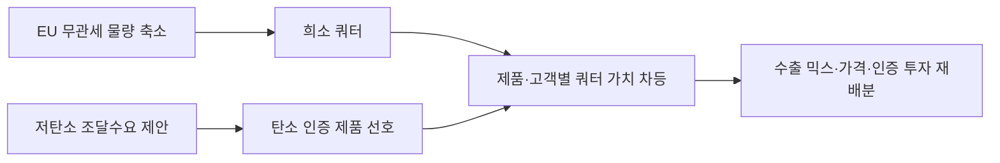

<!-- AUTO-GENERATED BY market-sensing-intelligence. DO NOT EDIT. -->

# EU 철강 수입축소와 저탄소 조달기준 결합

!!! abstract "한 문장 시그널"

    **포스코는 희소해진 EU 수입쿼터를 범용 물량이 아니라 탄소기준·고객 구매의향·순마진을 함께 충족하는 제품에 우선 배분하는 기준을 마련해야 합니다.**

| 사업축 | 사업영향도 | 긴급도 | 평가일 |
| --- | ---: | ---: | --- |
| 철강 | **5/5** | **4/5** | 2026-08-19 |

## 왜 중요한가

EU는 철강 무관세 수입량을 연 1,830만 톤으로 줄이는 동시에 자동차·건설 공공조달과 지원사업에 저탄소 철강 기준을 두는 법안을 제안했습니다. 법안은 미확정이지만 수입량 제한과 저탄소 수요창출이 함께 움직여 포스코의 쿼터 배분을 제품·고객별 수익성 문제로 바꿉니다.

### 판단 근거

- **사업 영향:** 수입쿼터 희소성과 저탄소 조달수요의 결합은 같은 쿼터 1톤의 제품·고객별 마진과 인증투자 가치를 크게 다르게 만듭니다.
- **긴급성:** 수입조치는 이미 시행 중이고 저탄소 법안은 협상 중이므로 2027년 판매계획과 고객계약 전에 통합 배분기준이 필요합니다.
- **대응 시한:** 2026-12-31

!!! warning "기존 전제를 무엇이 깨는가"

    **기존 전제:** EU 수입규제 대응은 국가·품목별 쿼터를 배분하고 초과관세를 피하는 물량관리 문제라는 전제입니다.

    **전제를 깨는 관측:** EU가 수입량을 크게 줄이는 동시에 자동차·건설 공공조달과 지원에 저탄소 철강 기준을 도입하는 법안을 제안했습니다.

    **바꿀 결정:** 쿼터 1톤당 제품 탄소강도·고객 조달자격·가격 가산분·인증비용을 계산해 수출 제품과 고객의 우선순위를 다시 정해야 합니다.

    **반증 확인:** 최종 법률에서 저탄소 철강 조달기준이 삭제되거나 역외 제품의 참여가 배제되는지 확인합니다.

## 상세 분석

## 판단 질문과 잠정 결론

**판단 질문:** EU 수출전략을 축소된 쿼터 안에서 물량만 배분하는 문제로 봐도 되는가?

**잠정 결론:** 부족합니다. EU는 무관세 수입량을 줄이는 동시에 자동차·건설 공공조달과 지원사업에서 저탄소 철강 수요를 만드는 법안을 제안했습니다. 쿼터가 희소해질수록 저탄소 기준을 충족하고 가격을 전가할 수 있는 제품·고객에 물량을 배분하는 문제가 됩니다.

## 통념과 확인된 간극

통념은 수입쿼터 축소가 국가·품목별 물량을 나누고 초과관세를 피하는 영업 문제라는 것입니다. Industrial Accelerator Act 제안은 철강에 EU산 원산지 의무를 결합하지 않으면서도 자동차·건설 부문의 공공조달과 지원에 저탄소 기준을 도입하려 합니다. 수입은 제한되지만 요건을 충족한 역외 저탄소강에는 수요 창출 기회가 남는 구조입니다.

반대 근거는 이 조치가 아직 법률 제안이라는 점입니다. 저탄소 정의는 건설제품 규정과 친환경설계 위임법령에서 구체화될 예정이고 협상 중 바뀔 수 있습니다. 따라서 2029년 물량이나 가격을 확정하지 않고, 현재 쿼터 배분과 탄소 인증 준비를 하나의 의사결정으로 묶는 것이 핵심입니다.

## 확인된 변화와 시점

EU의 새 철강조치는 연 무관세 수입량 1,830만 톤, 2024년 대비 47% 축소, 쿼터 초과관세 50%와 용해·주조 추적요건을 담고 있습니다. 2026년 3월 4일 발표된 산업가속법 제안은 철강의 자동차·건설 공공조달과 지원사업에 저탄소 기준을 두고, EU 원산지 요건은 철강에 적용하지 않는 방향을 명시했습니다.

## 포스코에 전달되는 사업 영향

같은 1톤의 쿼터라도 범용재와 저탄소 인증재의 기대마진이 달라질 수 있습니다. 포스코는 국가·품목 쿼터만이 아니라 제품별 탄소강도, 고객의 조달자격, 가격 가산분과 인증비용을 함께 계산해야 합니다. 법안이 지연되더라도 고객의 선제 조달기준이 먼저 움직일 수 있습니다.

## 사업 시나리오

| 시나리오 | 관찰 조건 | 예상되는 사업 의미 | 우선 대응 |
| --- | --- | --- | --- |
| 법안 지연 | 저탄소 기준 협상 장기화 | 쿼터 대응이 우선 | 기존 고객 마진 재계산 |
| 수요 분화 | 공공지원·조달에 기준 도입 | 인증 제품 우선배분 가치 | 고객별 탄소요건 확보 |
| 프리미엄 형성 | 저탄소 가격 가산분이 인증비 초과 | 희소 쿼터의 수익성 상승 | 제품 믹스와 장기계약 재설계 |

## 지금 확인할 지표

- 한국·품목별 실제 쿼터와 고객별 사용 가능 물량
- EU 저탄소 철강 정의, 검증기관과 고객별 요구 탄소강도
- 범용재·저탄소재의 도착원가, 가격 가산분과 인증비용

## 결론을 확정·폐기할 조건

최종 법률과 위임기준에 역외 저탄소강의 조달 참여가 유지되고 고객이 가격 가산분을 제시하면 제품 믹스 전환을 강화합니다. 저탄소 기준이 삭제되거나 포스코 제품이 조달대상에서 제외되면 약화합니다. 한 가지 핵심 확인은 주요 EU 고객의 제품별 유료 구매의향과 인증요건입니다.

## 의사결정에 필요한 다음 산출물

1. 쿼터 1톤당 제품·고객별 순마진과 탄소요건 순위표
2. 법안 지연·부분시행·확정의 수출 믹스 시나리오
3. 인증 투자와 장기 판매계약을 연결한 단계별 승인기준

!!! warning "판단의 한계"

    산업가속법은 2026년 8월 현재 제안 단계이며 최종 기준과 시행일이 바뀔 수 있습니다. 포스코의 품목별 쿼터, 제품 탄소강도, 고객 가격 가산분이 비공개라 손익액은 확정하지 않았습니다.

??? note "연결된 판단 근거"

    - **eu tariff free quota:** 연 18.3 Mt · [[sources/SRC-20260818-5C2CEB19|원문 근거]]
    - **eu quota cut vs 2024:** 47% 축소 · [[sources/SRC-20260818-5C2CEB19|원문 근거]]
    - **eu out of quota duty:** 50% · [[sources/SRC-20260818-5C2CEB19|원문 근거]]
    - **iaa steel requirement scope:** 자동차·건설 공공조달·지원의 저탄소 철강 기준 제안 · [[sources/SRC-20260819-E0FF0193|원문 근거]]
    - **business axis:** 철강 · [[sources/SRC-20260818-5C2CEB19|원문 근거]] · [[sources/SRC-20260819-E0FF0193|원문 근거]]
    - **business impact score 1 to 5:** 5 · [[sources/SRC-20260818-5C2CEB19|원문 근거]] · [[sources/SRC-20260819-E0FF0193|원문 근거]]
    - **business impact rationale:** 수입쿼터 희소성과 저탄소 조달수요의 결합은 같은 쿼터 1톤의 제품·고객별 마진과 인증투자 가치를 크게 다르게 만듭니다. · [[sources/SRC-20260818-5C2CEB19|원문 근거]] · [[sources/SRC-20260819-E0FF0193|원문 근거]]
    - **urgency score 1 to 5:** 4 · [[sources/SRC-20260818-5C2CEB19|원문 근거]] · [[sources/SRC-20260819-E0FF0193|원문 근거]]
    - **urgency rationale:** 수입조치는 이미 시행 중이고 저탄소 법안은 협상 중이므로 2027년 판매계획과 고객계약 전에 통합 배분기준이 필요합니다. · [[sources/SRC-20260818-5C2CEB19|원문 근거]] · [[sources/SRC-20260819-E0FF0193|원문 근거]]
    - **assessment confidence:** medium · [[sources/SRC-20260818-5C2CEB19|원문 근거]] · [[sources/SRC-20260819-E0FF0193|원문 근거]]
    - **assessed at:** 2026-08-19 · [[sources/SRC-20260818-5C2CEB19|원문 근거]] · [[sources/SRC-20260819-E0FF0193|원문 근거]]
    - **impact path:** 무관세 수입량 축소 + 저탄소 조달기준 → 희소 쿼터의 제품별 가치 차등 → 수출 믹스·가격·인증 투자 재배분 · [[sources/SRC-20260818-5C2CEB19|원문 근거]] · [[sources/SRC-20260819-E0FF0193|원문 근거]]
    - **recommended follow up:** EU 고객별 쿼터 사용 가능량·제품 탄소강도·가격 가산분·인증비용을 결합한 쿼터 1톤당 순마진 순위표 작성 · [[sources/SRC-20260818-5C2CEB19|원문 근거]] · [[sources/SRC-20260819-E0FF0193|원문 근거]]

## 원문

- **EU steel measure: 18.3 Mt tariff-free quota and 50% out-of-quota duty** · European Commission · 2026-06-30 · [원문 링크](https://policy.trade.ec.europa.eu/enforcement-and-protection/protecting-eu-steelmaking_en) · [[sources/SRC-20260818-5C2CEB19|보관 원문]]
- **Industrial Accelerator Act proposal COM(2026)100** · European Commission · 2026-03-04 · [원문 링크](https://single-market-economy.ec.europa.eu/publications/industrial-accelerator-act_en) · [[sources/SRC-20260819-E0FF0193|보관 원문]]
