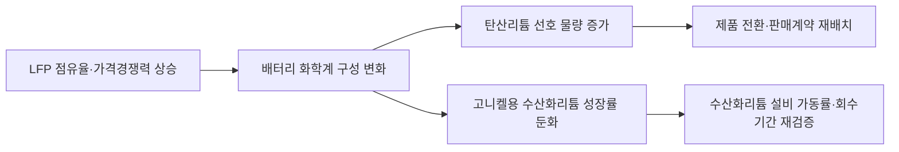

<!-- AUTO-GENERATED BY market-sensing-intelligence. DO NOT EDIT. -->

# LFP가 세계 전기차 배터리의 절반을 넘어섰다

!!! abstract "한 문장 시그널"

    **리튬 총수요 증가와 별개로 수산화리튬 중심의 제품·증설 계획을 화학계별 수요로 다시 계산해야 합니다.**

| 사업축 | 사업영향도 | 긴급도 | 평가일 |
| --- | ---: | ---: | --- |
| 리튬 | **5/5** | **4/5** | 2026-08-19 |

## 왜 중요한가

2025년 세계 전기차 배터리에서 LFP 비중이 55%를 넘었고 NMC 대비 평균 가격 격차도 40% 이상으로 확대됐습니다. 미국 에너지부는 LFP에 탄산리튬, NMC에 수산화리튬이 선호된다고 구분합니다. 총 배터리 수요는 계속 늘지만 포스코홀딩스는 수산화리튬 성장률과 설비 회수기간을 제품별로 재검증해야 합니다.

### 판단 근거

- **사업 영향:** 배터리 화학계 구성은 탄산리튬과 수산화리튬의 판매 믹스, 설비 가동률, 증설 회수기간을 동시에 바꿀 수 있습니다.
- **긴급성:** 2027년 이후 고객 계약과 증설계획에 반영하려면 2026년 하반기에 고객별 화학계 수요를 다시 계산해야 합니다.
- **대응 시한:** 2026-09-30

## 상세 분석

LFP는 더 이상 중국 보급형 전기차에 국한된 선택지가 아닙니다. 2025년 세계 전기차 배터리 사용량의 절반을 넘었고 가격 격차도 확대되어, 포스코홀딩스는 전체 리튬 수요 증가만 볼 것이 아니라 탄산리튬과 수산화리튬의 제품별 수요 구성을 따로 점검해야 합니다.

## 판단 질문과 잠정 결론

**질문:** 고니켈 배터리 확대를 전제로 한 수산화리튬 중심 판매·증설 계획을 그대로 유지해도 되는가?

**잠정 결론:** 전면 축소를 결정할 단계는 아니지만, 기존 성장률 전제를 유지하기 전에 고객별 배터리 화학계와 제품 전환 가능성을 다시 계산해야 합니다. 세계 LFP 비중이 2024년 거의 50%에서 2025년 55% 이상으로 상승했고, LFP 팩의 평균 가격이 NMC보다 40% 이상 낮았다는 두 지표가 같은 방향을 가리킵니다.

## 확인된 변화와 시점

IEA에 따르면 2025년 전기차 배터리 사용량은 1.2TWh로 전년보다 거의 30% 늘었습니다. 동시에 LFP 비중은 55%를 넘었고, 신흥·개도국의 전기차 판매에서는 LFP가 3분의 2를 차지했습니다. 미국에서는 관세와 조달요건 때문에 LFP 비중이 오히려 줄었지만, 50GWh가 넘는 현지 생산능력이 LFP로 전환되었습니다. 따라서 핵심 변화는 리튬 총수요의 감소가 아니라 성장하는 시장 안에서 화학계 구성이 달라진다는 점입니다.

## 포스코홀딩스에 전달되는 사업 영향

미국 에너지부 공급망 자료는 LFP에 탄산리튬, NMC에 수산화리튬이 각각 선호된다고 구분합니다. 이에 따라 `LFP 점유율 상승 → 탄산리튬 선호 물량 증가 → 수산화리튬 예상 성장률 둔화 → 제품별 가동률·판매가격·증설 회수기간 변화`의 경로가 성립합니다. 실제 영향액은 포스코홀딩스의 고객별 계약, 공정 전환비용, 탄산리튬과 수산화리튬의 생산 유연성이 공개되지 않아 확정할 수 없습니다. 다만 제품구성을 무시한 총톤 기준 수요전망은 방향이 맞아도 수익성 판단을 틀릴 수 있습니다.

## 조건부 사업 시나리오

| 시나리오 | 확인 조건 | 사업 의미 | 우선 대응 |
| --- | --- | --- | --- |
| 방어 | LFP가 55% 부근에서 정체하고 장거리·한랭지 중심 NMC 수요가 유지 | 수산화리튬 성장전제의 일부 유지 가능 | 고객·지역별 NMC 물량을 분리 확인 |
| 기준 | LFP 비중이 계속 상승하되 전체 배터리 수요도 함께 성장 | 총 리튬 물량은 늘지만 수산화리튬 성장률은 시장 평균보다 낮아질 수 있음 | 탄산·수산화 제품별 판매·가동률 계획 재산정 |
| 압박 | 비중 상승과 40% 이상 가격 격차가 지속되고 비중국 완성차 전환이 확대 | 수산화리튬 단일제품 증설의 회수기간 악화 가능 | 전환투자·장기계약·증설 순서를 경영안건으로 상정 |

## 지금 확인할 지표

- 분기별 세계·유럽·북미 LFP 사용 비중: 지역별 전환속도와 수산화리튬 수요 시차를 판단합니다.
- LFP와 NMC 팩의 kWh당 가격 격차: 완성차 업체가 화학계를 바꿀 경제적 압력을 확인합니다.
- 고객별 탄산리튬·수산화리튬 계약물량과 갱신시점: 시장 변화가 실제 판매 믹스로 전달되는 시점을 확인합니다.
- 포스코 공정의 제품 전환 가능량·기간·비용: 시장 변화에 대한 대응 가능성을 판단합니다.

## 결론을 확정·폐기할 조건

LFP 세계 비중이 2년 연속 하락하거나, 주요 고객의 고니켈 채택과 수산화리튬 장기계약이 기존 증설물량을 충분히 흡수하면 경고를 낮출 수 있습니다. 반대로 LFP가 60%를 넘고 비중국 완성차의 현지 양산 전환이 두 곳 이상 추가되며, 수산화리튬 계약 갱신률이 계획보다 낮아지면 경고를 심각 단계로 올려야 합니다.

## 의사결정에 필요한 다음 산출물

1. 2027~2030년 고객·지역·화학계별 리튬 수요표와 기존 사업계획의 차이표
2. 탄산리튬·수산화리튬 설비별 전환 가능량, 변동비, 전환기간을 반영한 손익 민감도
3. 장기계약 갱신·증설 의사결정을 연결한 분기별 경영진 검토안

## 판단의 한계

공개자료는 세계 화학계 비중과 기술상 선호 원료를 보여주지만 포스코홀딩스의 고객별 판매계약과 설비 전환 제약은 보여주지 않습니다. 따라서 이 분석은 수산화리튬 사업가치의 확정 하락을 말하는 것이 아니라, 총수요 전망만으로 제품별 투자판단을 유지하는 위험을 경고합니다.

!!! warning "판단 경계"

    LFP 점유율을 수산화리튬 물량 감소율로 직접 치환하지 않았습니다. 실제 손익은 내부 계약·제품전환·가격차 데이터를 확인한 뒤 계산해야 합니다.

??? note "연결된 판단 근거"

    - **global ev battery deployment 2025:** 1.2 TWh; 2024년 대비 거의 30% 증가 · [[sources/SRC-20260819-3F479FFE|원문 근거]]
    - **global lfp ev battery share 2025:** 55% 초과 · [[sources/SRC-20260819-3F479FFE|원문 근거]]
    - **global lfp ev battery share 2024:** 거의 50% · [[sources/SRC-20260819-C39C1B19|원문 근거]] · [[sources/SRC-20260819-3F479FFE|원문 근거]]
    - **lfp pack price discount vs nmc 2025:** kWh당 평균 40% 초과 저렴 · [[sources/SRC-20260819-3F479FFE|원문 근거]]
    - **us battery capacity reallocated to lfp 2025:** 50 GWh 초과 · [[sources/SRC-20260819-3F479FFE|원문 근거]]
    - **us lfp share direction 2025:** 낮은 2024년 기준에서 거의 절반으로 감소 · [[sources/SRC-20260819-3F479FFE|원문 근거]]
    - **nmc energy density advantage 2024:** LFP 팩은 NMC 대비 질량 기준 약 20%, 부피 기준 약 33% 낮은 에너지밀도 · [[sources/SRC-20260819-C39C1B19|원문 근거]]
    - **global ev battery demand outlook 2030:** IEA STEPS에서 3 TWh 초과 · [[sources/SRC-20260819-C39C1B19|원문 근거]]
    - **preferred lithium compound for lfp:** 탄산리튬 선호 · [[sources/SRC-20260819-3EDE7B8B|원문 근거]]
    - **preferred lithium compound for nmc:** 수산화리튬 선호 · [[sources/SRC-20260819-3EDE7B8B|원문 근거]]
    - **business axis:** 리튬 · [[sources/SRC-20260819-3F479FFE|원문 근거]]
    - **business impact score 1 to 5:** 5 · [[sources/SRC-20260819-3F479FFE|원문 근거]] · [[sources/SRC-20260819-3EDE7B8B|원문 근거]]
    - **business impact rationale:** 배터리 화학계 구성은 탄산리튬과 수산화리튬의 판매 믹스, 설비 가동률, 증설 회수기간을 동시에 바꿀 수 있습니다. · [[sources/SRC-20260819-3F479FFE|원문 근거]] · [[sources/SRC-20260819-3EDE7B8B|원문 근거]]
    - **urgency score 1 to 5:** 4 · [[sources/SRC-20260819-3F479FFE|원문 근거]]
    - **urgency rationale:** 2027년 이후 고객 계약과 증설계획에 반영하려면 2026년 하반기에 고객별 화학계 수요를 다시 계산해야 합니다. · [[sources/SRC-20260819-3F479FFE|원문 근거]]
    - **assessment confidence:** high · [[sources/SRC-20260819-3F479FFE|원문 근거]] · [[sources/SRC-20260819-3EDE7B8B|원문 근거]]
    - **assessed at:** 2026-08-19 · [[sources/SRC-20260819-3F479FFE|원문 근거]]
    - **impact path:** LFP 점유율 상승 → 탄산리튬 선호 증가 → 수산화리튬 성장률·가동률·증설 회수기간 재검증 · [[sources/SRC-20260819-3F479FFE|원문 근거]] · [[sources/SRC-20260819-3EDE7B8B|원문 근거]]
    - **recommended follow up:** 고객·지역·화학계별 2027~2030 수요와 탄산·수산화 설비 전환성을 2026-09-30까지 재산정 · [[sources/SRC-20260819-3F479FFE|원문 근거]]

## 원문

- **Global EV Outlook 2026 - Electric vehicle batteries** · International Energy Agency · 2026-05-20 · [원문 링크](https://www.iea.org/reports/global-ev-outlook-2026/electric-vehicle-batteries) · [[sources/SRC-20260819-3F479FFE|보관 원문]]
- **Global EV Outlook 2025 - Electric vehicle batteries** · International Energy Agency · 2025-05-14 · [원문 링크](https://www.iea.org/reports/global-ev-outlook-2025/electric-vehicle-batteries) · [[sources/SRC-20260819-C39C1B19|보관 원문]]
- **Supply Chain Readiness Level Preliminary Analysis: Batteries Summary** · U.S. Department of Energy · 2024-11-01 · [원문 링크](https://www.energy.gov/sites/default/files/2024-12/Supply_Chain_Readiness_Level_%28SCRL%29_Analysis_Nov2024--2024.12.04.pdf) · [[sources/SRC-20260819-3EDE7B8B|보관 원문]]
